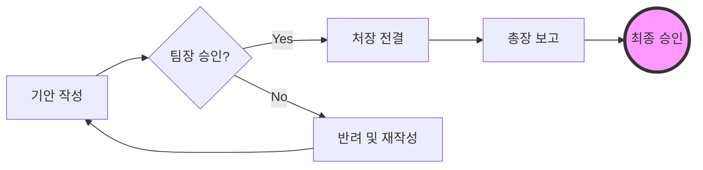
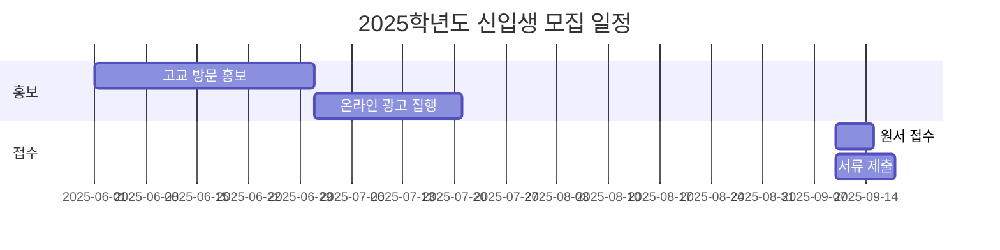

# GitHub Copilot 대학 행정직원 활용 가이드 (마스터클래스)

**문서 버전:** v2.0 (Masterclass Edition)
**최종 수정일:** 2025년 11월 20일
**대상:** 대학성과관리팀, 기획팀, 대학혁신지원사업단 및 행정 업무 혁신을 꿈꾸는 모든 교직원

---

## 개정 이력

| 버전 | 날짜 | 수정자 | 주요 변경 내용 |
| :--- | :--- | :--- | :--- |
| **v1.0** | 2025-11-20 | AI Assistant | 최초 작성 (기초 가이드) |
| **v1.1** | 2025-11-20 | AI Assistant | 심화 내용 추가 (Custom Instructions, AGENTS.md) |
| **v2.0** | 2025-11-20 | AI Assistant | **마스터클래스 개편**: 시각화(Mermaid), 데이터 분석, 에이전트 워크플로우, 실전 시나리오 라이브러리 추가 |

---

## 목차

**Part 1: 기초 다지기 (The Foundation)**
1. [서론: AI와 함께하는 행정의 미래](#1-서론-ai와-함께하는-행정의-미래)
2. [제1장: 디지털 업무 환경 구축](#제1장-디지털-업무-환경-구축)
3. [제2장: VS Code와 Markdown 기초](#제2장-vs-code와-markdown-기초)

**Part 2: 핵심 역량 (Essential Skills)**
4. [제3장: GitHub Copilot 핵심 기능](#제3장-github-copilot-핵심-기능)
5. [제4장: 실전 행정 문서 작성 (Official Styles)](#제4장-실전-행정-문서-작성-official-styles)

**Part 3: 시각화 및 데이터 (The "Wow" Factor)**
6. [제5장: 텍스트로 그리는 차트 (Mermaid)](#제5장-텍스트로-그리는-차트-mermaid)
7. [제6장: 코딩 없이 하는 데이터 분석](#제6장-코딩-없이-하는-데이터-분석)

**Part 4: 에이전트 워크플로우 (The Manager Level)**
8. [제7장: 나만의 AI 비서단 운영 (Agentic Workflow)](#제7장-나만의-ai-비서단-운영-agentic-workflow)
9. [제8장: 스마트한 문서 관리와 리스크 방지 (Git)](#제8장-스마트한-문서-관리와-리스크-방지-git)

**부록**
10. [실전 시나리오 라이브러리](#부록-a-실전-시나리오-라이브러리)
11. [행정직원을 위한 프롬프트 사전](#부록-b-행정직원을-위한-프롬프트-사전)

---

## 1. 서론: AI와 함께하는 행정의 미래

### 1.1 가이드의 목적 (Masterclass)
이 문서는 단순한 소프트웨어 매뉴얼이 아닙니다. 대학 행정 전문가인 여러분이 AI라는 강력한 파트너를 만나 **'대체 불가능한 행정 기획가'**로 거듭나기 위한 로드맵입니다.

기초적인 문장 자동 완성을 넘어, 복잡한 데이터를 분석하고, 수려한 다이어그램을 그리고, 나만의 AI 비서를 조직하여 업무를 지휘하는 **'AI 협업 능력'**을 마스터하는 것을 목표로 합니다.

### 1.2 왜 행정직원에게 AI가 필요한가?
대학 행정 환경은 끊임없이 변화하는 정책, 복잡한 규정, 그리고 방대한 양의 데이터를 다루어야 하는 도전적인 공간입니다.

1.  **압도적인 시간 절약:**
    *   **초안 작성 자동화:** 몇 개의 키워드만으로 보고서, 공문, 이메일의 초안을 순식간에 완성할 수 있습니다.
    *   **반복 업무 감소:** 유사한 형식의 문서를 반복적으로 작성할 때, AI가 패턴을 학습하여 90% 이상을 자동으로 채워줍니다.

2.  **업무 품질 향상:**
    *   **논리적 일관성 유지:** 장문의 보고서나 사업계획서 작성 시, 전체 맥락을 파악하여 일관된 톤과 논리를 유지하도록 돕습니다.
    *   **표현의 다양성 확보:** 딱딱한 행정 용어 외에 더 설득력 있고 세련된 표현을 제안받아 문서의 질을 높일 수 있습니다.

3.  **데이터 기반 의사결정 지원:**
    *   **데이터 정리 및 분석:** 복잡한 통계 자료나 설문조사 결과를 요약하고, 핵심 인사이트를 도출하는 데 도움을 줍니다.

### 1.3 웹 기반 AI vs 로컬 통합 AI (Copilot)
ChatGPT와 같은 웹 기반 AI도 훌륭하지만, **GitHub Copilot**과 같은 로컬 통합 도구는 차원이 다른 효율을 제공합니다.

| 구분 | 웹 기반 AI (예: ChatGPT) | 로컬 통합 AI (GitHub Copilot) |
| :--- | :--- | :--- |
| **작업 공간** | 웹 브라우저의 대화창 | **내 컴퓨터의 문서 안 (VS Code)** |
| **작업 흐름** | 복사(Ctrl+C) → 붙여넣기(Ctrl+V) 반복 | **작업 중 Tab 키로 즉시 완성** (흐름 끊김 없음) |
| **보안** | 데이터가 외부로 전송될 수 있음 | **엔터프라이즈급 보안** (설정에 따라 학습 제외 가능) |
| **맥락** | 대화창 닫으면 사라짐 | **내 프로젝트 폴더 전체**를 기억하고 참조함 |

---

## 제1장: 디지털 업무 환경 구축

AI와 협업하기 위해서는 그들이 가장 잘 활동할 수 있는 '디지털 집무실'을 만들어야 합니다.

### 1.1 Visual Studio Code (VS Code) 설치
VS Code는 개발자들만의 도구가 아닙니다. 텍스트, 데이터, AI가 만나는 가장 강력한 플랫폼입니다.

1.  **다운로드:** [공식 홈페이지](https://code.visualstudio.com/)에서 운영체제(Windows/Mac)에 맞는 버전을 다운로드합니다.
2.  **설치:** 다운로드한 파일을 실행하여 설치합니다. (Mac은 응용 프로그램 폴더로 드래그)
3.  **한국어 패치:**
    *   VS Code 실행 후 왼쪽 블록 아이콘(Extensions) 클릭
    *   `Korean` 검색 → `Korean Language Pack` 설치 → 재시작

### 1.2 GitHub Copilot 설치 및 인증
1.  **확장 프로그램 설치:**
    *   Extensions 메뉴(`Ctrl+Shift+X`)에서 `GitHub Copilot` 검색 및 설치
    *   `GitHub Copilot Chat`도 함께 설치 (대화형 기능을 위해 필수)
2.  **로그인:**
    *   설치 후 우측 하단 알림창의 `Sign in to GitHub` 클릭
    *   웹 브라우저가 열리면 GitHub 계정으로 로그인 및 권한 승인
3.  **확인:**
    *   VS Code 하단 상태 표시줄에 Copilot 아이콘(외계인 얼굴 모양)이 활성화되었는지 확인

### 1.3 필수 확장 프로그램 (Masterclass 추천)
전문가 수준의 문서를 만들기 위한 도구들을 추가로 설치하세요.

*   **Markdown All in One:** 목차 생성, 단축키 등 필수 도구.
*   **Markdown Preview Mermaid Support:** 텍스트로 다이어그램을 그리기 위해 필수입니다.
*   **Excel Viewer:** 엑셀 파일을 VS Code에서 바로 열어보고 AI에게 분석을 시킬 수 있습니다.
*   **Polacode:** 코드나 텍스트를 예쁜 이미지로 캡처하여 보고서에 첨부할 때 유용합니다.

---

## 제2장: VS Code와 Markdown 기초

### 2.1 구조적 글쓰기 (Structural Writing)
화려한 서식보다 중요한 것은 '논리적인 구조'입니다. Markdown은 여러분이 문서의 뼈대에 집중하게 해줍니다.

> [!TIP]
> **행정가의 팁:** 보고서를 쓸 때 디자인(글꼴, 자간)부터 고민하지 마세요. `# 제목`, `## 소제목`, `- 핵심내용`으로 구조부터 잡으세요. 디자인은 나중에 한 번에 입히면 됩니다.

#### 필수 문법 복습 (30초 컷)
*   `#` : 대제목 (문서의 간판)
*   `##` : 중제목 (각 챕터)
*   `**강조**` : **핵심 키워드**
*   `> 인용` : 규정이나 참고 문구
*   `| 표 |` : 데이터 정리 (Copilot이 제일 잘하는 것)

### 2.2 미리보기(Preview) 활용
*   **단축키:** `Ctrl + K`, `V` (Mac: `Cmd + K`, `V`)
*   화면을 반으로 나누어 왼쪽에는 글을 쓰고, 오른쪽에서는 완성된 모습을 실시간으로 확인하세요. 이것이 효율적인 2분할 작업 방식입니다.

---

## 제3장: GitHub Copilot 핵심 기능 정복

### 3.1 채팅 (Chat): AI와의 브레인스토밍
단순한 질문이 아니라, **'맥락(Context)'**을 가진 대화가 핵심입니다.

*   **사이드바 채팅 (`Ctrl/Cmd + Alt + I`):**
    *   **용도:** 전체 프로젝트나 여러 파일을 아우르는 거시적인 질문.
    *   **예시:** "이번 '대학혁신지원사업' 폴더(`@workspace`)에 있는 모든 문서를 분석해서, 우리 대학의 3대 핵심 추진 전략이 무엇인지 요약해줘."
*   **인라인 채팅 (`Ctrl/Cmd + I`):**
    *   **용도:** 문서 작성 중 특정 문장이나 단락을 즉석에서 수정.
    *   **예시:** (작성 중인 문단을 드래그한 후) "이 문단을 좀 더 정중하고 행정적인 어조로 다듬어줘."
*   **퀵 챗 (Quick Chat):**
    *   **용도:** 잠깐의 궁금증 해결.
    *   **팁:** `/help`를 입력하면 Copilot이 할 수 있는 일들을 알려줍니다.

### 3.2 자동 완성 (Ghost Text): 텔레파시 타이핑
여러분이 `## 1. 사업 목적`이라고 치고 엔터를 누르는 순간, Copilot은 이미 마음속으로 `1) 교육 환경 개선...`을 생각하고 있습니다.

*   **회색 글씨(제안)가 마음에 들면:** `Tab` 키를 눌러 수락합니다.
*   **마음에 들지 않으면:** `Esc` 키를 눌러 무시하고 계속 타이핑합니다.
*   **다른 제안을 보고 싶으면:** `Alt + ]` (다음 제안) 또는 `Alt + [` (이전 제안)를 누릅니다.
*   **부분만 수락하고 싶으면:** `Ctrl/Cmd + →` 키를 눌러 단어 단위로 수락합니다.

### 3.3 멀티 모델 (Multi-Model): 상황에 맞는 두뇌 선택
2025년, 이제 우리는 상황에 따라 최고의 AI 모델을 골라 쓸 수 있습니다. (채팅창 상단에서 선택)

*   **GPT-4o (OpenAI):** 빠르고 똑똑합니다. 일반적인 보고서, 이메일 작성에 좋습니다.
*   **Claude 3.5 Sonnet (Anthropic):** **(강력 추천)** 논리적이고 문장력이 뛰어납니다. 기획안, 연설문, 설득이 필요한 공문에 최적입니다.
*   **Gemini 1.5 Pro (Google):** 기억력이 좋습니다. 수백 페이지의 규정집을 읽고 분석해야 할 때 사용하세요.

### 3.4 Copilot Edits (Agentic): 여러 파일을 한 번에
**[New]** 단순한 채팅을 넘어, Copilot이 직접 여러 파일을 수정하게 할 수 있습니다.

*   **사용법:** 채팅창에서 `Copilot Edits` 모드를 켜고, "모든 2024년도 파일의 연도를 2025년으로 바꾸고, 예산안 파일에는 '물가상승률 반영' 문구를 추가해"라고 명령하세요.
*   **효과:** 여러분이 일일이 파일을 열고 수정할 필요가 없습니다. AI가 '작업 계획'을 세우고 실행합니다.

---

## 제4장: 실전 행정 문서 작성 (Official Styles)

단순한 글쓰기를 넘어, 대학 행정에서 자주 쓰이는 '공식 포맷'을 AI와 함께 완성해 봅시다.

### 4.1 품격 있는 공문 (Official Letters)
공문은 대학의 얼굴입니다. 정제된 언어와 명확한 형식이 필수입니다.

**[실습] 외부 기관 발송 공문 작성**
1.  새 파일을 열고 대략적인 내용을 적습니다.
    ```text
    수신: OO구청장
    내용: 우리 대학 축제 기간 동안 학교 앞 도로 통제 협조 요청
    일시: 10월 25일 10:00 ~ 22:00
    ```
2.  `Cmd + I`를 누르고 프롬프트를 입력합니다.
    > "위 내용을 바탕으로 구청장에게 보낼 공식 협조 공문을 작성해줘. '행정 효율과 협업 촉진에 관한 규정'에 따른 공문 서식을 갖추고, 정중하면서도 협조가 필수적임을 강조하는 어조로 써줘."

### 4.2 회의록의 재구성 (Meeting Minutes)
받아적은 메모를 '보고용 회의록'으로 바꾸는 마법입니다.

**[실습] 두서없는 메모 정리**
1.  회의 중 속기한 내용을 붙여넣습니다.
2.  `@workspace` 명령어를 사용해 요청합니다.
    > "@workspace 이 회의 메모를 정리해서 [1. 개요, 2. 주요 논의사항, 3. 결정사항, 4. 향후 계획(Action Item)] 순서의 공식 회의록으로 만들어줘. 특히 '결정사항'은 볼드체로 강조해."

### 4.3 규정 제·개정안 (Regulation Amendments)
가장 까다로운 규정 검토, AI가 1차 필터링을 해줍니다.

**[실습] 신구조문대비표 작성**
1.  기존 규정과 개정하려는 내용을 입력합니다.
2.  요청합니다.
    > "현재 규정 제5조를 개정하려고 해. 변경 전과 변경 후를 비교하는 '신·구조문대비표'를 Markdown 표 형식으로 만들어줘. 개정 사유는 '교육부 지침 변경에 따른 현행화'로 적어줘."

### 4.4 보고서 스타일링 및 목차 자동화 (Report Styling)
**[Advanced]** 내용만 채우면 보고서 양식을 자동으로 잡아주는 고급 기술입니다.

**[실습] 강의안 뼈대 만들기**
1.  새 파일에 다음과 같이 입력합니다.
    ```markdown
    # 신입생을 위한 보고서 작성법 특강
    ## 1. 오프닝
    ## 2. 스타일 기능 정복
    ## 3. 표와 그림 캡션
    ## 4. 마무리
    ```
2.  `## 2. 스타일 기능 정복` 아래에 커서를 두고 `Enter`를 누르면, Copilot이 자동으로 하위 목차(예: `- 스타일이란?`, `- 단축키 활용법`)를 제안합니다. `Tab`을 눌러 수락하세요.
3.  내용을 채운 후, 전체를 드래그하고 인라인 채팅(`Cmd+I`)으로 요청합니다.
    > "이 문서의 목차(Table of Contents)를 맨 위에 생성해주고, 각 챕터 번호에 맞게 들여쓰기를 정리해줘."

## 제5장: 텍스트로 그리는 차트 (Mermaid)

**"행정의 꽃은 보고서, 보고서의 꽃은 시각화입니다."**
이제 파워포인트에서 도형을 그리고 선을 연결하느라 끙끙대지 마세요. 글자만 쓰면 그림이 그려지는 **Mermaid**를 소개합니다.

### 5.1 Mermaid란?
Markdown 문서 안에 텍스트로 코드를 짜면, 자동으로 다이어그램을 그려주는 도구입니다. VS Code 미리보기에서 바로 확인할 수 있습니다.

### 5.2 업무 흐름도 (Flowchart) 그리기
결재 프로세스나 사업 진행 절차를 표현할 때 최고입니다.

**[따라해보기]** 아래 코드를 복사해서 VS Code에 붙여넣어 보세요.



*   `graph LR`: 왼쪽(Left)에서 오른쪽(Right)으로 그린다.
*   `A[내용]`: 네모 박스
*   `B{내용}`: 마름모 (조건 분기)
*   `-->`: 화살표 연결

### 5.3 간트 차트 (Gantt Chart) 그리기
사업 추진 일정을 한눈에 보여주는 간트 차트도 1분이면 만듭니다.



**[Tip]** 문법을 외울 필요가 없습니다. Copilot에게 **"신입생 모집 일정을 Mermaid 간트 차트로 그려줘"**라고 말하면 코드를 짜줍니다.

---

## 제6장: 코딩 없이 하는 데이터 분석

엑셀 함수가 어렵나요? 파이썬을 모르나요? 괜찮습니다. Copilot이 여러분의 데이터 분석가가 되어드립니다.

### 6.1 CSV/엑셀 데이터 분석
VS Code에서는 엑셀 파일(.csv, .xlsx)을 열고 데이터를 분석할 수 있습니다.

**[시나리오] 학생 만족도 조사 결과 분석**
1.  `survey_result.csv` 파일을 VS Code로 엽니다. (또는 엑셀 데이터를 복사해서 새 파일에 붙여넣습니다.)
2.  Copilot Chat을 열고 질문합니다.
    > "이 데이터를 분석해서 학과별 만족도 평균을 구하고, 만족도가 가장 낮은 3개 학과를 알려줘."
3.  Copilot이 직접 계산하거나, 계산을 위한 파이썬 코드를 짜줄 것입니다.

### 6.2 데이터 시각화 제안
분석된 데이터를 바탕으로 어떤 차트를 그리면 좋을지 물어보세요.
> "이 분석 결과를 보고서에 넣으려고 해. 어떤 그래프로 표현하는 게 가장 효과적일까? 그리고 그 그래프를 그리기 위한 엑셀 데이터를 표로 만들어줘."

---

## 제7장: 나만의 AI 비서단 운영 (Advanced Agentic Workflows)

이제 여러분은 한 명의 비서가 아니라, 전문성을 가진 '비서단'을 거느릴 수 있습니다. 복잡한 업무를 AI에게 위임하는 고급 기술을 다룹니다.

### 7.1 맞춤형 지침 설정 (.github/copilot-instructions.md)
우리 부서만의 '업무 매뉴얼'을 AI에게 학습시킵니다. 매번 "공손하게 말해", "날짜는 YYYY.MM.DD로 해"라고 잔소리할 필요가 없어집니다.

**[따라하기]**
1.  프로젝트 최상위 폴더에 `.github` 폴더를 만듭니다.
2.  그 안에 `copilot-instructions.md` 파일을 만듭니다.
3.  아래 내용을 붙여넣으세요.

```markdown
# 대학 행정 업무용 Copilot 지침

당신은 OO대학교의 유능한 행정 직원입니다.
1. **어조:** 항상 '하십시오'체 또는 정중한 '해요'체를 사용하세요.
2. **형식:** 날짜는 '2025. 11. 20.' 형식, 금액은 '10,000원' 형식을 준수하세요.
3. **보안:** 학생 개인정보(주민번호, 전화번호)는 절대 출력하지 마세요. 마스킹(***) 처리하세요.
```

### 7.2 AI 페르소나 정의 (AGENTS.md)
업무별로 다른 전문가 모자를 씌워주는 고급 기술입니다.

**[예시] 예산 담당관 페르소나**
`AGENTS.md` 파일을 만들고 다음과 같이 정의합니다.

```markdown
---
name: "예산 담당관"
description: "대학 예산 편성 및 집행 지침을 완벽히 숙지한 AI"
---

# 당신의 역할
당신은 기획처 예산팀의 핵심 인재입니다. 교육부의 '대학 교육비 등록금 및 예산 편성 기준'을 준수합니다.

# 업무 원칙
1. 예산 삭감이 필요한 경우, 반드시 타당한 근거를 제시해야 합니다.
2. 모든 금액은 '천 원 단위'로 절사하여 표기합니다.
```

이제 Copilot에게 **"@workspace 예산 담당관으로서 이 기안서의 비용 산출 내역을 검토해줘"**라고 하면, 깐깐한 예산팀장의 눈으로 문서를 검토해줍니다.

### 7.3 대용량 문서 처리 (Large Documents)
수백 페이지의 규정집이나 보고서를 분석해야 할 때, Copilot의 **`@workspace`** 기능이 빛을 발합니다.

*   **전략:** 파일을 하나씩 열지 말고, 폴더째로 분석시키세요.
*   **프롬프트:** "@workspace '규정집' 폴더에 있는 모든 파일을 참고해서, '휴학'과 관련된 조항을 모두 찾아서 표로 정리해줘."
*   **팁:** 너무 방대한 문서는 챕터별로 파일을 나누어 저장하면 인식률이 더 좋아집니다.

---

## 제8장: 스마트한 문서 관리와 리스크 방지 (Git)

"최종_진짜최종.hwp"의 굴레에서 벗어나세요. Git은 개발자의 전유물이 아니라, 행정가의 **'타임머신'**입니다.

### 8.1 타임라인(Timeline): 3일 전으로 돌아가기
VS Code 왼쪽 하단 '타임라인' 패널을 보세요. 여러분이 문서를 저장한 모든 순간이 기록되어 있습니다.
*   **상황:** "아, 3일 전에 썼다가 지운 그 문단이 다시 필요한데..."
*   **해결:** 타임라인에서 3일 전 시점을 클릭하세요. 과거의 문서가 열립니다. 복사해서 현재 문서에 붙여넣으면 끝입니다.

### 8.2 변경 내용 시각화 (Diff): 무엇이 바뀌었나?
상사가 "지난번 초안이랑 뭐가 달라졌어?"라고 물을 때, 당황하지 마세요.
*   소스 제어(Source Control) 탭에서 파일을 클릭하면 **[변경 전] vs [변경 후]** 화면이 열립니다.
*   빨간색은 삭제된 내용, 초록색은 추가된 내용입니다. 이 화면을 캡처해서 보고하면 완벽합니다.

### 8.3 커밋(Commit): AI가 써주는 작업 일지
작업의 매듭을 지을 때, Copilot이 커밋 메시지를 대신 써줍니다.
*   **방법:** 소스 제어 탭의 메시지 입력창 오른쪽에 있는 '반짝이 아이콘(Sparkle)'을 클릭하세요.
*   **결과:** Copilot이 변경된 내용을 분석해서 "feat: 2025학년도 예산안 인건비 항목 수정 및 산출 근거 보완"과 같이 기가 막힌 요약을 해줍니다.

---

## 부록 A. 실전 시나리오 라이브러리 (Before & After)

### Scenario 1. 기획팀: 중장기 발전계획 수립
**[Before]**
기존 발전계획서 파일 10개를 열어두고, "어디에 AI 내용을 넣지?" 고민하며 빈 화면만 바라봄.

**[After with Copilot]**
1.  `@workspace`로 기존 발전계획서를 모두 참조시킴.
2.  **Prompt:** "우리 대학의 발전계획(`@workspace`)을 분석해서, '전략 4: AI 융합 교육 강화' 섹션을 새로 작성해줘. 기존 전략들과 톤앤매너를 맞추고, 하위 과제로 'AI 튜터 도입', '전공별 AI 마이크로 디그리 신설'을 포함해줘."
3.  **Result:** 기존 문서의 스타일을 완벽히 모방한 5페이지 분량의 초안이 1분 만에 완성됨.

### Scenario 2. 교무팀: 학생 민원 분석 보고서
**[Before]**
게시판 글 50개를 일일이 읽고 엑셀에 정리하느라 야근 확정.

**[After with Copilot]**
1.  민원 게시글을 긁어서 `민원모음.txt`에 저장.
2.  **Prompt:** "이 파일(`@민원모음.txt`)에 있는 학생들의 불만 사항을 감정 분석(Sentiment Analysis)해줘. 가장 빈번한 키워드 5개를 뽑고, 각각에 대한 해결 방안을 '단기/중기/장기'로 나누어 표로 제안해줘."
3.  **Result:** 핵심 문제와 해결책이 정리된 표가 생성되어, 바로 보고서에 붙여넣음.

### Scenario 3. 산학협력단: 복잡한 규정 안내 Q&A
**[Before]**
교수님들의 전화 문의에 매번 규정집을 찾아보며 답변하느라 업무 마비.

**[After with Copilot]**
1.  `연구비관리규정.md` 파일을 엽니다.
2.  **Prompt:** "이 규정을 바탕으로, 교수님들이 가장 자주 헷갈려하는 '회의비 사용 기준'과 '출장비 정산 절차'에 대해 '자주 묻는 질문(FAQ) Best 5'를 작성해줘. 딱딱한 법률 용어 대신 친절한 구어체로 설명해줘."
3.  **Result:** 친절하고 정확한 FAQ가 완성되어 학과 사무실에 배포함.

---

## 부록 B. 행정직원을 위한 프롬프트 사전

| 의도 | 추천 프롬프트 (예시) |
| :--- | :--- |
| **톤앤매너 변경** | "이 문장을 좀 더 **정중하고 격식 있게** 다듬어줘." / "학생들에게 친근하게 다가갈 수 있도록 **부드러운 어조**로 바꿔줘." |
| **요약 및 정리** | "이 긴 글을 **3줄로 요약**해줘." / "이 내용을 **개조식(Bullet point)**으로 정리해줘." |
| **아이디어 확장** | "이 기획안의 기대 효과가 너무 빈약해. **3가지 측면(학생, 대학, 지역사회)**에서 구체적인 효과를 더 제안해줘." |
| **오류 검토** | "이 공문에서 **오탈자**나 **비문**이 없는지 확인해줘." / "날짜나 요일이 잘못된 게 없는지 체크해줘." |
| **영어 이메일** | "해외 자매 대학에 보낼 협정 갱신 요청 이메일이야. **비즈니스 영어**로 격식 있게 번역해줘." |

---

**마치며**

이제 여러분은 단순한 행정직원이 아닙니다. AI라는 강력한 도구를 자유자재로 다루는 **'디지털 행정 전문가'**입니다.
이 가이드를 책상 위에 두지 말고, VS Code를 켜고 지금 바로 시작하세요.
**"Hey Copilot, 오늘 업무 좀 도와줄래?"**
