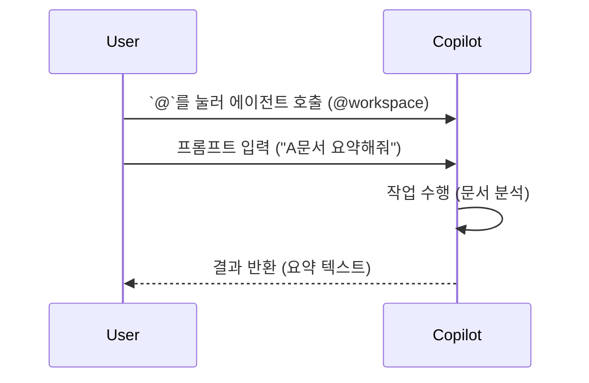

[🏠 목차로 돌아가기](../../README.md) | [🇺🇸 English Version](../../../docs/en/level-3-expert/07-agents-instructions.md)

---
title: "Agents & Instructions: 부서 맞춤형 AI 만들기"
level: 3
order: 7
---

# [Level 3: 전문가] 나만의 AI 비서단 운영

## 7. Agents & Instructions: 부서 맞춤형 AI 만들기
- [ ] 학습 완료

이제 Copilot을 우리 부서 전용 직원으로 교육시킬 차례입니다.

### 7.1 맞춤형 지침 (.github/copilot-instructions.md)
매번 "공손하게 말해", "날짜는 YYYY.MM.DD로 해"라고 잔소리하기 지치셨나요?
프로젝트 폴더에 `.github/copilot-instructions.md` 파일을 만들고 규칙을 적어두면, Copilot이 이 규칙을 항상 따릅니다.

> **예시:**
> 1. 모든 문서는 '대학혁신지원사업 관리 지침'을 준수할 것.
> 2. 금액은 천 원 단위로 절사할 것.
> 3. 학생 개인정보는 마스킹(***) 처리할 것.

### 7.2 AI 페르소나 (Agents)
**[2025 New Feature]**
채팅창에서 `@`를 누르면 다양한 전문가를 호출할 수 있습니다.
*   `@workspace`: 내 컴퓨터에 있는 모든 문서를 다 아는 비서
*   `@terminal`: 복잡한 명령어를 대신 쳐주는 비서
*   `@vscode`: VS Code 사용법을 알려주는 비서

---
## ✅ Key Takeaways
- `.github/copilot-instructions.md` 파일을 통해 프로젝트 전반에 걸친 AI의 행동 규칙을 미리 정의할 수 있다.
- `@` 기호를 사용하여 `@workspace`, `@terminal` 등 특정 목적에 특화된 AI 에이전트를 호출할 수 있다.
---
### ✍️ 자가 진단 퀴즈

Q1. 프로젝트의 모든 문서에 특정 규칙(예: 날짜 형식)을 Copilot이 항상 따르게 하려면 어떤 파일을 수정해야 하나요?

**A1.** 프로젝트 루트의 `.github/copilot-instructions.md` 파일입니다.

---
[< 이전 글](../../level-2-practical/06-workbook-2.md) | [다음 글 >](./08-data-visualization.md) |
