# Complete GitHub Copilot Guide for University Administrative Staff (All-in-One Guide)

**Welcome!** This document is a comprehensive guide for administrative professionals who are new to working with AI. Instead of a complex structure with multiple files, you can simply read and follow this single document from top to bottom to learn everything from the basics of Copilot to expert-level usage.

---

## Table of Contents

- **[Level 1: Introduction](#level-1-introduction-first-steps-as-an-ai-administrator)**
  - [1. Setup: Creating Your Digital Office](#1-setup-creating-your-digital-office)
  - [2. Fundamentals: Distinguishing Chat from Autocomplete](#2-fundamentals-distinguishing-chat-from-autocomplete)
  - [3. Workbook 1: Finishing an English Email in 3 Minutes](#3-workbook-1-finishing-an-english-email-in-3-minutes)
- **[Level 2: Practical](#level-2-practical-increasing-work-speed-10x)**
  - [4. Prompt Engineering: Making AI Understand You Perfectly](#4-prompt-engineering-making-ai-understand-you-perfectly)
  - [5. Copilot Edits: Modifying Multiple Files at Once](#5-copilot-edits-modifying-multiple-files-at-once)
  - [6. Workbook 2: Remodeling Last Year's Report into This Year's Version](#6-workbook-2-remodeling-last-years-report-into-this-years-version)
- **[Level 3: Expert](#level-3-expert-operating-your-own-ai-assistant-team)**
  - [7. Agents & Instructions: Creating Department-Specific AI](#7-agents--instructions-creating-department-specific-ai)
  - [8. Data & Visualization: Analyzing and Drawing Without Excel](#8-data--visualization-analyzing-and-drawing-without-excel)
  - [9. Workbook 3: Meeting Minutes Automation and Visualization Reports](#9-workbook-3-meeting-minutes-automation-and-visualization-reports)
- **[Appendix](#appendix)**
  - [A. Practical Scenario Library](#a-practical-scenario-library-before--after)
  - [B. Prompt Dictionary for Administrative Staff](#b-prompt-dictionary-for-administrative-staff)

---

## 📊 Learning Path Guide

This guide is structured as a 3-level learning path:


**Expected Learning Time**:
- Level 1 (Introduction): 30 minutes
- Level 2 (Practical): 1 hour
- Level 3 (Expert): 1 hour 30 minutes
- **Total Time Required**: Approximately 3 hours

**Learning Method**:
1. Use the checkboxes `- [ ]` in each section to track your learning progress.
2. Be sure to practice the Workbook exercises hands-on.
3. Review key concepts using Key Takeaways and quizzes.

---

## [Level 1: Introduction] First Steps as an AI Administrator

### 1. Setup: Creating Your Digital Office
- [ ] Learning Complete

To properly collaborate with AI, you need a smart 'notepad'. We will use a free program called **VS Code**. Unlike regular notepads, VS Code can manage files on a folder-by-folder basis, which greatly helps AI understand the context of multiple documents at once and provide more accurate answers. Don't be intimidated because it's a developer tool! We'll use it as a 'digital office where your AI assistant works'.

#### 1.1 Installation and Setup (2025 Latest)


**Step-by-Step Instructions**:
1.  **Install Visual Studio Code:** Download and install from [code.visualstudio.com](https://code.visualstudio.com).
2.  **GitHub Copilot Extension:**
    *   Click the 'block icon (Extensions)' on the left side of VS Code → Search for `GitHub Copilot` and install.
    *   **Important:** From the 2025 version onwards, `Copilot Chat` is integrated and does not require separate installation.
3.  **Login:** Click the notification in the lower right corner or the profile icon on the left to login with your GitHub account.

#### 1.2 Understanding the Screen Layout
*   **Editor:** The main screen where you write (like Hangul/Word)
*   **Sidebar:** The left area showing the file list
*   **Secondary Sidebar:** The right area where the Copilot chat window opens (open and close with `Ctrl/Cmd + Alt + I`)

---
## ✅ Key Takeaways
- You can build an AI development environment by installing VS Code and the GitHub Copilot extension.
- Copilot's main features are divided into sidebar chat and in-editor autocomplete (Ghost Text).

---
### ✍️ Self-Assessment Quiz

<details>
<summary>Q1. What is the shortcut key to open the Copilot Chat sidebar in VS Code?</summary>
**A1.** It is `Ctrl/Cmd + Alt + I`.
</details>
<br/>
<details>
<summary>Q2. When installing the 2025 version of GitHub Copilot, do you need to install the `Copilot Chat` extension separately?</summary>
**A2.** No, it is integrated into the basic `GitHub Copilot` extension and does not require separate installation.
</details>

---

### 2. Fundamentals: Distinguishing Chat from Autocomplete
- [ ] Learning Complete

There are two main ways to use Copilot. If you can distinguish between these two, you're in the top 10%.

```mermaid
graph TD
    A[GitHub Copilot Features] --> B[Interactive Chat]
    A --> C[Autocomplete Ghost Text]
    
    B --> B1["📍 Location: Sidebar Chat Window"]
    B --> B2["⌨️ Shortcut: Ctrl/Cmd + Alt + I"]
    B --> B3["🎯 Use:<br/>- Q&A/Summary<br/>- Draft Generation<br/>- Complex Requests"]
    
    C --> C1["📍 Location: Inside Editor"]
    C --> C2["⌨️ Accept: Tab Key"]
    C --> C3["🎯 Use:<br/>- Next Sentence Prediction<br/>- Auto-fill Tables<br/>- Complete Repetitive Patterns"]
    
    style B fill:#e1f5ff
    style C fill:#fff4e1
    style B3 text-align:left
    style C3 text-align:left
```



#### 2.1 Interactive (Chat): "Do This for Me"
This is like talking to an assistant in the right chat window.
*   **When to use?** When asking questions, summarizing long texts, or asking to create something from scratch.
*   **Shortcut:** `Ctrl/Cmd + Alt + I` (Sidebar chat)

#### 2.2 Autocomplete (Ghost Text): "Read My Mind"
When you're writing in the editor, it shows the next content in gray text.
*   **When to use?** While writing a document, when the next sentence is obvious, when filling in tables.
*   **How to use:** Press the `Tab` key to accept if you like the gray text.

> [!TIP]
> **Administrator's Tip:** When creating a report outline, **autocomplete** is convenient, and when filling in the report content, **chat** is more convenient.

---
## ✅ Key Takeaways
- **Chat (`Ctrl/Cmd + Alt + I`)**: Use for complex and creative tasks such as questions, summaries, and draft generation.
- **Autocomplete (`Tab` key)**: Use to quickly complete documents by receiving suggestions for the next content that fits the code or context.

---
### ✍️ Self-Assessment Quiz

<details>
<summary>Q1. Which Copilot feature is more suitable when summarizing long texts or creating a new draft from scratch?</summary>
**A1.** The interactive feature, **Chat**, is more suitable.
</details>
<br/>
<details>
<summary>Q2. What feature do you use when writing code or wanting recommendations for the next sentence that fits the context, and what key do you press to accept the suggestion?</summary>
**A2.** The **Autocomplete (Ghost Text)** feature, and you press the `Tab` key to accept the suggestion.
</details>

---

### 3. Workbook 1: Finishing an English Email in 3 Minutes
- [ ] Learning Complete

Now let's not just look, but actually do it. Let's write an email requesting renewal of an agreement with an overseas university.

### [Step 1] Download Template File
Copy the template below and save it as a file named `email_draft.md`.

```markdown
# Level 1 Practice: Drafting an English Email

Use this template to practice drafting an English email with GitHub Copilot.

---

## Template

**To:** `partner_university@example.com`
**Cc:** `your_team_leader@example.com`
**Subject:** Request for Renewal of Student Exchange Agreement

**[Email Body]**

---

## Practice Instructions

1.  Open this file in VS Code.
2.  Press `Ctrl/Cmd + Alt + I` to open Copilot Chat.
3.  Copy the prompt below, enter it into Copilot Chat, and see how the email is generated.

Prompt:
I am a staff member of the International Exchange Team at OO University. I need to send an email to ABC University, a sister university in the United States, requesting renewal of our student exchange agreement. Based on the template above, please write the body (Email Body) in polite and formal business English.
```

### [Step 2] Open File in VS Code
1.  Open the `email_draft.md` file you just saved in VS Code.
2.  Check the template content.

### [Step 3] Describe the Situation (Chat)
Enter the prompt from the template into the right chat window (`Ctrl/Cmd + Alt + I`).

> **Input:**
> "I am a staff member of the International Exchange Team at OO University. I need to send an email to ABC University, a sister university in the United States, requesting renewal of our student exchange agreement. Based on the template above, please write the body (Email Body) in polite and formal business English."

### [Step 4] Check and Edit Results
Copy the English that Copilot wrote and paste it into the `[Email Body]` section of the editor. Then make some modifications to the content.

### [Step 5] Experience Autocomplete
Try typing `Sincerely,` at the end of the email and press Enter.
Copilot will suggest your name or title in gray text. Press `Tab` to complete it.

> [!NOTE]
> **Success Check:** Did you finish the email draft in 3 minutes? If so, you've passed Level 1!

---
## ✅ Key Takeaways
- By providing a clear role, context, and desired output format, you can quickly generate high-quality drafts (e.g., English emails) with Copilot Chat.
- The autocomplete feature reduces repetitive tasks by suggesting names or titles when writing common phrases like `Sincerely,`.

---
### ✍️ Self-Assessment Quiz

<details>
<summary>Q1. What are the 3 key elements you should provide to get more accurate results from Copilot? (Hint: R.C.O)</summary>
**A1.** **Role, Context, Output**. (This will be covered in more detail in Level 2.)
</details>
<br/>
<details>
<summary>Q2. When you type `Sincerely,` at the end of an email and Copilot suggests your name, which feature is this an example of?</summary>
**A2.** This is an example of the **Autocomplete (Ghost Text)** feature.
</details>

---

## [Level 2: Practical] Increasing Work Speed 10x

### 4. Writing Good Instructions: Making AI Understand You Perfectly
- [ ] Learning Complete

Getting AI to do work well is also a skill. This is sometimes called 'prompt engineering', but simply put, it's about **writing clear instructions**. It's not difficult. Just remember 3 things: **Role, Context, Output**.

#### 4.1 The R.C.O Formula
*   **Role:** "You are a veteran administrator with 10 years of experience."
*   **Context:** "I'm preparing materials for an audit by the Ministry of Education."
*   **Output:** "Organize a list of expected audit findings in a table."


**Example:** "You are a veteran administrator (Role) + Preparing for Ministry of Education audit (Context) + Organize in a table (Output) → Clear result"

#### 4.2 Adjusting Tone and Manner
You can adjust AI's tone.
*   "Write in a dry and objective tone." (For reports)
*   "Write in a friendly and gentle tone." (For notices)
*   "Summarize only the key points in outline format." (For executive reports)

---
## ✅ Key Takeaways
- Using the R.C.O (Role, Context, Output) formula allows you to clearly and effectively instruct AI on tasks.
- You can control the style of results by specifying tone and manner such as "dryly," "kindly," or "in outline format."

---
### ✍️ Self-Assessment Quiz

<details>
<summary>Q1. What are the 3 elements of the R.C.O formula to remember when instructing AI?</summary>
**A1.** Role, Context, Output.
</details>

---

### 5. Copilot Edits: Modifying Multiple Files at Once
- [ ] Learning Complete

**[2025 New Feature]**
Until now, we've been copying and pasting from the chat window, right? Now you can have Copilot directly modify files. This is **Copilot Edits**.

#### 5.1 How to Use
1.  Change the mode at the bottom of the chat window (`Ctrl/Cmd + Alt + I`) to **'Edits'**.
2.  Drag the files you want to modify into the chat window, or press `#` to select them.
3.  Give the command.
    > "Change the year in all 5 files here from 2024 to 2025. And add a 'Confidential' label at the top of the documents."
4.  Copilot shows the modification plan. Press **'Accept'** to actually modify the files.

```mermaid
graph TD
    A[1. Switch to Edits mode] --> B[2. Select files (#)];
    B --> C[3. Give modification command];
    C --> D{4. Review modification plan};
    D -- Accept --> E[5. Files automatically modified];
    D -- Reject --> F[Cancel];
```

#### 5.2 When to Use?
*   When unifying the format of multiple files
*   When regulations change and you need to modify specific wording in all documents
*   When you want to finish simple repetitive tasks in one go

```mermaid
flowchart LR
    subgraph Input["Input: Multiple Files"]
        F1[Official1.docx]
        F2[Official2.docx]
        F3[Report.pdf]
    end
    
    subgraph Process["Copilot Edits Processing"]
        P1[Change Date<br/>2024→2025]
        P2[Add Text<br/>'Confidential' Label]
        P3[Review Stage]
    end
    
    subgraph Output["Output: Modification Complete"]
        O1[✅ Official1_Edited]
        O2[✅ Official2_Edited]
        O3[✅ Report_Edited]
    end
    
    Input --> Process
    Process --> Output
    
    style Input fill:#e3f2fd,stroke:#1976d2
    style Process fill:#fff3e0,stroke:#f57c00
    style Output fill:#e8f5e9,stroke:#2e7d32
```


**Efficiency:** 3 files × 5 minutes = 15 minute task → **Reduced to 1 minute**

---
## ✅ Key Takeaways
- The Copilot Edits feature is a powerful function that modifies the content of multiple files at once.
- You can activate Edits mode in the chat window and reference files with the `#` key to give commands.
---
### ✍️ Self-Assessment Quiz
<details>
<summary>Q1. What feature is most useful when you want to change the year in multiple files at once or add specific wording to all documents?</summary>
**A1.** The Copilot Edits feature.
</details>

---

### 6. Workbook 2: Remodeling Last Year's Report into This Year's Version
- [ ] Learning Complete

There's an excellent business plan that a senior colleague wrote last year. Let's create this year's version based on it.

### [Step 1] Get Your Materials Ready
1.  Prepare last year's business plan file (`plan_2024.md`). Download and use the template below.
2.  Prepare a memo (`memo_2025.txt`) containing this year's key initiatives. Download and use the template below.

#### 📥 Template 1: `plan_2024.md` (Last Year's Business Plan)

```markdown
# 2024 Business Plan (Draft)

---
<!--
Practice Instructions:
1. Use the Copilot Edits feature to create a '2025 Business Plan' based on this document.
2. Try filling in the 'Quarterly Goals' and 'Key Results (OKR)' tables below with Copilot.
3. For example, you can ask in the chat window "Please suggest 3 detailed action plans for the Q1 goal below."
-->

## 1. Q1 2024 Goals
- **Goal:** Establish AI utilization education program for new students
- **Key Results (Objectives and Key Results - OKR):**
    | Key Result | Starting Value | Target Value | Achievement Rate |
    | :--- | :--- | :--- | :--- |
    | Freshman orientation satisfaction | 0% | 90% | |
    | Copilot usage guide views | 0 | 1,000 | |

## 2. Q2 2024 Goals
- **Goal:** Expand AI utilization to all faculty and staff
- **Key Results (OKR):**
    | Key Result | Starting Value | Target Value | Achievement Rate |
    | :--- | :--- | :--- | :--- |
    | AI use case discovery by department | 0 cases | 10 cases | |
    | Monthly AI newsletter subscription rate | 0% | 50% | |

<!-- Q3, Q4 goals below ... -->
```

#### 📥 Template 2: `memo_2025.txt` (This Year's Key Initiatives Memo)

```text
# 2025 Key Initiatives (Brainstorming Memo)

- (Practice Instructions) Try transforming this unstructured text into a 'refined memo' format using Copilot.
  - Group by topic
  - Refine each item into a clear sentence
  - Unify dates to YYYY-MM-DD format

---
(Original Memo)

- Next year's budget... need to increase by 5%. Report completion by January 2025.
- Need to create new global competency enhancement program. Target start in March.
- Review AI chatbot introduction... but what about information leakage risk?
- School anniversary event on 2025/05/15.
- Last year's faculty training, should we do it in the metaverse this year?
- Smart campus construction project, need 1st phase completion report. End of February 2025.
```

### [Step 2] Summon Copilot Edits
1.  Switch the chat window to **Edits mode**.
2.  Reference both files with `@`.

### [Step 3] Give the Command
> **Input:**
> "Based on last year's plan (`plan_2024.md`), create a new `plan_2025.md`.
> However, you need to modify the 'Implementation Strategy' section to reflect this year's key tasks in `memo_2025.txt`.
> Update all dates to 2025, and calculate the budget with a 5% increase from last year."

### [Step 4] Review and Approve
Copilot will show you the modified content.
*   Red: Deleted content
*   Green: Added content
If the content is correct, press **'Accept'** to save.

> [!TIP]
> **Success Check:** Did you finish the 'copy-paste' and 'edit' work that would take 1 hour in 5 minutes? Congratulations. You've now mastered the 'practical level'.

---
## ✅ Key Takeaways
- You can leave complex tasks to Copilot that involve referencing existing documents and additional requirements (memos) together to restructure new documents.
- Simple calculations and numerical changes such as date updates and budget increase calculations can also be automated through prompts.
---
### ✍️ Self-Assessment Quiz
<details>
<summary>Q1. The practice of giving last year's business plan and this year's change memo together to create this year's business plan is an example of using which feature?</summary>
**A1.** This is an advanced use case of the Copilot Edits feature that references and modifies multiple files.
</details>

---

## [Level 3: Expert] Operating Your Own AI Assistant Team

### 7. Agents & Instructions: Creating Department-Specific AI
- [ ] Learning Complete

Now it's time to train Copilot as a dedicated employee for our department.

#### 7.1 Custom Instructions (.github/copilot-instructions.md)
Tired of nagging "speak politely" and "use YYYY.MM.DD for dates" every time?
Create a `.github/copilot-instructions.md` file in your project folder and write down the rules, and Copilot will always follow these rules.

> **Example:**
> 1. All documents must comply with the 'University Innovation Support Project Management Guidelines'.
> 2. Amounts should be rounded down to the nearest thousand won.
> 3. Student personal information should be masked (***).

#### 7.2 AI Personas (AI Assistants)
**[2025 New Feature]**
Press `@` in the chat window to call various specialized AI helpers (called "agents").
*   `@workspace`: An assistant who knows all documents on your computer
*   `@terminal`: An assistant who types complex commands for you
*   `@vscode`: An assistant who teaches you how to use VS Code


---
## ✅ Key Takeaways
- Through the `.github/copilot-instructions.md` file, you can predefine AI behavior rules across the project.
- Using the `@` symbol, you can call AI agents specialized for specific purposes, such as `@workspace` and `@terminal`.
---
### ✍️ Self-Assessment Quiz
<details>
<summary>Q1. Which file should you modify to have Copilot always follow specific rules (e.g., date format) in all documents of a project?</summary>
**A1.** The `.github/copilot-instructions.md` file in the project root.
</details>

---

### 8. Data & Visualization: Analyzing and Drawing Without Excel
- [ ] Learning Complete

#### 8.1 Drawing Charts with Text (Mermaid Diagrams)
Don't waste time drawing shapes in PowerPoint. Using a simple diagram tool called "Mermaid", you can write text and it automatically becomes a picture.

**[Practice] Drawing a Workflow**
Try copying and pasting the code below.


#### 8.2 Data Analysis
Open an Excel file and ask in the chat window, and it will analyze for you.
> "From this Excel file (`survey.xlsx`), pick the 3 items with the lowest satisfaction and summarize the reasons."


**Workflow:** Upload file → Ask in natural language → Copilot automatically analyzes → Provides table/chart results

---
## ✅ Key Takeaways
- Using Mermaid syntax, you can draw various diagrams such as flowcharts and Gantt charts with text alone.
- You can reference data files (e.g., .xlsx, .csv) in Copilot Chat and ask in natural language to perform data analysis and summarization.
---
### ✍️ Self-Assessment Quiz
<details>
<summary>Q1. What syntax can you use to draw workflow diagrams directly in a Markdown document without PowerPoint?</summary>
**A1.** Mermaid syntax.
</details>

---

### 9. Workbook 3: Meeting Minutes Automation and Visualization Reports
- [ ] Learning Complete

This is the final challenge. Let's turn meeting notes into a nice report.

### [Step 1] Prepare Meeting Notes
Prepare roughly written meeting notes (`meeting_note_template.txt`). Download and use the template below.

#### 📥 Template: `meeting_note_template.txt` (Meeting Minutes)

```text
# Level 3 Practice: Meeting Minutes Summary and Action Item Extraction

- (Practice Instructions) Provide the virtual meeting minutes below to Copilot Chat and request the following.
  1. Summarize the key content of this meeting in 3 lines.
  2. Organize the Action Items (tasks) decided in the meeting in a table including person in charge and deadline.

---
(Virtual Meeting Minutes)

- Attendees: Team Leader Kim, Senior Park, Assistant Choi
- Meeting Date: November 28, 2025
- Agenda: Next-Generation Integrated Information System Construction Kickoff

Team Leader Kim: "Everyone's here. Today we begin the construction of the next-generation system, which has been our department's long-cherished project. Senior Park, please briefly brief us on the current situation."

Senior Park: "Yes, vendor selection is complete, and we are about to sign a contract with Consortium A. We must complete the legal review of the contract by this Friday (12/1). I will take care of it."

Assistant Choi: "After the legal review, we need to submit a budget execution proposal by next week. I will draft it and deliver it to Senior Park by next Wednesday (12/6)."

Team Leader Kim: "Good. And most importantly. There are many opinions that the User Requirements Document (Request for Proposal - RFP) is still insufficient. Especially the student complaint part is weak. Assistant Choi, please consult with the Student Affairs Office and reinforce this by next Friday (12/8)."

Senior Park: "Understood. So I'll summarize that I'm in charge of the contract, and Assistant Choi is in charge of the proposal and requirements reinforcement."

Team Leader Kim: "Yes, let's do that. We need to get this started off right. Everyone, thank you."
```

### [Step 2] Request Report Creation
> **Input:**
> "@workspace Based on `meeting_note.txt`, write a 'Weekly Work Report'.
> 1. Organize the main agenda in a table.
> 2. Draw the future schedule as a Mermaid Gantt chart.
> 3. Make the overall tone dry for 'reporting purposes'."

### [Step 3] Check Results
Did you get a perfect report with tables and charts?
You are now an **'AI Administration Master'**.


**Automation Result:** Meeting notes → Table organization → Gantt chart → Report completion (30 seconds)

---
## ✅ Key Takeaways
- By utilizing the `@workspace` agent, you can perform complex tasks that reference specific files to summarize content and reprocess it into desired forms such as tables or charts.
- You can automatically convert simple notes or meeting minutes into systematic report formats, greatly reducing document work time.
---
### ✍️ Self-Assessment Quiz
<details>
<summary>Q1. When you want to create a visualization report based on meeting minutes files on your computer, which agent is most effective to call?</summary>
**A1.** The `@workspace` agent.
</details>

---

## Appendix

## A. Practical Scenario Library (Before & After)

| Situation | Before (Existing) | After (AI Usage) |
| :--- | :--- | :--- |
| **Regulation Search** | Open 5 regulation PDFs and search with 'Ctrl+F' | "@workspace Summarize only the leave application period and procedures from 'Academic Regulations'." |
| **Official Document Writing** | Find last year's document and modify date/recipient (risk of typos) | "Refer to last year's document (`@doc`) and rewrite it, changing only the recipient to 'Ministry of Education'." |
| **Event Planning** | Manually write program and preparation list in Excel | "Create a program and checklist table for freshman orientation." |


**Time Savings:** Based on regulation search example, approximately **90% time reduction** (30 minutes → 3 minutes)

---

## B. Prompt Dictionary for Administrative Staff

*   **Summary:** "Summarize this document to one A4 page, and extract 3 key keywords."
*   **Translation:** "Translate this email into polite business English."
*   **Proofreading:** "Find and correct typos and awkward sentences in this report."
*   **Ideas:** "Suggest 10 promotional slogans for our university. (Keywords: innovation, future, global)"


**Usage Tip:** Determine purpose first → Specify format → Add specific requirements

---

## C. Good vs Bad Prompt Examples

Understanding what makes a good prompt is essential. Below are three real administrative scenarios showing the difference between vague and effective prompts.

### 💡 The R.C.O. Formula for Good Prompts
- **R**ole: Who is the AI helping? (e.g., "You are assisting a university admin staff member...")
- **C**ontext: What's the situation? (e.g., "Our department is hosting a year-end event...")
- **O**utput: What format do you need? (e.g., "Write a 200-word email in polite tone...")

---

### Example 1: Department-Wide Email Drafting

#### ❌ Bad Prompt (Vague)
```
Write an email about the event.
```

**Problems:**
- No context: What event? Who is the audience?
- No tone guidance: Formal or casual?
- No format requirements: Length? Key points to include?

#### ✅ Good Prompt (Using R.C.O.)
```
You are helping a university General Affairs staff member draft an official email.

**Context:** Our department is hosting a year-end faculty appreciation dinner on December 22nd, 6 PM at the University Conference Hall. We need to invite all faculty members (approximately 120 people).

**Output Requirements:**
- Write a 200-word email in polite business tone
- Include: Event purpose, date/time/location, RSVP deadline (December 15th), dress code (business casual)
- End with contact information (General Affairs Office, ext. 1234)
```

**Why it's better:** Provides complete context, specifies exact length and tone, lists all required details.

---

### Example 2: Meeting Minutes Summarization

#### ❌ Bad Prompt (Vague)
```
Summarize this meeting.
```

**Problems:**
- No focus: Summarize what aspects? Action items? Decisions?
- No format: Bullet points? Paragraph? Table?
- No audience consideration: For participants or executives?

#### ✅ Good Prompt (Using R.C.O.)
```
You are helping a university Planning Office staff member summarize a budget meeting.

**Context:** This is a 2-hour budget allocation meeting with 5 department heads. The transcript is attached below. The summary will be shared with the Vice President who needs to make final decisions.

**Output Requirements:**
- Create a structured summary with these sections:
  1. Key Decisions Made (bullet points)
  2. Budget Allocation by Department (table format)
  3. Unresolved Issues (numbered list)
  4. Action Items with Deadlines (who/what/when format)
- Keep the total summary under 500 words
- Use professional tone suitable for executive review

[Paste meeting transcript here]
```

**Why it's better:** Defines the audience (Vice President), specifies exact structure, provides word limit, and explains the summary's purpose.

---

### Example 3: Annual Report Data Compilation

#### ❌ Bad Prompt (Vague)
```
Organize this data for the report.
```

**Problems:**
- No data context: What type of data? What report?
- No visualization needs: Tables? Charts? Text?
- No comparison requirements: Year-over-year? Trends?

#### ✅ Good Prompt (Using R.C.O.)
```
You are helping a university Student Affairs staff member compile annual enrollment statistics for the 2024 Academic Report.

**Context:** I have raw enrollment data for 2022, 2023, and 2024 across 8 colleges. The data includes new students, transfers, leave of absence, and graduations. This will be presented to the Board of Trustees.

**Output Requirements:**
- Create a summary table showing:
  - Total enrollment by year (2022-2024)
  - Percentage change year-over-year
  - Top 3 colleges by enrollment growth
- Highlight any significant trends (e.g., >10% change)
- Write 3-4 sentence interpretation of the data trends
- Format: Excel-compatible table with clear headers

**Data:**
[Paste raw data here: College name, year, enrollment numbers, etc.]
```

**Why it's better:** Specifies data type and timeframe, defines exact table structure, requests trend analysis, and indicates the output format needed.

---

### 📊 Impact Comparison

| Prompt Type | Time to Get Useful Result | Revision Cycles Needed | Output Quality |
|:------------|:--------------------------|:-----------------------|:---------------|
| ❌ Bad (Vague) | 15-20 minutes | 3-4 revisions | 40-60% usable |
| ✅ Good (R.C.O.) | 3-5 minutes | 0-1 revisions | 85-95% usable |

```mermaid
graph LR
    subgraph Bad["❌ Vague Prompt Path"]
        B1[Write Vague Prompt] --> B2[Get Generic Output]
        B2 --> B3[Revise Prompt]
        B3 --> B4[Still Not Right]
        B4 --> B5[Manually Fix]
        B5 --> B6[20+ Minutes]
    end
    
    subgraph Good["✅ Good Prompt Path"]
        G1[Write Detailed Prompt<br/>Using R.C.O.] --> G2[Get Targeted Output]
        G2 --> G3[Minor Tweaks Only]
        G3 --> G4[Ready to Use]
        G4 --> G5[5 Minutes]
    end
    
    style Bad fill:#ffebee,stroke:#c62828
    style Good fill:#e8f5e9,stroke:#2e7d32
    style B6 fill:#ffcdd2
    style G5 fill:#a5d6a7
```



**Key Takeaway:** Spending 2 extra minutes writing a detailed prompt saves 15+ minutes in revisions and manual corrections.

---

**"Starting is half the work. Press `Ctrl + Alt + I` right now!"**
