# 대학 행정직원을 위한 GitHub Copilot 완전 정복 (All-in-One 가이드)

**환영합니다!** 이 문서는 AI와 협업하는 것이 처음인 행정 전문가를 위한 종합 가이드입니다. 여러 개의 파일로 된 복잡한 구조 대신, 이 하나의 문서만 위에서부터 아래로 읽고 따라 하시면 Copilot의 기초부터 전문가 수준의 활용법까지 모두 익히실 수 있습니다.

---

## 목차 (Table of Contents)

- [📊 학습 경로 안내](#-학습-경로-안내)

### **[Level 1: 입문 - AI 행정가의 첫걸음](#level-1-입문-ai-행정가의-첫걸음)**
  - [1. 준비하기: 나만의 디지털 집무실 만들기](#1-준비하기-나만의-디지털-집무실-만들기)
    - [1.1 설치 및 세팅 (2025년 최신)](#11-설치-및-세팅-2025년-최신)
    - [1.2 화면 구성 이해하기](#12-화면-구성-이해하기)
  - [✅ Key Takeaways](#-key-takeaways)
  - [✍️ 자가 진단 퀴즈](#-자가-진단-퀴즈)
  - [2. 기초: 채팅과 자동완성 구분하기](#2-기초-채팅과-자동완성-구분하기)
    - [2.1 대화형 (Chat): "이거 해줘"](#21-대화형-chat-이거-해줘)
    - [2.2 자동완성 (Ghost Text): "내 마음을 읽어줘"](#22-자동완성-ghost-text-내-마음을-읽어줘)
  - [✅ Key Takeaways](#-key-takeaways-1)
  - [✍️ 자가 진단 퀴즈](#-자가-진단-퀴즈-1)
  - [3. Workbook 1: 3분 만에 끝내는 영문 이메일](#3-workbook-1-3분-만에-끝내는-영문-이메일)
    - [Step 1: 템플릿 파일 다운로드](#step-1-템플릿-파일-다운로드)
    - [Step 2: VS Code에서 파일 열기](#step-2-vs-code에서-파일-열기)
    - [Step 3: 상황 설명하기 (채팅)](#step-3-상황-설명하기-채팅)
    - [Step 4: 결과 확인 및 수정](#step-4-결과-확인-및-수정)
    - [Step 5: 자동완성 체험하기](#step-5-자동완성-체험하기)
  - [✅ Key Takeaways](#-key-takeaways-2)
  - [✍️ 자가 진단 퀴즈](#-자가-진단-퀴즈-2)

### **[Level 2: 실무 - 업무 속도 10배 올리기](#level-2-실무-업무-속도-10배-올리기)**
  - [4. 명령어 작성법: 개떡같이 말해도 찰떡같이 알아듣게 시키기](#4-명령어-작성법-개떡같이-말해도-찰떡같이-알아듣게-시키기)
    - [4.1 R.C.O 공식](#41-rco-공식)
    - [4.2 톤앤매너 조절하기](#42-톤앤매너-조절하기)
  - [✅ Key Takeaways](#-key-takeaways-3)
  - [✍️ 자가 진단 퀴즈](#-자가-진단-퀴즈-3)
  - [5. Copilot Edits: 여러 파일을 한 번에 수정하기](#5-copilot-edits-여러-파일을-한-번에-수정하기)
    - [5.1 사용법](#51-사용법)
    - [5.2 언제 쓰나요?](#52-언제-쓰나요)
  - [✅ Key Takeaways](#-key-takeaways-4)
  - [✍️ 자가 진단 퀴즈](#-자가-진단-퀴즈-4)
  - [5.5 Workbook 2.5: 연례 보고서 데이터 정리하기](#55-workbook-25-연례-보고서-데이터-정리하기)
    - [Step 1: 원본 데이터 준비하기](#step-1-원본-데이터-준비하기)
    - [Step 2: 구체적인 프롬프트 작성하기](#step-2-구체적인-프롬프트-작성하기)
    - [Step 3: 표 + 추세 분석 요청하기](#step-3-표--추세-분석-요청하기)
    - [Step 4: 계산 결과 검증하기](#step-4-계산-결과-검증하기)
    - [Step 5: 엑셀 형식으로 내보내기](#step-5-엑셀-형식으로-내보내기)
  - [✅ Key Takeaways](#-key-takeaways-5)
  - [✍️ 자가 진단 퀴즈](#-자가-진단-퀴즈-5)
  - [6. Workbook 2: 작년 보고서를 올해 버전으로 리모델링하기](#6-workbook-2-작년-보고서를-올해-버전으로-리모델링하기)
    - [Step 1: 준비물 챙기기](#step-1-준비물-챙기기)
    - [Step 2: Copilot Edits 소환](#step-2-copilot-edits-소환)
    - [Step 3: 명령 내리기](#step-3-명령-내리기)
    - [Step 4: 검토 및 승인](#step-4-검토-및-승인)
  - [✅ Key Takeaways](#-key-takeaways-6)
  - [✍️ 자가 진단 퀴즈](#-자가-진단-퀴즈-6)

### **[Level 3: 전문가 - 나만의 AI 비서단 운영](#level-3-전문가-나만의-ai-비서단-운영)**
  - [7. Agents & Instructions: 부서 맞춤형 AI 만들기](#7-agents--instructions-부서-맞춤형-ai-만들기)
    - [7.1 맞춤형 지침 (.github/copilot-instructions.md)](#71-맞춤형-지침-githubcopilot-instructionsmd)
    - [7.2 AI 페르소나 (AI 전문 보조자)](#72-ai-페르소나-ai-전문-보조자)
  - [✅ Key Takeaways](#-key-takeaways-7)
  - [✍️ 자가 진단 퀴즈](#-자가-진단-퀴즈-7)
  - [8. Data & Visualization: 엑셀 없이 분석하고 그림 그리기](#8-data--visualization-엑셀-없이-분석하고-그림-그리기)
    - [8.1 텍스트로 차트 그리기 (Mermaid 다이어그램)](#81-텍스트로-차트-그리기-mermaid-다이어그램)
    - [8.2 데이터 분석 (Data Analysis)](#82-데이터-분석-data-analysis)
  - [✅ Key Takeaways](#-key-takeaways-8)
  - [✍️ 자가 진단 퀴즈](#-자가-진단-퀴즈-8)
  - [9. Workbook 3: 회의록 자동화와 시각화 보고서](#9-workbook-3-회의록-자동화와-시각화-보고서)
    - [Step 1: 회의 메모 준비](#step-1-회의-메모-준비)
    - [Step 2: 구조화된 프롬프트 작성하기](#step-2-구조화된-프롬프트-작성하기)
    - [Step 3: 생성된 출력 검토하기](#step-3-생성된-출력-검토하기)
  - [✅ Key Takeaways](#-key-takeaways-9)
  - [✍️ 자가 진단 퀴즈](#-자가-진단-퀴즈-9)

### **[부록](#부록)**
  - [A. 실전 시나리오 라이브러리 (Before & After)](#a-실전-시나리오-라이브러리-before--after)
  - [B. 행정직원을 위한 프롬프트 사전](#b-행정직원을-위한-프롬프트-사전)
  - [C. 좋은 프롬프트 vs 나쁜 프롬프트 예시](#c-좋은-프롬프트-vs-나쁜-프롬프트-예시)
    - [💡 좋은 프롬프트를 위한 R.C.O. 공식](#-좋은-프롬프트를-위한-rco-공식)
    - [예시 1: 부서 전체 이메일 작성](#예시-1-부서-전체-이메일-작성)
    - [예시 2: 회의록 요약](#예시-2-회의록-요약)
    - [예시 3: 연간 보고서 데이터 정리](#예시-3-연간-보고서-데이터-정리)
    - [📊 영향 비교](#-영향-비교)

---

## 📊 학습 경로 안내

이 가이드는 3단계 학습 경로로 구성되어 있습니다:

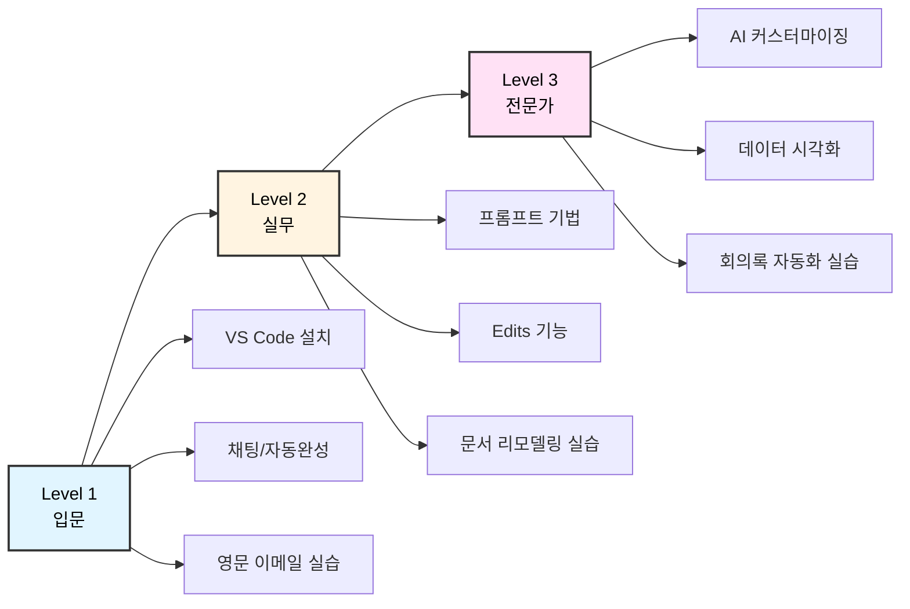

**예상 학습 시간**:
- Level 1 (입문): 30분
- Level 2 (실무): 1시간
- Level 3 (전문가): 1시간 30분
- **총 소요 시간**: 약 3시간

**학습 방법**:
1. 각 섹션의 체크박스 `- [ ]`를 활용하여 학습 진도를 체크하세요.
2. Workbook 실습은 반드시 직접 따라 하며 체득하세요.
3. Key Takeaways와 퀴즈로 핵심 내용을 복습하세요.

---

## 🤔 왜 ChatGPT가 아닌 VS Code + Copilot인가요?

### 이미 ChatGPT/Claude를 쓰고 있는데, 왜 배워야 하나요?

"저는 이미 ChatGPT로 문서 작업을 하고 있어요. 충분히 편리한데, 왜 또 다른 도구를 배워야 하나요?"

많은 분들이 이런 질문을 하십니다. ChatGPT, Claude, Gemini 같은 웹 기반 AI는 분명 훌륭한 도구입니다. 하지만 **여러 파일을 동시에 다루는 행정 업무**에서는 VS Code + Copilot이 훨씬 효율적입니다. 마치 식칼과 가위의 차이처럼, 용도에 맞는 도구를 선택하는 것이 중요합니다.

간단한 비교로 시작해볼까요?

### 실제 업무 시나리오로 비교해봅시다

#### 📊 시나리오: 5개 학과의 수강신청 안내문 작성

각 단과대학마다 비슷하지만 조금씩 다른 수강신청 안내문을 만들어야 하는 상황입니다. 두 가지 방법을 비교해보겠습니다.

| 단계 | 웹 기반 AI (ChatGPT/Claude) | VS Code + Copilot |
|------|--------------------------|------------------|
| **1. 준비** | • 브라우저 새 탭 열기<br>• ChatGPT 접속<br>• 프롬프트 입력 | • VS Code에서 폴더 열기<br>• 5개 파일 미리보기로 확인 |
| **2. 작업** | • 첫 번째 학과 내용 생성<br>• 전체 텍스트 복사<br>• Word/한글 붙여넣기<br>• 파일 저장<br>• **반복 5번** | • 첫 번째 파일에서 Copilot 호출<br>• 나머지 4개 파일에 자동 적용<br>• 실시간 미리보기 확인 |
| **3. 수정** | • 공통 수정사항 발견<br>• 5개 파일 다시 열기<br>• 하나씩 수정<br>• 다시 저장 | • 전체 선택 후 일괄 수정<br>• Copilot이 패턴 학습해 제안<br>• 한 번에 적용 |
| **4. 완료** | • 파일 위치 확인<br>• 버전 관리 수동 처리 | • 자동 저장 완료<br>• 변경 이력 자동 기록 |
| **⏱️ 소요 시간** | **약 25분** | **약 10분 (60% 절약)** |
| **반복 작업** | 복사-붙여넣기 5회 반복 | 한 번 설정 후 자동 적용 |
| **수정 용이성** | 각 파일 개별 수정 필요 | 패턴 기반 일괄 수정 |

#### 🔄 작업 흐름 비교

**웹 기반 AI의 작업 흐름:**

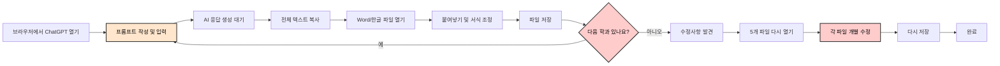

**VS Code + Copilot의 작업 흐름:**

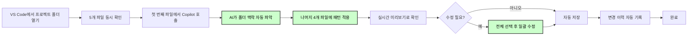

### 핵심 차이점 3가지

#### 1. 📁 폴더 기반 맥락 이해

**웹 기반 AI:**
- 대화창에 입력한 내용만 이해합니다
- 이전 파일의 패턴을 기억하지 못합니다
- 매번 같은 설명을 반복해야 합니다

**VS Code + Copilot:**
- 열려 있는 폴더 전체를 분석합니다
- 파일 간의 공통 패턴을 자동으로 파악합니다
- "나머지도 같은 방식으로"라고만 해도 이해합니다

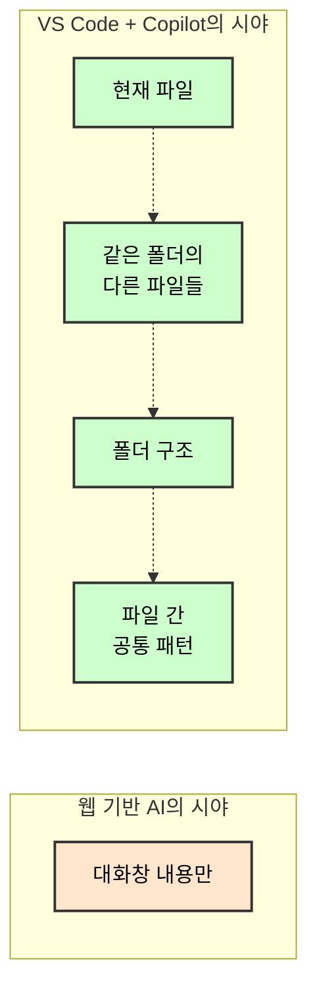

**실제 예시:**

5개 학과의 안내문을 작성할 때:
- **웹 AI**: "인문대학 수강신청 안내문 작성해줘" → 복사 → "사회과학대학 수강신청 안내문 작성해줘" → 복사 (반복)
- **VS Code**: "이 5개 파일을 같은 형식으로 작성해줘" → 한 번에 완료

#### 2. ✏️ 직접 수정 vs 복사-붙여넣기

**웹 기반 AI:**
- AI가 생성 → 복사 → 다른 프로그램에 붙여넣기 → 저장
- 수정이 필요하면 다시 AI에게 요청 → 복사 → 붙여넣기
- 서식이 깨지는 경우가 많습니다

**VS Code + Copilot:**
- 파일 안에서 직접 수정하며 작업합니다
- 수정 사항을 실시간으로 확인할 수 있습니다
- 서식과 구조가 그대로 유지됩니다

💡 **팁**: VS Code에서는 "수정-확인-수정-확인"을 즉시 반복할 수 있어 완성도가 높아집니다.

#### 3. 🎯 일관성 자동 유지

**시나리오**: 5개 안내문을 모두 작성한 후, "신청 기간"을 "2025. 3. 4. ~ 3. 8."에서 "2025. 3. 11. ~ 3. 15."로 변경해야 하는 상황

**웹 기반 AI:**
```
1. 첫 번째 파일 열기 → 수동 수정 → 저장
2. 두 번째 파일 열기 → 수동 수정 → 저장
3. 세 번째 파일 열기 → 수동 수정 → 저장
4. 네 번째 파일 열기 → 수동 수정 → 저장
5. 다섯 번째 파일 열기 → 수동 수정 → 저장
⏱️ 소요 시간: 약 10분
⚠️ 실수 위험: 하나를 빠뜨리거나 잘못 수정할 수 있음
```

**VS Code + Copilot:**
```
1. 전체 파일 선택 (Ctrl+Shift+F)
2. "2025. 3. 4. ~ 3. 8." 검색
3. "2025. 3. 11. ~ 3. 15."로 일괄 변경
⏱️ 소요 시간: 약 30초
✅ 정확성: 모든 파일이 동일하게 수정됨
```

### 그렇다면 ChatGPT는 언제 쓰나요?

두 도구는 경쟁 관계가 아닙니다. **상황에 맞게 함께 사용**하는 것이 가장 효율적입니다.

| 작업 유형 | 추천 도구 | 이유 |
|---------|---------|-----|
| 💭 빠른 질문/답변 | ChatGPT/Claude | • 즉시 답변 가능<br>• 대화형 인터페이스가 편리<br>• 파일 작업이 필요 없음 |
| 📝 단일 문서 작성 | ChatGPT/Claude | • 한 번에 완성하는 작업<br>• 복사-붙여넣기로 충분 |
| 📁 여러 파일 작업 | VS Code + Copilot | • 5개 이상의 유사한 파일<br>• 폴더 구조 기반 작업<br>• 일관성이 중요한 경우 |
| 🔄 문서 일괄 수정 | VS Code + Copilot | • 여러 파일의 공통 내용 변경<br>• 패턴 기반 수정<br>• 버전 관리 필요 시 |
| 💡 아이디어 브레인스토밍 | ChatGPT/Claude | • 자유로운 대화<br>• 다양한 관점 제시<br>• 창의적 제안 |
| 📊 템플릿 기반 반복 작업 | VS Code + Copilot | • 같은 형식 반복<br>• 자동화 가능한 작업<br>• 대량 생성 필요 시 |

#### 🎯 도구 선택 가이드

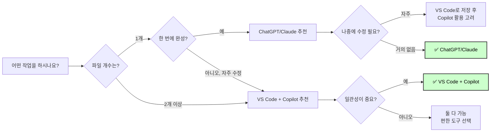

### 💡 실전 활용 팁

**이렇게 함께 사용하세요:**

1. **아이디어 단계**: ChatGPT에서 초안 작성
2. **실행 단계**: VS Code로 복사 후 Copilot으로 확장/수정
3. **유지보수 단계**: VS Code에서 일괄 관리

**예시 워크플로우:**
```
ChatGPT: "학과 소개 페이지 구성 아이디어 제시해줘"
    ↓ (아이디어 확정)
VS Code: 아이디어를 바탕으로 10개 학과 페이지 일괄 생성
    ↓ (3개월 후 수정 필요)
VS Code: 전체 페이지에서 공통 내용 일괄 수정
```

---

## [Level 1: 입문] AI 행정가의 첫걸음

### 1. 준비하기: 나만의 디지털 집무실 만들기
- [ ] 학습 완료

AI와 제대로 협업하려면, 똑똑한 '메모장'이 하나 필요합니다. 우리는 **VS Code**라는 무료 프로그램을 사용할 것입니다. 일반 메모장과 달리, VS Code는 폴더 단위로 파일을 관리할 수 있어 AI가 여러 문서의 맥락을 한 번에 파악하고 더 정확한 답변을 주는 데 큰 도움이 됩니다. 개발자 도구라고 겁먹지 마세요! 우리는 이것을 'AI 비서가 일하는 디지털 집무실'로 사용할 것입니다.

#### 1.1 설치 및 세팅 (2025년 최신)

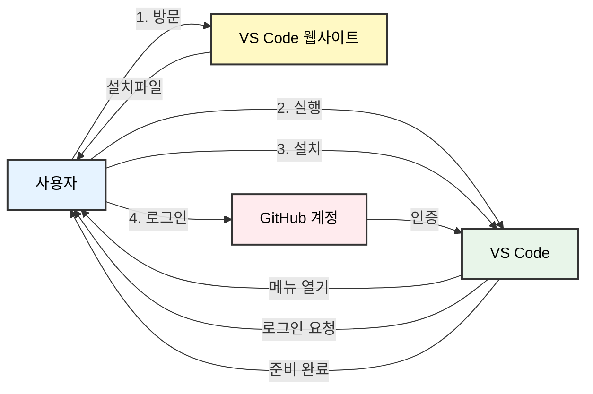

**단계별 설명**:
1.  **Visual Studio Code 설치:** [code.visualstudio.com](https://code.visualstudio.com)에서 다운로드 및 설치.
2.  **GitHub Copilot 확장 프로그램:**
    *   VS Code 왼쪽 '블록 아이콘(Extensions)' 클릭 → `GitHub Copilot` 검색 및 설치.
    *   **중요:** 2025년 버전부터는 `Copilot Chat`이 통합되어 별도 설치가 필요 없습니다. (원활한 사용을 위해 VS Code를 최신 버전으로 업데이트하세요)
3.  **로그인:** 우측 하단 알림창 또는 왼쪽 프로필 아이콘을 눌러 GitHub 계정으로 로그인합니다.

#### 1.2 화면 구성 이해하기
*   **편집기(Editor):** 글을 쓰는 메인 화면 (한글/워드와 같은 곳)
*   **사이드바(Sidebar):** 파일 목록이 보이는 왼쪽 영역
*   **보조 사이드바(Secondary Sidebar):** Copilot 채팅창이 열리는 오른쪽 영역 (`Ctrl/Cmd + Alt + I`로 열고 닫음)

---
## ✅ Key Takeaways
- VS Code와 GitHub Copilot 확장 프로그램을 설치하여 AI 개발 환경을 구축할 수 있다.
- Copilot의 주요 기능은 사이드바 채팅과 편집기 내 자동완성(Ghost Text)으로 나뉜다.

---
### ✍️ 자가 진단 퀴즈

<details>
<summary>Q1. VS Code에서 Copilot Chat 사이드바를 여는 단축키는 무엇인가요?</summary>
**A1.** `Ctrl/Cmd + Alt + I` 입니다.
</details>
<br/>
<details>
<summary>Q2. 2025년 버전 GitHub Copilot을 설치할 때, `Copilot Chat` 확장 프로그램을 별도로 설치해야 하나요?</summary>
**A2.** 아니요, 기본 `GitHub Copilot` 확장 프로그램에 통합되어 있어 별도 설치가 필요 없습니다.
</details>

---

### 2. 기초: 채팅과 자동완성 구분하기
- [ ] 학습 완료

Copilot을 쓰는 방법은 크게 두 가지입니다. 이 두 가지만 구분해도 상위 10%입니다.

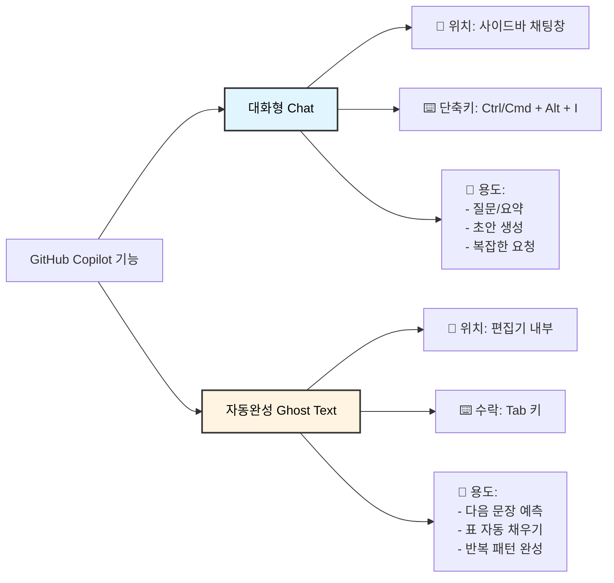

#### 2.1 대화형 (Chat): "이거 해줘"
오른쪽 채팅창에서 비서에게 말을 걸듯이 시키는 것입니다.
*   **언제 쓰나요?** 모르는 걸 물어볼 때, 긴 글을 요약할 때, 처음부터 뭔가를 만들어달라고 할 때.
*   **단축키:** `Ctrl/Cmd + Alt + I` (사이드바 채팅)

#### 2.2 자동완성 (Ghost Text): "내 마음을 읽어줘"
편집기에서 글을 쓰고 있으면, 회색 글씨로 다음 내용을 미리 보여줍니다.
*   **언제 쓰나요?** 문서를 작성하는 도중, 다음 문장이 뻔할 때, 표를 채워 넣을 때.
*   **사용법:** 회색 글씨가 마음에 들면 `Tab` 키를 눌러 수락합니다.

> [!TIP]
> **행정가의 팁:** 보고서 목차를 짤 때는 **자동완성**이 편하고, 보고서 내용을 채울 때는 **채팅**이 편합니다.

---
## ✅ Key Takeaways
- **채팅 (`Ctrl/Cmd + Alt + I`)**: 질문, 요약, 초안 생성 등 복잡하고 창의적인 작업에 사용한다.
- **자동완성 (`Tab` 키)**: 코드나 문맥에 맞는 다음 내용을 제안받아 빠르게 문서를 완성할 때 사용한다.

---
### ✍️ 자가 진단 퀴즈

<details>
<summary>Q1. 긴 글을 요약하거나 처음부터 새로운 글의 초안을 작성할 때 더 적합한 Copilot 기능은 무엇인가요?</summary>
**A1.** 대화형 기능인 **채팅(Chat)**이 더 적합합니다.
</details>
<br/>
<details>
<summary>Q2. 코드를 작성하거나 문맥에 맞는 다음 문장을 추천받고 싶을 때 사용하는 기능과, 제안을 수락하는 키는 무엇인가요?</summary>
**A2.** **자동완성(Ghost Text)** 기능이며, `Tab` 키를 눌러 제안을 수락합니다.
</details>

---

### 3. Workbook 1: 3분 만에 끝내는 영문 이메일
- [ ] 학습 완료

💡 **효율성 팁**: ChatGPT에서 이메일 초안을 받아 복사-붙여넣기로 작업하면 5-7분 걸리지만, VS Code에서 파일을 열고 Copilot과 직접 대화하면 3분이면 충분합니다. **40-50% 시간 절약!**

자, 이제 눈으로만 보지 말고 직접 해봅시다. 해외 대학에 협정 갱신을 요청하는 이메일을 써보겠습니다.

> 💡 **시작하기 전에:** 이메일 작성에 효과적인 프롬프트 작성법을 배우고 싶으신가요? **[부록 C.1: 학과 공지 이메일 작성](#example-1-department-wide-email-drafting)**에서 막연한 지시와 명확한 지시의 차이를 보여주는 "좋은 예시 vs 나쁜 예시"를 확인하세요.

### [Step 1] 템플릿 파일 다운로드
아래 템플릿을 복사하여 `email_draft.md` 파일로 저장하세요.

```markdown
# Level 1 실습: 영문 이메일 초안 작성

이 템플릿을 사용하여 GitHub Copilot으로 영문 이메일 초안을 작성하는 실습을 진행합니다.

---

## 템플릿

**To:** `partner_university@example.com`
**Cc:** `your_team_leader@example.com`
**Subject:** Request for Renewal of Student Exchange Agreement

**[Email Body]**

---

## 실습 지침

1.  VS Code에서 이 파일을 엽니다.
2.  `Ctrl/Cmd + Alt + I`를 눌러 Copilot Chat을 엽니다.
3.  아래 프롬프트를 복사하여 Copilot Chat에 입력하고, 어떻게 이메일이 생성되는지 확인하세요.

프롬프트:
나는 OO대학교 국제교류팀 직원이야. 미국 자매대학인 ABC University에 교환학생 협정 갱신을 요청하는 이메일을 보내야 해. 위 템플릿의 내용을 바탕으로, 정중하고 격식 있는 비즈니스 영어로 본문(Email Body)을 작성해줘.
```

### [Step 2] VS Code에서 파일 열기
1.  VS Code에서 방금 저장한 `email_draft.md` 파일을 엽니다.
2.  템플릿 내용을 확인하세요.

### [Step 3] 상황 설명하기 (채팅)
오른쪽 채팅창(`Ctrl/Cmd + Alt + I`)에 템플릿에 있는 프롬프트를 입력하세요.

> **입력(Input):**
> "나는 OO대학교 국제교류팀 직원이야. 미국 자매대학인 ABC University에 교환학생 협정 갱신을 요청하는 이메일을 보내야 해. 위 템플릿의 내용을 바탕으로, 정중하고 격식 있는 비즈니스 영어로 본문(Email Body)을 작성해줘."

### [Step 4] 결과 확인 및 수정
Copilot이 써준 영어를 복사해서 편집기의 `[Email Body]` 부분에 붙여넣으세요. 그리고 내용을 조금 수정해봅니다.

### [Step 5] 자동완성 체험하기
이메일 마지막에 `Sincerely,` 라고 쓰고 엔터를 쳐보세요.
Copilot이 여러분의 이름이나 직함을 회색 글씨로 제안할 것입니다. `Tab`을 눌러 완성하세요.

> ⚠️ **흔히 하는 실수 피하기**
> 
> Copilot으로 이메일 작성할 때 다음 실수들을 피하세요:
> - **너무 막연함:** "협정 관련 이메일 써줘" → 누가, 무엇을, 언제에 대한 세부사항 누락
> - **역할 미지정:** 국제교류팀 직원임을 언급하지 않음 → 일반적인 톤으로 작성됨
> - **출력 요구사항 누락:** "격식 있는 비즈니스 영어"를 명시하지 않음 → 캐주얼한 문체 생성
> - **맥락 생략:** "갱신"과 "자매대학"을 언급하지 않음 → 이메일 목적이 잘못됨
> 
> 💡 **전문가 팁:** 항상 R.C.O. 공식(역할, 맥락, 출력)을 사용하여 더 나은 결과를 얻으세요. 자세한 예시는 [부록 C.1](#example-1-department-wide-email-drafting)을 참고하세요.

> [!NOTE]
> **성공 확인:** 이메일 초안이 3분 안에 완성되었나요? 그렇다면 Level 1 통과입니다!

---
## ✅ Key Takeaways
- 명확한 역할, 맥락, 원하는 결과 형식을 제공하면 Copilot Chat으로 고품질의 초안(e.g., 영문 이메일)을 빠르게 생성할 수 있다.
- 자동완성 기능은 `Sincerely,` 와 같은 상용구 작성 시 이름이나 직책을 제안하여 반복 작업을 줄여준다.

---
### ✍️ 자가 진단 퀴즈

<details>
<summary>Q1. Copilot에게 원하는 결과물을 더 정확하게 얻기 위해 제공해야 할 3가지 핵심 요소는 무엇인가요? (힌트: R.C.O)</summary>
**A1.** **역할(Role), 맥락(Context), 출력(Output)** 입니다. (이 내용은 Level 2에서 더 자세히 다룹니다.)
</details>
<br/>
<details>
<summary>Q2. 이메일 마지막에 `Sincerely,`를 입력했을 때 Copilot이 내 이름을 제안하는 것은 어떤 기능의 예시인가요?</summary>
**A2.** **자동완성(Ghost Text)** 기능의 예시입니다.
</details>

---

🎯 **왜 VS Code에서 하나요?**
파일을 직접 열어서 Copilot과 대화하면, 복사-붙여넣기 없이 바로 결과가 파일에 반영됩니다. ChatGPT/Claude에서는 초안을 받아 복사한 후 이메일 클라이언트로 옮겨야 하지만, VS Code에서는 이메일 템플릿 파일에서 바로 작성하고 저장할 수 있습니다. (자세한 내용은 [여기](#-왜-chatgpt가-아닌-vs-code--copilot인가요)를 참고하세요)

---

## [Level 2: 실무] 업무 속도 10배 올리기

### 4. 명령어 작성법: 개떡같이 말해도 찰떡같이 알아듣게 시키기
- [ ] 학습 완료

AI에게 일을 잘 시키는 것도 능력입니다. 이를 '프롬프트 엔지니어링'이라고 하지만, 쉽게 말하면 **명확한 지시문 작성하기**입니다. 어렵지 않습니다. 딱 3가지만 기억하세요: **역할(Role), 맥락(Context), 출력(Output)**.

#### 4.1 R.C.O 공식
*   **Role (역할):** "너는 10년 차 베테랑 행정가야."
*   **Context (맥락):** "이번에 교육부 감사 대비 자료를 만들고 있어."
*   **Output (출력):** "감사 지적 사항 예상 리스트를 표로 정리해줘."


**예시:** "너는 베테랑 행정가야(Role) + 교육부 감사 대비(Context) + 표로 정리(Output) → 명확한 결과"

#### 4.2 톤앤매너 조절하기
AI의 말투를 조절할 수 있습니다.
*   "건조하고 객관적인 어조로 써줘." (보고서용)
*   "친절하고 부드러운 어조로 써줘." (안내문용)
*   "핵심만 요약해서 개조식으로 써줘." (임원 보고용)

---
## ✅ Key Takeaways
- R.C.O (역할, 맥락, 출력) 공식을 사용하면 AI에게 명확하고 효과적으로 작업을 지시할 수 있다.
- "건조하게", "친절하게", "개조식으로" 등 톤앤매너를 지정하여 결과물의 스타일을 제어할 수 있다.

---
### ✍️ 자가 진단 퀴즈

<details>
<summary>Q1. AI에게 일을 시킬 때 기억해야 할 R.C.O 공식의 3가지 요소는 무엇인가요?</summary>
**A1.** 역할(Role), 맥락(Context), 출력(Output)입니다.
</details>

---

### 5. Copilot Edits: 여러 파일을 한 번에 수정하기
- [ ] 학습 완료

**[2025 New Feature]**
지금까지는 채팅창에서 복사해서 붙여넣었죠? 이제는 Copilot이 직접 파일을 수정하게 시킬 수 있습니다. 이것이 바로 **Copilot Edits**입니다.

#### 5.1 사용법
1.  채팅창(`Ctrl/Cmd + Alt + I`) 하단의 모드를 **'Edits'**로 변경합니다.
2.  수정하고 싶은 파일들을 채팅창으로 드래그하거나, `#` 키를 누르고 파일명을 입력하여 선택합니다.
3.  명령을 내립니다.
    > "여기 있는 5개 파일의 연도를 모두 2024년에서 2025년으로 바꿔줘. 그리고 문서 상단에 '대외비' 표시를 추가해줘."
4.  Copilot이 수정 계획을 보여줍니다. **'확인(Accept)'**을 누르면 파일이 실제로 수정됩니다.

```mermaid
graph LR
    A[1. Edits 모드로 변경] --> B[2. 파일 선택 (#)];
    B --> C[3. 수정 명령 내리기];
    C --> D{4. 수정 계획 검토};
    D -- 수락 --> E[5. 파일 자동 수정 완료];
    D -- 거절 --> F[취소];

    style A fill:#f9f9f9,stroke:#333,stroke-width:2px,color:#000
    style B fill:#f9f9f9,stroke:#333,stroke-width:2px,color:#000
    style C fill:#f9f9f9,stroke:#333,stroke-width:2px,color:#000
    style D fill:#fff9c4,stroke:#333,stroke-width:2px,color:#000
    style E fill:#e8f5e9,stroke:#333,stroke-width:2px,color:#000
    style F fill:#ffebee,stroke:#333,stroke-width:2px,color:#000
```

#### 5.2 언제 쓰나요?
*   여러 파일의 양식을 통일할 때
*   규정이 바뀌어서 모든 문서의 특정 문구를 수정해야 할 때
*   단순 반복 작업을 한 방에 끝내고 싶을 때

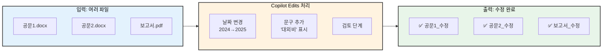
**효율:** 파일 3개 × 5분 = 15분 작업 → **1분으로 단축**

---
## ✅ Key Takeaways
- Copilot Edits 기능은 여러 파일의 내용을 한 번에 수정하는 강력한 기능이다.
- 채팅창에서 Edits 모드를 활성화하고, `#` 키로 파일을 참조하여 명령을 내릴 수 있다.
---
### ✍️ 자가 진단 퀴즈
<details>
<summary>Q1. 여러 파일의 연도를 한 번에 바꾸거나, 모든 문서에 특정 문구를 추가하고 싶을 때 가장 유용한 기능은 무엇인가요?</summary>
**A1.** Copilot Edits 기능입니다.
</details>

---

### 5.5 Workbook 2.5: 연례 보고서 데이터 정리하기
- [ ] 학습 완료

💡 **효율성 팁**: ChatGPT에서 데이터를 복사-붙여넣기하여 표로 정리받으면 10분 정도 걸리지만, VS Code에서 파일을 열고 Copilot과 작업하면 4분이면 충분합니다. **60% 시간 절약!**

대학 행정 업무에서는 연례 보고서 작성을 위해 입학 통계, 예산 데이터, 성과 지표 등을 정리해야 하는 경우가 많습니다. Copilot을 활용하여 데이터를 효율적으로 구조화하는 방법을 배워봅시다.

> 💡 **시작하기 전에:** 데이터 정리에 효과적인 프롬프트 작성법을 보고 싶으신가요? **[부록 C.3: 연례 보고서 데이터 정리](#example-3-annual-report-data-compilation)**에서 "좋은 예시 vs 나쁜 예시"를 확인하세요.

#### [Step 1] 원본 데이터 준비하기

`enrollment_data.md` 파일을 생성하고 다음 샘플 데이터를 입력하세요:

```markdown
# 2022-2024 입학 현황 데이터

연례 보고서 작성을 위한 단과대학별 학생 입학 현황입니다.

## 원본 데이터
2022년 공과대학: 1,245명
2022년 경영대학: 890명
2022년 인문대학: 672명
2022년 자연과학대학: 534명

2023년 공과대학: 1,298명
2023년 경영대학: 923명
2023년 인문대학: 645명
2023년 자연과학대학: 567명

2024년 공과대학: 1,356명
2024년 경영대학: 981명
2024년 인문대학: 638명
2024년 자연과학대학: 589명

전체 예산: 2022년=450억원, 2023년=480억원, 2024년=520억원
```

#### [Step 2] 구체적인 프롬프트 작성하기

Copilot Chat(`Ctrl/Cmd + Alt + I`)을 열고 다음과 같이 구조화된 프롬프트를 입력하세요:

> **입력(Input):**
> 
> "저는 기획처 직원으로 연례 보고서를 준비하고 있습니다. 위의 입학 현황 데이터를 사용하여 다음 사양대로 요약 표를 만들어주세요:
> 
> **역할(Role):** 통계 자료를 정리하는 기획처 행정직원
> **맥락(Context):** 임원 발표용 연도별 입학 현황 비교 필요
> **출력 요구사항(Output):**
> 1. 마크다운 표 생성: 단과대학 | 2022년 | 2023년 | 2024년 | 3개년 증감률(%) 컬럼으로 구성
> 2. 각 단과대학별로 2022년 대비 2024년 증감률(%) 계산
> 3. 표 하단에 전체 단과대학 합계를 나타내는 '총계' 행 추가
> 4. 표 아래에 입학 추세를 분석한 문장 2-3개 작성
> 5. 엑셀에 복사-붙여넣기 가능한 형식으로 작성"

#### [Step 3] 표 + 추세 분석 요청하기

Copilot이 다음과 같이 적절한 형식의 표를 생성할 것입니다:

| 단과대학 | 2022년 | 2023년 | 2024년 | 3개년 증감률(%) |
|:---------|-------:|-------:|-------:|---------------:|
| 공과대학 | 1,245 | 1,298 | 1,356 | +8.9% |
| 경영대학 | 890 | 923 | 981 | +10.2% |
| 인문대학 | 672 | 645 | 638 | -5.1% |
| 자연과학대학 | 534 | 567 | 589 | +10.3% |
| **총계** | **3,341** | **3,433** | **3,564** | **+6.7%** |

**추세 분석:** 전체 입학생 수는 3개년 동안 6.7% 증가했으며, 자연과학대학(+10.3%)과 경영대학(+10.2%)에서 가장 높은 성장률을 보였습니다. 인문대학은 5.1% 감소하여 전략적 검토가 필요합니다.

#### [Step 4] 계산 결과 검증하기

항상 다음 사항을 확인하세요:
- ✅ 증감률이 정확히 계산되었는지 확인
- ✅ 총계가 각 열의 합계와 일치하는지 확인
- ✅ 연도 레이블이 데이터와 일치하는지 확인
- ✅ 추세 분석에 핵심 인사이트가 포함되어 있는지 확인

> ⚠️ **흔히 하는 실수 피하기**
> 
> - **막연한 요청:** "보고서용으로 이 데이터 정리해줘" → 형식이나 분석 방법 미지정
> - **구조 누락:** 표 컬럼을 명시하지 않음 → 일관성 없는 출력 형식
> - **맥락 생략:** "임원 발표용"을 언급하지 않음 → 지나치게 상세한 분석
> - **검증 생략:** 계산 확인 없이 출력 수락 → 데이터 정확성 오류
> 
> 💡 **전문가 팁:** 스프레드시트에 붙여넣기할 예정이라면 항상 "엑셀 호환 형식"을 요청하세요. 더 많은 예시는 [부록 C.3](#example-3-annual-report-data-compilation)을 참고하세요.

#### [Step 5] 엑셀 형식으로 내보내기

1. 생성된 마크다운 표를 복사하세요
2. Excel 또는 Google Sheets를 여세요
3. 직접 붙여넣기 하세요 (Ctrl/Cmd + V)
4. 표 구조가 자동으로 셀로 변환됩니다

> [!NOTE]
> **성공 확인:** Copilot이 2분 안에 정확한 표와 추세 분석을 생성했나요? 그렇다면 데이터 정리를 마스터하셨습니다!

---
## ✅ Key Takeaways
- 역할, 맥락, 출력 사양이 포함된 구조화된 프롬프트는 잘 형식화된 데이터 표를 생성합니다
- 여러 번 수정하는 것을 피하려면 계산 요구사항(백분율, 합계, 추세)을 미리 명시하세요
- 스프레드시트 소프트웨어로 전송해야 하는 출력물에는 "엑셀 호환 형식"을 요청하세요
- 공식 보고서에 사용하기 전에 모든 계산을 검증하세요

---
### ✍️ 자가 진단 퀴즈

<details>
<summary>Q1. 데이터 정리를 요청할 때 정확한 결과를 얻기 위해 프롬프트에 포함해야 할 3가지 요소는 무엇인가요?</summary>
**A1.** **역할(Role)**(본인의 업무), **맥락(Context)**(데이터의 용도), **출력(Output)**(필요한 형식과 계산) 입니다.
</details>
<br/>
<details>
<summary>Q2. 데이터 표에서 Copilot의 계산을 항상 검증해야 하는 이유는 무엇인가요?</summary>
**A2.** AI는 특히 복잡한 백분율 계산에서 수학적 오류를 만들 수 있습니다. 공식 보고서에 사용하기 전에 항상 합계와 백분율을 확인하세요.
</details>

---

🎯 **왜 VS Code에서 하나요?**
데이터 파일을 직접 열어서 Copilot과 작업하면, 원본 데이터를 보면서 즉시 표를 생성하고 검증할 수 있습니다. ChatGPT에서는 데이터를 복사해서 붙여넣고, 결과를 다시 복사해서 스프레드시트로 옮겨야 하지만, VS Code에서는 마크다운 파일에서 바로 작업하여 이중 복사 과정을 생략할 수 있습니다. (자세한 내용은 [여기](#-왜-chatgpt가-아닌-vs-code--copilot인가요)를 참고하세요)

---

### 6. Workbook 2: 작년 보고서를 올해 버전으로 리모델링하기
- [ ] 학습 완료

💡 **효율성 팁**: ChatGPT에서 보고서 내용을 복사-붙여넣기하고 수정 지시를 여러 번 반복하면 8분 정도 걸리지만, VS Code에서 Copilot Edits로 여러 파일을 한 번에 수정하면 4분이면 충분합니다. **50% 시간 절약!**

작년에 선배가 쓴 훌륭한 사업계획서가 있습니다. 이걸 바탕으로 올해 버전을 만들어봅시다.

### [Step 1] 준비물 챙기기
1.  작년 사업계획서 파일(`plan_2024.md`)을 준비합니다. 아래 템플릿을 다운로드하여 사용하세요.
2.  올해의 중점 추진 과제가 담긴 메모(`memo_2025.txt`)를 준비합니다. 아래 템플릿을 다운로드하여 사용하세요.

#### 📥 템플릿 1: `plan_2024.md` (작년 사업계획서)

```markdown
# 2024년 사업 계획서 (초안)

---
<!--
실습 지침:
1. 이 문서를 바탕으로 Copilot Edits 기능을 사용하여 '2025년 사업 계획서'를 만들어 보세요.
2. 아래의 '분기별 목표'와 '주요 결과(OKR)' 테이블을 Copilot을 이용해 채워보세요.
3. 예를 들어, 채팅창에 "아래 1분기 목표에 대한 세부 실행 방안 3가지를 제안해줘" 라고 요청할 수 있습니다.
-->

## 1. 2024년 1분기 목표
- **목표:** 신입생 대상 AI 활용 교육 프로그램 안착
- **주요 결과 (목표 및 핵심 결과지표 - OKR):**
    | Key Result | 시작 값 | 목표 값 | 달성률 |
    | :--- | :--- | :--- | :--- |
    | 신입생 OT 만족도 | 0% | 90% | |
    | Copilot 활용 가이드 조회수 | 0 | 1,000 | |

## 2. 2024년 2분기 목표
- **목표:** 전 교직원 대상 AI 활용 확산
- **주요 결과 (OKR):**
    | Key Result | 시작 값 | 목표 값 | 달성률 |
    | :--- | :--- | :--- | :--- |
    | 부서별 AI 활용 사례 발굴 | 0건 | 10건 | |
    | 월간 AI 뉴스레터 구독률 | 0% | 50% | |

<!-- 이하 3, 4분기 목표 ... -->
```

#### 📥 템플릿 2: `memo_2025.txt` (올해 중점 추진 과제 메모)

```text
# 2025년 중점 추진 과제 (브레인스토밍 메모)

- (실습 지침) 이 비정형 텍스트를 Copilot을 사용하여 아래와 같이 '정제된 메모' 형식으로 바꿔보세요.
  - 주제별로 그룹화
  - 각 항목을 명확한 문장으로 다듬기
  - 날짜는 YYYY-MM-DD 형식으로 통일

---
(원본 메모)

- 내년도 예산안... 5% 증액해야 함. 2025년 1월까지 보고 완료.
- 글로벌 역량 강화 프로그램 새로 만들어야 할 듯. 3월 시작 목표.
- AI 챗봇 도입 검토... 근데 정보 유출 위험은?
- 2025/05/15에 개교기념일 행사 있음.
- 작년에 했던 교직원 연수, 올해는 메타버스에서 해볼까?
- 스마트 캠퍼스 구축 사업, 1단계 완료 보고서 필요. 2025년 2월 말.
```

### [Step 2] Copilot Edits 소환
1.  채팅창을 **Edits 모드**로 바꿉니다.
2.  두 파일을 모두 참조(`@`)시킵니다.

### [Step 3] 명령 내리기
> **입력(Input):**
> "작년 계획서(`plan_2024.md`)를 바탕으로 `plan_2025.md`를 새로 만들어줘.
> 단, `memo_2025.txt`에 있는 올해 중점 과제를 반영해서 '추진 전략' 부분을 수정해야 해.
> 날짜는 모두 2025년으로 업데이트하고, 예산은 작년 대비 5% 증액해서 계산해줘."

### [Step 4] 검토 및 승인
Copilot이 수정한 내용을 보여줄 겁니다.
*   빨간색: 삭제된 내용
*   초록색: 추가된 내용
내용이 맞다면 **'Accept'**를 눌러 저장하세요.

> [!TIP]
> **성공 확인:** 1시간 걸릴 '복붙'과 '수정' 작업이 5분 만에 끝났나요? 축하합니다. 여러분은 이제 '실무 레벨'을 마스터했습니다.

---
## ✅ Key Takeaways
- 기존 문서와 추가 요구사항(메모)을 함께 참조하여 새로운 문서를 재구성하는 복잡한 작업을 Copilot에게 맡길 수 있다.
- 날짜 업데이트, 예산 증액 계산 등 단순 계산 및 수치 변경 작업도 프롬프트로 자동화할 수 있다.
---
### ✍️ 자가 진단 퀴즈
<details>
<summary>Q1. 작년 사업계획서와 올해의 변경사항 메모를 함께 주고 올해 사업계획서를 만들게 하는 실습은 어떤 기능의 활용 예시인가요?</summary>
**A1.** 여러 파일을 참조하여 수정하는 Copilot Edits 기능의 심화 활용 예시입니다.
</details>

---

## [Level 3: 전문가] 나만의 AI 비서단 운영

### 7. Agents & Instructions: 부서 맞춤형 AI 만들기
- [ ] 학습 완료

이제 Copilot을 우리 부서 전용 직원으로 교육시킬 차례입니다.

#### 7.1 맞춤형 지침 (.github/copilot-instructions.md)
매번 "공손하게 말해", "날짜는 YYYY.MM.DD로 해"라고 잔소리하기 지치셨나요?
프로젝트 폴더에 `.github/copilot-instructions.md` 파일을 만들고 규칙을 적어두면, Copilot이 이 규칙을 항상 따릅니다.

> **예시:**
> 1. 모든 문서는 '대학혁신지원사업 관리 지침'을 준수할 것.
> 2. 금액은 천 원 단위로 절사할 것.
> 3. 학생 개인정보는 마스킹(***) 처리할 것.

#### 7.2 AI 페르소나 (AI 전문 보조자)
**[2025 New Feature]**
채팅창에서 `@`를 누르면 다양한 전문 AI 도우미(에이전트)를 호출할 수 있습니다.
*   `@workspace`: **현재 작업 중인 프로젝트 폴더 내의** 모든 문서를 파악하고 있는 비서
*   `@terminal`: 복잡한 명령어를 대신 쳐주는 비서
*   `@vscode`: VS Code 사용법을 알려주는 비서

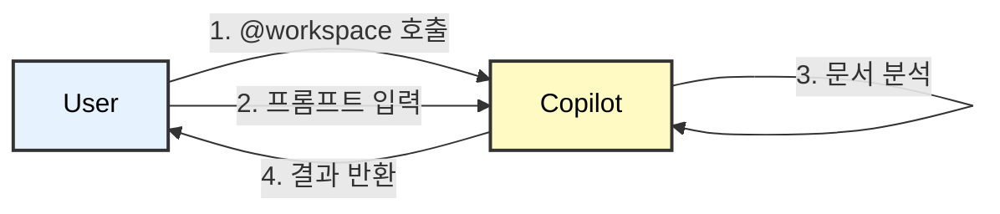

---
## ✅ Key Takeaways
- `.github/copilot-instructions.md` 파일을 통해 프로젝트 전반에 걸친 AI의 행동 규칙을 미리 정의할 수 있다.
- `@` 기호를 사용하여 `@workspace`, `@terminal` 등 특정 목적에 특화된 AI 에이전트를 호출할 수 있다.
---
### ✍️ 자가 진단 퀴즈
<details>
<summary>Q1. 프로젝트의 모든 문서에 특정 규칙(예: 날짜 형식)을 Copilot이 항상 따르게 하려면 어떤 파일을 수정해야 하나요?</summary>
**A1.** 프로젝트 루트의 `.github/copilot-instructions.md` 파일입니다.
</details>

🎯 **왜 VS Code에서 하나요?**
여러 파일을 동시에 열고 Copilot Edits로 일괄 수정하면, 파일 간 이동과 반복적인 수정 요청 없이 한 번에 작업이 완료됩니다. ChatGPT에서는 각 문서를 따로 복사-붙여넣기하며 수정해야 하지만, VS Code에서는 작업 공간에 있는 모든 관련 파일을 한 번에 업데이트할 수 있습니다. (자세한 내용은 [여기](#-왜-chatgpt가-아닌-vs-code--copilot인가요)를 참고하세요)

---

### 8. Data & Visualization: 엑셀 없이 분석하고 그림 그리기
- [ ] 학습 완료

#### 8.1 텍스트로 차트 그리기 (Mermaid 다이어그램)
파워포인트에서 도형 그리느라 시간 낭비하지 마세요. "Mermaid"라는 간단한 다이어그램 도구를 사용하면 글자만 쓰면 자동으로 그림이 됩니다.

**[실습] 업무 흐름도 그리기**
아래 코드를 복사해서 붙여넣어 보세요.

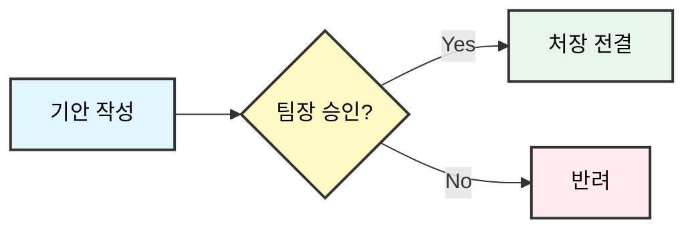

#### 8.2 데이터 분석 (Data Analysis)
엑셀 파일을 열고 채팅창에 물어보면 분석해줍니다.
> "이 엑셀 파일(`survey.xlsx`)에서 만족도가 가장 낮은 항목 3개를 뽑고, 그 이유를 요약해줘."

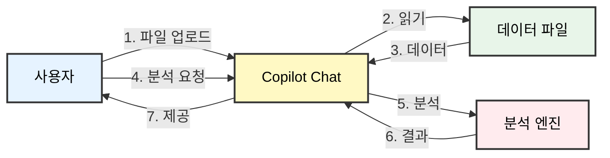
**워크플로우:** 파일 업로드 → 자연어 질문 → Copilot이 자동 분석 → 표/차트 결과 제공

---
## ✅ Key Takeaways
- Mermaid 문법을 사용하면 텍스트만으로 순서도, 간트 차트 등 다양한 다이어그램을 그릴 수 있다.
- Copilot Chat에 데이터 파일(예: .xlsx, .csv)을 참조시키고 자연어로 질문하여 데이터 분석 및 요약을 수행할 수 있다.
---
### ✍️ 자가 진단 퀴즈
<details>
<summary>Q1. 파워포인트 없이 마크다운 문서 내에서 직접 워크플로우 다이어그램을 그리려면 어떤 문법을 사용할 수 있나요?</summary>
**A1.** Mermaid 문법입니다.
</details>

---

### 9. Workbook 3: 회의록 자동화와 시각화 보고서
- [ ] 학습 완료

마지막 관문입니다. 회의 메모를 근사한 보고서로 바꿔봅시다.

💡 **효율성 팁**: ChatGPT 15분 → VS Code 5분 = **70% 시간 절약!**

> 💡 **시작하기 전에:** 회의록 프롬프트를 효과적으로 구조화하는 방법을 배우고 싶으신가요? **[부록 C.2: 회의록 요약](#example-2-meeting-minutes-summarization)**에서 명확한 지시와 막연한 지시의 차이를 보여주는 "좋은 예시 vs 나쁜 예시"를 확인하세요.

> ⚠️ **프롬프트 구조화 팁**
> 
> 효과적인 회의록 처리를 위해:
> - **청중 명시:** 누가 읽을지 언급하세요 (예: "부총장 검토용")
> - **섹션 정의:** 필요한 섹션을 정확히 나열하세요 (요약, 실행 항목, 일정)
> - **형식 지정:** 표 구조, 글자 수 제한, 차트 요구사항을 명시하세요
> - **어조 언급:** "격식 있는 보고체" vs "팀 내부 캐주얼 업데이트"
> 
> 💡 **전문가 팁:** 여기서도 R.C.O. 공식을 사용하세요 - 역할(회의 코디네이터), 맥락(임원 검토), 출력(3줄 요약 + 실행 항목 표). 자세한 예시는 [부록 C.2](#example-2-meeting-minutes-summarization)를 참고하세요.

### [Step 1] 회의 메모 준비
대충 적은 회의 메모(`meeting_note_template.txt`)를 준비합니다. 아래 템플릿을 다운로드하여 사용하세요.

#### 📥 템플릿: `meeting_note_template.txt` (회의록)

```text
# Level 3 실습: 회의록 요약 및 Action Item 도출

- (실습 지침) 아래 가상 회의록을 Copilot Chat에 제공하고, 다음을 요청해보세요.
  1. 이 회의의 핵심 내용을 3줄로 요약해줘.
  2. 회의에서 결정된 Action Item(할 일)을 담당자와 기한을 포함하여 표로 정리해줘.

---
(가상 회의록)

- 참석자: 김팀장, 박선임, 최주임
- 회의일시: 2025년 11월 28일
- 안건: 차세대 통합 정보시스템 구축 킥오프

김팀장: "다들 오셨네요. 오늘부터 우리 부서의 숙원 사업이었던 차세대 시스템 구축을 시작합니다. 박선임, 현재 상황 간단히 브리핑해주세요."

박선임: "네, 현재 업체 선정은 완료되었고, A사 컨소시엄과 계약을 앞두고 있습니다. 이번 주 금요일(12/1)까지 계약서 법무 검토를 마쳐야 합니다. 제가 챙기겠습니다."

최주임: "법무 검토 후에, 다음 주 중으로 예산 집행 품의를 올려야 합니다. 제가 초안을 작성해서 박선임께 다음 주 수요일(12/6)까지 드리겠습니다."

김팠장: "좋습니다. 그리고 가장 중요한 것. 사용자 요구사항 정의서(제안요청서 - RFP)가 아직 미흡하다는 의견이 많습니다. 특히 학생 민원 파트가 부실해요. 최주임, 이건 학생처와 협의해서 다음 주 금요일(12/8)까지 꼭 보강해주세요."

박선임: "알겠습니다. 그럼 제가 계약을, 최주임이 품의와 요구사항 보강을 맡는 것으로 정리하겠습니다."

김팀장: "네, 그렇게 합시다. 첫 단추를 잘 꿰어야 합니다. 다들 잘 부탁합니다."
```

### [Step 2] 구조화된 프롬프트 작성하기

Copilot Chat을 열고 `@workspace`를 사용하여 파일을 참조하세요. 다음과 같은 구조화된 프롬프트 형식을 사용하세요:

> **입력(Input):**
> 
> "@workspace `meeting_note.txt`를 바탕으로 임원 검토용 '주간 업무 보고서'를 작성해야 합니다.
> 
> **역할(Role):** 회의 요약을 준비하는 행정 코디네이터
> **맥락(Context):** 부총장께서 시스템 구축 프로젝트 킥오프에 대한 간결한 업데이트가 필요합니다
> **출력 요구사항(Output):**
> 1. 주요 결정 사항을 3줄로 임원 요약 작성
> 2. 실행 항목 표 생성: 업무 | 담당자 | 마감일 | 상태 컬럼으로 구성
> 3. 프로젝트 일정을 보여주는 Mermaid 간트 차트 생성
> 4. 전체적으로 격식 있는 '보고' 어조 사용
> 5. 총 길이는 300자를 초과하지 않도록"

### [Step 3] 생성된 출력 검토하기

Copilot의 출력에 다음이 포함되어 있는지 확인하세요:
- ✅ **임원 요약:** 주요 결정 사항을 다루는 3개의 간결한 문장
- ✅ **실행 항목 표:** 담당자와 마감일이 포함된 모든 업무
- ✅ **간트 차트:** 프로젝트 일정을 나타내는 Mermaid 구문
- ✅ **적절한 어조:** 임원 검토에 적합한 격식 있는 언어

> [!NOTE]
> **성공 확인:** 1분 안에 표와 차트가 포함된 완벽한 보고서가 생성되었나요? 이제 여러분은 **'AI 행정 마스터'**입니다!

```mermaid
graph LR
    U[사용자] --> W[@workspace];
    W --> F[meeting_note.txt];
    F --> W;
    U --> W;
    W --> AI[Copilot AI];
    AI --> AI;
    AI --> AI;
    AI --> AI;
    AI --> U;
    
    U -- "회의록 파일 참조" --> W;
    W -- "파일 내용 읽기" --> F;
    F -- "회의 내용 전달" --> W;
    U -- ""표 + 차트 보고서 작성"" --> W;
    W -- "구조화 요청" --> AI;
    AI -- "주요 안건 추출" --> AI;
    AI -- "일정 데이터 정리" --> AI;
    AI -- "간트 차트 생성" --> AI;
    AI -- "📊 완성된 보고서 출력" --> U;
    
    Note over U,AI: 변환 시간: 약 30초

    style U fill:#e6f3ff,stroke:#333333,stroke-width:2px,color:#000000
    style W fill:#fff9c4,stroke:#333333,stroke-width:2px,color:#000000
    style F fill:#e8f5e9,stroke:#333333,stroke-width:2px,color:#000000
    style AI fill:#ffebee,stroke:#333333,stroke-width:2px,color:#000000
```
**자동화 결과:** 회의 메모 → 표 정리 → 간트 차트 → 보고서 완성 (30초)

---
## ✅ Key Takeaways
- `@workspace` 에이전트를 활용하면 특정 파일을 참조하여 내용을 요약하고, 표나 차트 등 원하는 형태로 재가공하는 복합적인 작업이 가능하다.
- 단순 메모나 회의록을 체계적인 보고서 형태로 자동 변환하여 문서 작업 시간을 크게 단축할 수 있다.
---
### ✍️ 자가 진단 퀴즈
<details>
<summary>Q1. 내 컴퓨터에 있는 회의록 파일을 바탕으로 시각화 보고서를 만들고 싶을 때, 어떤 에이전트를 호출하는 것이 가장 효과적인가요?</summary>
**A1.** `@workspace` 에이전트입니다.
</details>

🎯 **왜 VS Code에서 하나요?**
회의록 파일을 VS Code에서 열고 Copilot으로 요약, 표 생성, 차트까지 한 번에 요청하면, ChatGPT처럼 내용을 복사-붙여넣기하고 결과를 다시 파일로 옮기는 과정이 필요 없습니다. 파일이 열린 작업 환경에서 바로 문서를 생성하고 저장할 수 있어, 회의록 → 보고서 전환 시간이 10분 이상 단축됩니다. (자세한 내용은 [여기](#-왜-chatgpt가-아닌-vs-code--copilot인가요)를 참고하세요)

---

## 부록

## A. 실전 시나리오 라이브러리 (Before & After)

| 상황 | Before (기존) | After (AI 활용) |
| :--- | :--- | :--- |
| **규정 검색** | 규정집 PDF 5개를 열고 'Ctrl+F'로 검색 | "@workspace '학칙'에서 휴학 신청 기간과 절차만 요약해줘." |
| **공문 작성** | 작년 공문 찾아서 날짜/수신처 수정 (오타 위험) | "작년 공문(`@doc`) 참고해서 수신처만 '교육부'로 바꿔서 새로 써줘." |
| **행사 기획** | 식순, 준비물 리스트 엑셀에 수기 작성 | "신입생 오리엔테이션 식순과 체크리스트를 표로 만들어줘." |

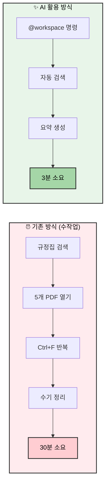
**시간 절감:** 규정 검색 예시 기준 약 **90% 시간 단축** (30분 → 3분)

---

## B. 행정직원을 위한 프롬프트 사전

*   **요약:** "이 문서를 A4 1장 분량으로 요약하고, 핵심 키워드 3개를 뽑아줘."
*   **번역:** "이 이메일을 정중한 비즈니스 영어로 번역해줘."
*   **교정:** "이 보고서에서 오탈자와 비문을 찾아서 고쳐줘."
*   **아이디어:** "우리 대학 홍보 슬로건 10개만 제안해줘. (키워드: 혁신, 미래, 글로벌)"

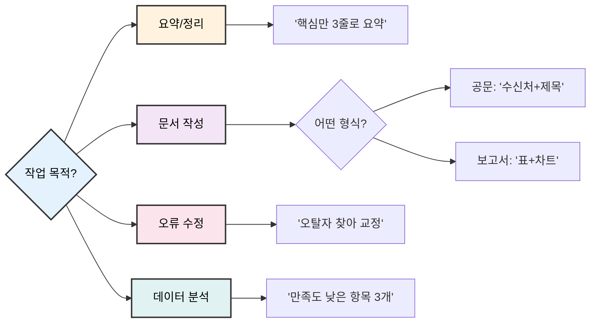
**사용 팁:** 목적 먼저 정하기 → 형식 지정 → 구체적 요구사항 추가

---

## C. 좋은 프롬프트 vs 나쁜 프롬프트 예시

좋은 프롬프트가 무엇인지 이해하는 것이 중요합니다. 아래는 실제 행정 업무 시나리오에서 막연한 프롬프트와 효과적인 프롬프트의 차이를 보여줍니다.

### 💡 좋은 프롬프트를 위한 R.C.O. 공식
- **R**ole (역할): AI가 누구를 돕고 있나요? (예: "당신은 대학 행정직원을 돕고 있습니다...")
- **C**ontext (맥락): 어떤 상황인가요? (예: "우리 부서는 연말 행사를 개최합니다...")
- **O**utput (출력): 어떤 형식이 필요한가요? (예: "정중한 어조로 200자 이메일을 작성해주세요...")

---

### 예시 1: 부서 전체 이메일 작성

#### ❌ 나쁜 프롬프트 (막연함)
```
행사에 대한 이메일을 작성해줘.
```

**문제점:**
- 맥락 없음: 어떤 행사? 누가 받는 사람?
- 어조 안내 없음: 격식체? 반말?
- 형식 요구사항 없음: 길이? 포함할 핵심 사항?

#### ✅ 좋은 프롬프트 (R.C.O. 활용)
```
당신은 대학 총무처 직원이 공식 이메일 초안을 작성하는 것을 돕고 있습니다.

**맥락:** 우리 부서는 12월 22일 오후 6시에 대학 컨퍼런스홀에서 연말 교수진 감사 만찬을 개최합니다. 전체 교수진(약 120명)을 초대해야 합니다.

**출력 요구사항:**
- 정중한 비즈니스 어조로 200자 분량의 이메일 작성
- 포함 사항: 행사 목적, 날짜/시간/장소, RSVP 마감일(12월 15일), 복장(비즈니스 캐주얼)
- 연락처 정보로 마무리 (총무처, 내선 1234)
```

**왜 더 나은가:** 완전한 맥락 제공, 정확한 길이와 어조 명시, 필요한 모든 세부 사항 나열.

---

### 예시 2: 회의록 요약

#### ❌ 나쁜 프롬프트 (막연함)
```
이 회의를 요약해줘.
```

**문제점:**
- 초점 없음: 어떤 측면을 요약? 실행 항목? 결정 사항?
- 형식 없음: 글머리 기호? 문단? 표?
- 청중 고려 없음: 참석자용? 임원용?

#### ✅ 좋은 프롬프트 (R.C.O. 활용)
```
당신은 대학 기획처 직원이 예산 회의를 요약하는 것을 돕고 있습니다.

**맥락:** 이것은 5개 부서장과의 2시간 예산 배분 회의입니다. 회의록이 아래에 첨부되어 있습니다. 요약본은 최종 결정을 내려야 하는 부총장님께 공유될 것입니다.

**출력 요구사항:**
- 다음 섹션으로 구성된 요약본 작성:
  1. 주요 결정 사항 (글머리 기호)
  2. 부서별 예산 배분 (표 형식)
  3. 미해결 문제 (번호 매긴 목록)
  4. 마감일이 있는 실행 항목 (누가/무엇을/언제 형식)
- 전체 요약은 500자 이내로 유지
- 임원 검토에 적합한 전문적인 어조 사용

[여기에 회의록 붙여넣기]
```

**왜 더 나은가:** 청중(부총장) 정의, 정확한 구조 명시, 글자 수 제한 제공, 요약의 목적 설명.

---

### 예시 3: 연간 보고서 데이터 정리

#### ❌ 나쁜 프롬프트 (막연함)
```
보고서를 위해 이 데이터를 정리해줘.
```

**문제점:**
- 데이터 맥락 없음: 어떤 종류의 데이터? 어떤 보고서?
- 시각화 필요 없음: 표? 차트? 텍스트?
- 비교 요구사항 없음: 연도별? 추세?

#### ✅ 좋은 프롬프트 (R.C.O. 활용)
```
당신은 대학 학생처 직원이 2024학년도 학사 보고서를 위한 연간 입학 통계를 정리하는 것을 돕고 있습니다.

**맥락:** 8개 단과대학의 2022년, 2023년, 2024년 원시 입학 데이터가 있습니다. 데이터에는 신입생, 편입생, 휴학자, 졸업생이 포함됩니다. 이것은 이사회에 발표될 것입니다.

**출력 요구사항:**
- 다음을 보여주는 요약 표 작성:
  - 연도별 총 입학자 수 (2022-2024)
  - 전년 대비 백분율 변화
  - 입학 증가율 상위 3개 단과대학
- 중요한 추세 강조 (예: >10% 변화)
- 데이터 추세에 대한 3-4문장 해석 작성
- 형식: 명확한 헤더가 있는 Excel 호환 표

**데이터:**
[여기에 원시 데이터 붙여넣기: 단과대학명, 연도, 입학자 수 등]
```

**왜 더 나은가:** 데이터 유형과 기간 명시, 정확한 표 구조 정의, 추세 분석 요청, 필요한 출력 형식 표시.

---

### 📊 영향 비교

| 프롬프트 유형 | 유용한 결과를 얻는 시간 | 필요한 수정 횟수 | 출력 품질 |
|:------------|:--------------------------|:-----------------------|:---------------|
| ❌ 나쁨 (막연함) | 15-20분 | 3-4회 수정 | 40-60% 사용 가능 |
| ✅ 좋음 (R.C.O.) | 3-5분 | 0-1회 수정 | 85-95% 사용 가능 |

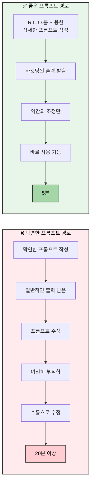

**핵심 포인트:** 상세한 프롬프트를 작성하는 데 2분을 추가로 투자하면 수정 및 수동 교정에서 15분 이상을 절약할 수 있습니다.

---

**"시작이 반입니다. 지금 바로 `Ctrl + Alt + I`를 눌러보세요!"**

---

## 버전 이력 (Version History)

### Version 1.0.0 - 초기 릴리스 (2025. 11. 23.)

**주요 통합 릴리스**

이 올인원 가이드는 여러 소스 파일의 콘텐츠를 대학 행정 직원을 위한 하나의 종합 문서로 통합한 것입니다.

**콘텐츠 구조:**
- **Level 1 (입문)**: 설정, 기초, 첫 실습 (30분)
- **Level 2 (실전)**: 프롬프트 엔지니어링, Copilot Edits, 고급 워크플로 (1시간)
- **Level 3 (전문가)**: 맞춤 지시문, 데이터 시각화, 회의록 자동화 (1.5시간)
- **부록**: 실전 시나리오, 프롬프트 사전, 빠른 참조

**주요 기능:**
- 📊 시각적 학습을 위한 13개의 Mermaid 다이어그램
- ✅ 학습 진도 추적을 위한 대화형 체크박스
- 📝 템플릿이 있는 실습 워크북 연습
- 💡 핵심 요약 및 자가 평가 퀴즈
- 🔗 86개 항목의 종합 목차

**콘텐츠 출처:**
- 주요 출처: `docs/ko/` (구조화된 학습 자료)
- 보조 출처: `staging/refined_content.md` (검토된 콘텐츠)
- 참조: `legacy/` (과거 문서)

**최근 업데이트:**
- 2025. 11. 23.: 앵커 링크가 포함된 종합 목차 추가 (tasks 18.1-18.2)
- 2025. 11. 23.: 서식 규정 준수 검증 - 스타일 위반 0건 (task 18.4)
- 2025. 11. 23.: 이미지 참조 확인 - 100% Mermaid 기반 다이어그램 (task 18.3)
- 2025. 11. 23.: 평이한 언어로 워크플로 재구성 (task 17.3)
- 2025. 11. 23.: 좋은 예시 vs 나쁜 예시 프롬프트 추가 (task 17.2)
- 2025. 11. 23.: 행정 대상 청중을 위한 기술 용어 제거 (task 17.1)
- 2025. 11. 23.: 시각적 개선 완료 - 13개 다이어그램 (tasks 15-16)
- 2025. 11. 23.: 한국어 원본에서 영어 번역 완료 (task 13)

**스타일 준수:**
- Markdown: H1 1개, 논리적 헤더 계층, 언어 식별자가 있는 코드 블록
- 링크: 모든 내부 앵커 기능 정상
- 다이어그램: 네이티브 Mermaid 렌더링 (GitHub/VS Code 호환)

**대상 청중:** 기술적 배경이 최소한인 대학 행정 직원  
**예상 학습 시간:** 총 3시간 (실습 포함)

---

**질문 또는 피드백:**  
다음 링크에서 문제를 보고하세요: https://github.com/sst/opencode

---

*이 문서는 Task Master 워크플로 관리 기능을 갖춘 OpenCode AI를 사용하여 생성되었습니다.*
