# Complete GitHub Copilot Guide for University Administrative Staff (All-in-One Guide)

**Welcome!** This document is a comprehensive guide for administrative professionals who are new to working with AI. Instead of a complex structure with multiple files, you can simply read and follow this single document from top to bottom to learn everything from the basics of Copilot to expert-level usage.

---

## Table of Contents

- [📊 Learning Path Guide](#-learning-path-guide)

### **[Level 1: Introduction - First Steps as an AI Administrator](#level-1-introduction-first-steps-as-an-ai-administrator)**
  - [1. Setup: Creating Your Digital Office](#1-setup-creating-your-digital-office)
    - [1.1 Installation and Setup (2025 Latest)](#11-installation-and-setup-2025-latest)
    - [1.2 Understanding the Screen Layout](#12-understanding-the-screen-layout)
    - [1.5 The 3 Core Principles of Using Generative AI](#15-the-3-core-principles-of-using-generative-ai)
  - [✅ Key Takeaways](#-key-takeaways)
  - [✍️ Self-Assessment Quiz](#-self-assessment-quiz)
  - [2. Fundamentals: Distinguishing Chat from Autocomplete](#2-fundamentals-distinguishing-chat-from-autocomplete)
    - [2.1 Interactive (Chat): "Do This for Me"](#21-interactive-chat-do-this-for-me)
    - [2.2 Autocomplete (Ghost Text): "Read My Mind"](#22-autocomplete-ghost-text-read-my-mind)
  - [✅ Key Takeaways](#-key-takeaways-1)
  - [✍️ Self-Assessment Quiz](#-self-assessment-quiz-1)
  - [3. Workbook 1: Finishing an English Email in 3 Minutes](#3-workbook-1-finishing-an-english-email-in-3-minutes)
    - [Step 1: Download Template File](#step-1-download-template-file)
    - [Step 2: Open File in VS Code](#step-2-open-file-in-vs-code)
    - [Step 3: Describe the Situation (Chat)](#step-3-describe-the-situation-chat)
    - [Step 4: Check and Edit Results](#step-4-check-and-edit-results)
    - [Step 5: Experience Autocomplete](#step-5-experience-autocomplete)
  - [✅ Key Takeaways](#-key-takeaways-2)
  - [✍️ Self-Assessment Quiz](#-self-assessment-quiz-2)

### **[Level 2: Practical - Increasing Work Speed 10x](#level-2-practical-increasing-work-speed-10x)**
  - [4. Writing Good Instructions: Making AI Understand You Perfectly](#4-writing-good-instructions-making-ai-understand-you-perfectly)
    - [4.1 The R.C.O Formula](#41-the-rco-formula)
    - [4.2 Adjusting Tone and Manner](#42-adjusting-tone-and-manner)
  - [✅ Key Takeaways](#-key-takeaways-3)
  - [✍️ Self-Assessment Quiz](#-self-assessment-quiz-3)
  - [5. Copilot Edits: Modifying Multiple Files at Once](#5-copilot-edits-modifying-multiple-files-at-once)
    - [5.1 How to Use](#51-how-to-use)
    - [5.2 When to Use?](#52-when-to-use)
  - [✅ Key Takeaways](#-key-takeaways-4)
  - [✍️ Self-Assessment Quiz](#-self-assessment-quiz-4)
  - [5.5 Workbook 2.5: Compiling Annual Report Data](#55-workbook-25-compiling-annual-report-data)
    - [Step 1: Prepare Your Raw Data](#step-1-prepare-your-raw-data)
    - [Step 2: Write a Detailed Prompt](#step-2-write-a-detailed-prompt)
    - [Step 3: Request Table + Trend Analysis](#step-3-request-table--trend-analysis)
    - [Step 4: Review and Verify Calculations](#step-4-review-and-verify-calculations)
    - [Step 5: Export to Excel Format](#step-5-export-to-excel-format)
  - [✅ Key Takeaways](#-key-takeaways-5)
  - [✍️ Self-Assessment Quiz](#-self-assessment-quiz-5)
  - [6. Workbook 2: Remodeling Last Year's Report into This Year's Version](#6-workbook-2-remodeling-last-years-report-into-this-years-version)
    - [Step 1: Get Your Materials Ready](#step-1-get-your-materials-ready)
    - [Step 2: Summon Copilot Edits](#step-2-summon-copilot-edits)
    - [Step 3: Give the Command](#step-3-give-the-command)
    - [Step 4: Review and Approve](#step-4-review-and-approve)
  - [✅ Key Takeaways](#-key-takeaways-6)
  - [✍️ Self-Assessment Quiz](#-self-assessment-quiz-6)

### **[Level 3: Expert - Operating Your Own AI Assistant Team](#level-3-expert-operating-your-own-ai-assistant-team)**
  - [7. Agents & Instructions: Creating Department-Specific AI](#7-agents--instructions-creating-department-specific-ai)
    - [7.1 Custom Instructions (.github/copilot-instructions.md)](#71-custom-instructions-githubcopilot-instructionsmd)
    - [7.2 AI Personas (AI Assistants)](#72-ai-personas-ai-assistants)
  - [✅ Key Takeaways](#-key-takeaways-7)
  - [✍️ Self-Assessment Quiz](#-self-assessment-quiz-7)
  - [8. Data & Visualization: Analyzing and Drawing Without Excel](#8-data--visualization-analyzing-and-drawing-without-excel)
    - [8.1 Drawing Charts with Text (Mermaid Diagrams)](#81-drawing-charts-with-text-mermaid-diagrams)
    - [8.2 Data Analysis](#82-data-analysis)
  - [✅ Key Takeaways](#-key-takeaways-8)
  - [✍️ Self-Assessment Quiz](#-self-assessment-quiz-8)
  - [9. Workbook 3: Meeting Minutes Automation and Visualization Reports](#9-workbook-3-meeting-minutes-automation-and-visualization-reports)
    - [Step 1: Prepare Meeting Notes](#step-1-prepare-meeting-notes)
    - [Step 2: Write a Structured Prompt](#step-2-write-a-structured-prompt)
    - [Step 3: Review Generated Output](#step-3-review-generated-output)
  - [✅ Key Takeaways](#-key-takeaways-9)
  - [✍️ Self-Assessment Quiz](#-self-assessment-quiz-9)

### **[Appendix](#appendix)**
  - [A. Practical Scenario Library (Before & After)](#a-practical-scenario-library-before--after)
  - [B. Prompt Dictionary for Administrative Staff](#b-prompt-dictionary-for-administrative-staff)
  - [C. Good vs Bad Prompt Examples](#c-good-vs-bad-prompt-examples)
    - [💡 The R.C.O. Formula for Good Prompts](#-the-rco-formula-for-good-prompts)
    - [Example 1: Department-Wide Email Drafting](#example-1-department-wide-email-drafting)
    - [Example 2: Meeting Minutes Summarization](#example-2-meeting-minutes-summarization)
    - [Example 3: Annual Report Data Compilation](#example-3-annual-report-data-compilation)
    - [📊 Impact Comparison](#-impact-comparison)

---

## 📊 Learning Path Guide

This guide is structured as a 3-level learning path:


**Expected Learning Time**:
- Level 1 (Introduction): 30 minutes
- Level 2 (Practical): 1 hour
- Level 3 (Expert): 1 hour 30 minutes
- **Total Time Required**: Approximately 3 hours

**Learning Method**:
1. Use the checkboxes `- [ ]` in each section to track your learning progress.
2. Be sure to practice the Workbook exercises hands-on.
3. Review key concepts using Key Takeaways and quizzes.

---

## 🤔 Why VS Code + Copilot Instead of ChatGPT?

### I'm Already Using ChatGPT/Claude – Why Learn Another Tool?

"I'm already using ChatGPT for document work. It's convenient enough. Why should I learn yet another tool?"

Many people ask this question. Web-based AI tools like ChatGPT, Claude, and Gemini are certainly excellent tools. However, **for administrative tasks involving multiple files simultaneously**, VS Code + Copilot is far more efficient. Just like the difference between a kitchen knife and scissors, choosing the right tool for the job is important.

Let's start with a simple comparison.

### Let's Compare with a Real Work Scenario

#### 📊 Scenario: Creating Course Registration Notices for 5 Departments

You need to create course registration notices for each college – similar but slightly different documents. Let's compare two approaches.

| Step | Web-based AI (ChatGPT/Claude) | VS Code + Copilot |
|------|------------------------------|------------------|
| **1. Preparation** | • Open new browser tab<br>• Access ChatGPT<br>• Enter prompt | • Open folder in VS Code<br>• Preview all 5 files |
| **2. Work** | • Generate first department content<br>• Copy entire text<br>• Paste into Word/HWP<br>• Save file<br>• **Repeat 5 times** | • Call Copilot in first file<br>• Auto-apply to remaining 4 files<br>• Check real-time preview |
| **3. Revision** | • Discover common changes needed<br>• Reopen 5 files<br>• Edit one by one<br>• Save again | • Select all and batch edit<br>• Copilot learns pattern and suggests<br>• Apply at once |
| **4. Completion** | • Confirm file locations<br>• Manual version control | • Auto-save complete<br>• Change history auto-recorded |
| **⏱️ Time Required** | **~25 minutes** | **~10 minutes (60% savings)** |
| **Repetitive Tasks** | Copy-paste repeated 5 times | Set once, auto-apply |
| **Edit Flexibility** | Each file needs individual editing | Pattern-based batch editing |

#### 🔄 Workflow Comparison

**Web-based AI Workflow:**


**VS Code + Copilot Workflow:**


### 3 Key Differences

#### 1. 📁 Folder-Based Context Understanding

**Web-based AI:**
- Understands only what you type in the chat window
- Doesn't remember patterns from previous files
- Requires repeating the same explanation every time

**VS Code + Copilot:**
- Analyzes the entire open folder
- Automatically identifies common patterns across files
- Understands even when you just say "do the rest the same way"


**Real Example:**

When creating notices for 5 departments:
- **Web AI**: "Create course registration notice for College of Humanities" → copy → "Create course registration notice for College of Social Sciences" → copy (repeat)
- **VS Code**: "Create these 5 files in the same format" → done at once

#### 2. ✏️ Direct Editing vs Copy-Paste

**Web-based AI:**
- AI generates → copy → paste into another program → save
- If edits needed, request AI again → copy → paste
- Formatting often breaks

**VS Code + Copilot:**
- Work by editing directly within files
- See changes in real-time
- Format and structure remain intact

💡 **Tip**: In VS Code, you can instantly repeat "edit-check-edit-check" cycles, resulting in higher quality output.

#### 3. 🎯 Automatic Consistency Maintenance

**Scenario**: After writing all 5 notices, you need to change "Registration Period" from "March 4–8, 2025" to "March 11–15, 2025"

**Web-based AI:**
```
1. Open first file → manual edit → save
2. Open second file → manual edit → save
3. Open third file → manual edit → save
4. Open fourth file → manual edit → save
5. Open fifth file → manual edit → save
⏱️ Time: ~10 minutes
⚠️ Error risk: Might miss one or edit incorrectly
```

**VS Code + Copilot:**
```
1. Select all files (Ctrl+Shift+F)
2. Search "March 4–8, 2025"
3. Batch replace with "March 11–15, 2025"
⏱️ Time: ~30 seconds
✅ Accuracy: All files edited identically
```

### So When Should I Use ChatGPT?

These two tools aren't competitors. **Using them together based on the situation** is most efficient.

| Task Type | Recommended Tool | Reason |
|-----------|-----------------|--------|
| 💭 Quick Q&A | ChatGPT/Claude | • Instant answers<br>• Conversational interface is convenient<br>• No file work needed |
| 📝 Single document | ChatGPT/Claude | • One-time completion task<br>• Copy-paste is sufficient |
| 📁 Multiple files | VS Code + Copilot | • 5+ similar files<br>• Folder structure-based work<br>• When consistency is critical |
| 🔄 Batch document edits | VS Code + Copilot | • Changing common content across files<br>• Pattern-based editing<br>• When version control needed |
| 💡 Idea brainstorming | ChatGPT/Claude | • Free-flowing conversation<br>• Multiple perspectives<br>• Creative suggestions |
| 📊 Template-based repetitive tasks | VS Code + Copilot | • Repeating same format<br>• Automatable tasks<br>• When mass generation needed |

#### 🎯 Tool Selection Guide


### 💡 Practical Usage Tips

**Use them together like this:**

1. **Idea phase**: Draft in ChatGPT
2. **Execution phase**: Copy to VS Code, expand/edit with Copilot
3. **Maintenance phase**: Batch management in VS Code

**Example Workflow:**
```
ChatGPT: "Suggest structure ideas for department introduction pages"
    ↓ (Finalize idea)
VS Code: Generate 10 department pages at once based on idea
    ↓ (3 months later, edits needed)
VS Code: Batch edit common content across all pages
```

---

## [Level 0: Preparation] AI Anxiety Clinic - Clearing Misunderstandings Before We Start

Before we begin, let's address the three most common fears that administrative staff have.

### 1. 🔒 "Does AI steal my data?" (Security)
> **"Is it safe to upload university documents to AI?"**

Many people worry because of news about "personal data leaks." However, the **Enterprise version** we use is different.
*   **Free Version (Public):** Uses user data for training to get smarter. (Do NOT input sensitive data ❌)
*   **Enterprise Version (Copilot):** **Does NOT train on your data.** Input data is encrypted, processed, and immediately discarded. (Safe to input ✅)
*   **Conclusion:** The account provided by the university is safe. However, it's a good habit to mask sensitive personal information like resident registration numbers (***).

### 2. 🤥 "AI lies." (Accuracy)
> **"Can I trust what AI writes?"**

No, you shouldn't trust it blindly. Think of AI as a **"smart intern who works well but sometimes says silly things."**
*   **AI's Role:** Drafting, suggesting ideas, simple repetitive tasks (80% of the work)
*   **Your Role:** Fact-checking, final review, taking responsibility (The remaining 20%)
*   **Conclusion:** AI is not a "truth vending machine" but a "collaboration partner." The final decision-maker is still you.

### 3. 🤖 "Will I be replaced?" (Job Security)
> **"If AI does all my work, will I become obsolete?"**

Calculators didn't replace mathematicians, and Excel didn't replace accountants.
*   **What disappears:** "Boring repetitive tasks" like copy-pasting, simple summarizing, and finding typos.
*   **What remains:** "High-value work" like planning, communication, judgment, and decision-making.
*   **Conclusion:** AI won't replace you. Instead, **"Administrators who use AI well will replace those who don't."** Use this guide to become that "AI-savvy administrator."

---

## [Level 1: Introduction] First Steps as an AI Administrator

### 1. Setup: Creating Your Digital Office
- [ ] Learning Complete

To properly collaborate with AI, you need a smart 'notepad'. We will use a free program called **VS Code**. Unlike regular notepads, VS Code can manage files on a folder-by-folder basis, which greatly helps AI understand the context of multiple documents at once and provide more accurate answers. Don't be intimidated because it's a developer tool! We'll use it as a 'digital office where your AI assistant works'.

#### 1.1 Installation and Setup (2025 Latest)


**Step-by-Step Instructions**:
1.  **Install Visual Studio Code:** Download and install from [code.visualstudio.com](https://code.visualstudio.com).
2.  **GitHub Copilot Extension:**
    *   Click the 'block icon (Extensions)' on the left side of VS Code → Search for `GitHub Copilot` and install.
    *   **Important:** From the 2025 version onwards, `Copilot Chat` is integrated and does not require separate installation.
3.  **Login:** Click the notification in the lower right corner or the profile icon on the left to login with your GitHub account.

#### 1.2 Understanding the Screen Layout
*   **Editor:** The main screen where you write (like Hangul/Word)
*   **Sidebar:** The left area showing the file list
*   **Secondary Sidebar:** The right area where the Copilot chat window opens (open and close with `Ctrl/Cmd + Alt + I`)

---
## ✅ Key Takeaways
- You can build an AI development environment by installing VS Code and the GitHub Copilot extension.
- Copilot's main features are divided into sidebar chat and in-editor autocomplete (Ghost Text).

---
### ✍️ Self-Assessment Quiz

<details>
<summary>Q1. What is the shortcut key to open the Copilot Chat sidebar in VS Code?</summary>
**A1.** It is `Ctrl/Cmd + Alt + I`.
</details>
<br/>
<details>
<summary>Q2. When installing the 2025 version of GitHub Copilot, do you need to install the `Copilot Chat` extension separately?</summary>
**A2.** No, it is integrated into the basic `GitHub Copilot` extension and does not require separate installation.
</details>

---

### 1.5 The 3 Core Principles of Using Generative AI
- [ ] Learning Complete

Before learning how to use the tools, you must first establish the right **'mindset'** for working with AI. Adhering to these 3 principles alone can reduce the failure rate of AI adoption by 90%.

#### Principle 1: Delegation - "Who Does What?"
AI is not omnipotent. Think of it as a **"smart intern with no social experience."**

| Category | 🤖 Tasks for AI (80%) | 👤 Tasks for Humans (20%) |
| :--- | :--- | :--- |
| **Nature** | Drafting, summarizing, translating, data formatting | Final decision making, taking responsibility, sensitive communication |
| **Example** | "Summarize last month's meeting minutes in 3 lines" | "Deciding whether to report this agenda to the President" |
| **Example** | "Convert this table to Excel format" | "Writing a polite refusal email regarding budget cuts" |

> [!TIP]
> **Judgment Criteria:** "Can I take responsibility for this output?" If you cannot take responsibility, you must review it yourself even if you delegate it to AI.

#### Principle 2: Verification - "Trust but Verify"
The most common mistake beginners make is **"copy-pasting AI answers exactly as they are."** This is a shortcut to disaster.

**Human-in-the-Loop Workflow:**

```mermaid
graph LR
    A[Task Instruction] --> B(🤖 AI Generation);
    B --> C{👤 Human Verification};
    C -- Pass --> D[Final Completion];
    C -- Error Found --> E[Correction Instruction];
    E --> B;
    
    style C fill:#fff9c4,stroke:#ff9800,stroke-width:2px
```


*   **Check Numbers:** Always verify budgets, dates, and phone numbers against the original source.
*   **Check URLs:** Actually click on links provided by AI. (They might be fake)
*   **Fact Check:** When AI says "According to university regulations...", look up the actual regulation book.

#### Principle 3: Consistency - "Speaking with One Voice"
When multiple people work on a large project (e.g., University Innovation Support Project Plan), or when working alone over several days, terminology and tone can become inconsistent.

*   **Problem Situation:**
    *   Page 1: "Enrolled Student" / Page 10: "Attendee" / Page 50: "Learner"
    *   Page 1: "We will do..." (Formal) / Page 20: "To do..." (Bullet points)
*   **Solution:**
    *   **Define Terms:** Before starting, instruct AI: "Unify 'student' as 'enrolled student' in this document."
    *   **Unify Tone:** Request: "Write in the same tone as the previous document."
    *   **Use VS Code:** If you put multiple files in one folder (project) and work, Copilot understands the entire context and maintains consistency.

---

### 2. Fundamentals: Distinguishing Chat from Autocomplete
- [ ] Learning Complete

There are two main ways to use Copilot. If you can distinguish between these two, you're in the top 10%.

```mermaid
graph LR
    A[GitHub Copilot Features] --> B[Interactive Chat]
    A --> C[Autocomplete Ghost Text]
    
    B --> B1["📍 Location: Sidebar Chat Window"]
    B --> B2["⌨️ Shortcut: Ctrl/Cmd + Alt + I"]
    B --> B3["🎯 Use:<br/>- Q&A/Summary<br/>- Draft Generation<br/>- Complex Requests"]
    
    C --> C1["📍 Location: Inside Editor"]
    C --> C2["⌨️ Accept: Tab Key"]
    C --> C3["🎯 Use:<br/>- Next Sentence Prediction<br/>- Auto-fill Tables<br/>- Complete Repetitive Patterns"]
    
    style B fill:#e1f5ff,stroke:#333,stroke-width:2px,color:#000
    style C fill:#fff4e1,stroke:#333,stroke-width:2px,color:#000
    style B3 text-align:left
    style C3 text-align:left
```



#### 2.1 Interactive (Chat): "Do This for Me"
This is like talking to an assistant in the right chat window.
*   **When to use?** When asking questions, summarizing long texts, or asking to create something from scratch.
*   **Shortcut:** `Ctrl/Cmd + Alt + I` (Sidebar chat)

#### 2.2 Autocomplete (Ghost Text): "Read My Mind"
When you're writing in the editor, it shows the next content in gray text.
*   **When to use?** While writing a document, when the next sentence is obvious, when filling in tables.
*   **How to use:** Press the `Tab` key to accept if you like the gray text.

> [!TIP]
> **Administrator's Tip:** When creating a report outline, **autocomplete** is convenient, and when filling in the report content, **chat** is more convenient.

---
## ✅ Key Takeaways
- **Chat (`Ctrl/Cmd + Alt + I`)**: Use for complex and creative tasks such as questions, summaries, and draft generation.
- **Autocomplete (`Tab` key)**: Use to quickly complete documents by receiving suggestions for the next content that fits the code or context.

---
### ✍️ Self-Assessment Quiz

<details>
<summary>Q1. Which Copilot feature is more suitable when summarizing long texts or creating a new draft from scratch?</summary>
**A1.** The interactive feature, **Chat**, is more suitable.
</details>
<br/>
<details>
<summary>Q2. What feature do you use when writing code or wanting recommendations for the next sentence that fits the context, and what key do you press to accept the suggestion?</summary>
**A2.** The **Autocomplete (Ghost Text)** feature, and you press the `Tab` key to accept the suggestion.
</details>

---

### 3. Workbook 1: Finishing an English Email in 3 Minutes
- [ ] Learning Complete

Now let's not just look, but actually do it. Let's write an email requesting renewal of an agreement with an overseas university.

💡 **Efficiency Tip**: ChatGPT 5-7 min → VS Code 3 min = **40-50% time saved!**

> 💡 **Before You Start:** Want to learn how to write effective prompts for email drafting? See **[Appendix C.1: Department-Wide Email Drafting](#example-1-department-wide-email-drafting)** for "Good vs Bad" examples that show the difference between vague and clear instructions.

### [Step 1] Download Template File
Copy the template below and save it as a file named `email_draft.md`.

```markdown
# Level 1 Practice: Drafting an English Email

Use this template to practice drafting an English email with GitHub Copilot.

---

## Template

**To:** `partner_university@example.com`
**Cc:** `your_team_leader@example.com`
**Subject:** Request for Renewal of Student Exchange Agreement

**[Email Body]**

---

## Practice Instructions

1.  Open this file in VS Code.
2.  Press `Ctrl/Cmd + Alt + I` to open Copilot Chat.
3.  Copy the prompt below, enter it into Copilot Chat, and see how the email is generated.

Prompt:
I am a staff member of the International Exchange Team at OO University. I need to send an email to ABC University, a sister university in the United States, requesting renewal of our student exchange agreement. Based on the template above, please write the body (Email Body) in polite and formal business English.
```

### [Step 2] Open File in VS Code
1.  Open the `email_draft.md` file you just saved in VS Code.
2.  Check the template content.

### [Step 3] Describe the Situation (Chat)
Enter the prompt from the template into the right chat window (`Ctrl/Cmd + Alt + I`).

> **Input:**
> "I am a staff member of the International Exchange Team at OO University. I need to send an email to ABC University, a sister university in the United States, requesting renewal of our student exchange agreement. Based on the template above, please write the body (Email Body) in polite and formal business English."

### [Step 4] Check and Edit Results
Copy the English that Copilot wrote and paste it into the `[Email Body]` section of the editor. Then make some modifications to the content.

### [Step 5] Experience Autocomplete
Try typing `Sincerely,` at the end of the email and press Enter.
Copilot will suggest your name or title in gray text. Press `Tab` to complete it.

> ⚠️ **Common Mistakes to Avoid**
> 
> When drafting emails with Copilot, avoid these pitfalls:
> - **Too Vague:** "Write an email about the agreement" → Missing who, what, when details
> - **No Role Specified:** Not mentioning you're International Exchange Team staff → Generic tone
> - **Missing Output Requirements:** Not specifying "formal business English" → Casual writing style
> - **Forgetting Context:** Not mentioning "renewal" and "sister university" → Wrong email purpose
> 
> 💡 **Pro Tip:** Always use the R.C.O. formula (Role, Context, Output) for better results. See [Appendix C.1](#example-1-department-wide-email-drafting) for detailed examples.

> [!NOTE]
> **Success Check:** Did you finish the email draft in 3 minutes? If so, you've passed Level 1!

---
## ✅ Key Takeaways
- By providing a clear role, context, and desired output format, you can quickly generate high-quality drafts (e.g., English emails) with Copilot Chat.
- The autocomplete feature reduces repetitive tasks by suggesting names or titles when writing common phrases like `Sincerely,`.

---
### ✍️ Self-Assessment Quiz

<details>
<summary>Q1. What are the 3 key elements you should provide to get more accurate results from Copilot? (Hint: R.C.O)</summary>
**A1.** **Role, Context, Output**. (This will be covered in more detail in Level 2.)
</details>
<br/>
<details>
<summary>Q2. When you type `Sincerely,` at the end of an email and Copilot suggests your name, which feature is this an example of?</summary>
**A2.** This is an example of the **Autocomplete (Ghost Text)** feature.
</details>

🎯 **Why VS Code?**
By working directly on the file in VS Code, you can edit and refine the email without switching between ChatGPT and your text editor. This eliminates the copy-paste workflow, allowing you to iterate faster and save the final result instantly. (For more details, see [here](#why-vs-code--copilot-instead-of-chatgpt))

---

## [Level 2: Practical] Increasing Work Speed 10x

### 4. Writing Good Instructions: Making AI Understand You Perfectly
- [ ] Learning Complete

Getting AI to do work well is also a skill. This is sometimes called 'prompt engineering', but simply put, it's about **writing clear instructions**. It's not difficult. Just remember 3 things: **Role, Context, Output**.

#### 4.1 The R.C.O Formula
*   **Role:** "You are a veteran administrator with 10 years of experience."
*   **Context:** "I'm preparing materials for an audit by the Ministry of Education."
*   **Output:** "Organize a list of expected audit findings in a table."


**Example:** "You are a veteran administrator (Role) + Preparing for Ministry of Education audit (Context) + Organize in a table (Output) → Clear result"

#### 4.2 Adjusting Tone and Manner
You can adjust AI's tone.
*   "Write in a dry and objective tone." (For reports)
*   "Write in a friendly and gentle tone." (For notices)
*   "Summarize only the key points in outline format." (For executive reports)

---
## ✅ Key Takeaways
- Using the R.C.O (Role, Context, Output) formula allows you to clearly and effectively instruct AI on tasks.
- You can control the style of results by specifying tone and manner such as "dryly," "kindly," or "in outline format."

---
### ✍️ Self-Assessment Quiz

<details>
<summary>Q1. What are the 3 elements of the R.C.O formula to remember when instructing AI?</summary>
**A1.** Role, Context, Output.
</details>

---

### 5. Copilot Edits: Modifying Multiple Files at Once
- [ ] Learning Complete

**[2025 New Feature]**
Until now, we've been copying and pasting from the chat window, right? Now you can have Copilot directly modify files. This is **Copilot Edits**.

#### 5.1 How to Use
1.  Change the mode at the bottom of the chat window (`Ctrl/Cmd + Alt + I`) to **'Edits'**.
2.  Drag the files you want to modify into the chat window, or press `#` to select them.
3.  Give the command.
    > "Change the year in all 5 files here from 2024 to 2025. And add a 'Confidential' label at the top of the documents."
4.  Copilot shows the modification plan. Press **'Accept'** to actually modify the files.

```mermaid
graph LR
    A[1. Switch to Edits mode] --> B[2. Select files (#)];
    B --> C[3. Give modification command];
    C --> D{4. Review modification plan};
    D -- Accept --> E[5. Files automatically modified];
    D -- Reject --> F[Cancel];

    style A fill:#f9f9f9,stroke:#333,stroke-width:2px,color:#000
    style B fill:#f9f9f9,stroke:#333,stroke-width:2px,color:#000
    style C fill:#f9f9f9,stroke:#333,stroke-width:2px,color:#000
    style D fill:#fff9c4,stroke:#333,stroke-width:2px,color:#000
    style E fill:#e8f5e9,stroke:#333,stroke-width:2px,color:#000
    style F fill:#ffebee,stroke:#333,stroke-width:2px,color:#000
```

#### 5.2 When to Use?
*   When unifying the format of multiple files
*   When regulations change and you need to modify specific wording in all documents
*   When you want to finish simple repetitive tasks in one go

```mermaid
flowchart LR
    subgraph Input["Input: Multiple Files"]
        F1[Official1.docx]
        F2[Official2.docx]
        F3[Report.pdf]
    end
    
    subgraph Process["Copilot Edits Processing"]
        P1[Change Date<br/>2024→2025]
        P2[Add Text<br/>'Confidential' Label]
        P3[Review Stage]
    end
    
    subgraph Output["Output: Modification Complete"]
        O1[✅ Official1_Edited]
        O2[✅ Official2_Edited]
        O3[✅ Report_Edited]
    end
    
    Input --> Process
    Process --> Output
    
    style Input fill:#e3f2fd,stroke:#333,stroke-width:2px,color:#000
    style Process fill:#fff3e0,stroke:#333,stroke-width:2px,color:#000
    style Output fill:#e8f5e9,stroke:#333,stroke-width:2px,color:#000
```


**Efficiency:** 3 files × 5 minutes = 15 minute task → **Reduced to 1 minute**

---
## ✅ Key Takeaways
- The Copilot Edits feature is a powerful function that modifies the content of multiple files at once.
- You can activate Edits mode in the chat window and reference files with the `#` key to give commands.
---
### ✍️ Self-Assessment Quiz
<details>
<summary>Q1. What feature is most useful when you want to change the year in multiple files at once or add specific wording to all documents?</summary>
**A1.** The Copilot Edits feature.
</details>

---

### 5.5 Workbook 2.5: Compiling Annual Report Data
- [ ] Learning Complete

University administrators often need to compile enrollment statistics, budget data, or performance metrics for annual reports. Let's learn how to structure data efficiently using Copilot.

💡 **Efficiency Tip**: ChatGPT 10 min → VS Code 4 min = **60% time saved!**

> 💡 **Before You Start:** Want to see how to write effective prompts for data compilation? Check **[Appendix C.3: Annual Report Data Compilation](#example-3-annual-report-data-compilation)** for "Good vs Bad" examples.

#### [Step 1] Prepare Your Raw Data

Create a file called `enrollment_data.md` with the following sample data:

```markdown
# Enrollment Data 2022-2024

Student enrollment numbers by college for annual report compilation.

## Raw Data
2022 Engineering: 1,245 students
2022 Business: 890 students
2022 Humanities: 672 students
2022 Natural Sciences: 534 students

2023 Engineering: 1,298 students
2023 Business: 923 students
2023 Humanities: 645 students
2023 Natural Sciences: 567 students

2024 Engineering: 1,356 students
2024 Business: 981 students
2024 Humanities: 638 students
2024 Natural Sciences: 589 students

Total Budget: 2022=$45M, 2023=$48M, 2024=$52M
```

#### [Step 2] Write a Detailed Prompt

Open Copilot Chat (`Ctrl/Cmd + Alt + I`) and enter the following structured prompt:

> **Input:**
> 
> "I am a planning department staff member preparing the annual report. Using the enrollment data above, please create a summary table with the following specifications:
> 
> **Role:** Planning department administrator compiling statistics
> **Context:** Need year-over-year enrollment comparison for executive presentation
> **Output Requirements:**
> 1. Create a markdown table with columns: College Name | 2022 | 2023 | 2024 | 3-Year Change (%)
> 2. Calculate percentage change from 2022 to 2024 for each college
> 3. Add a 'Total' row at the bottom with sum of all colleges
> 4. Below the table, write 2-3 sentences analyzing the enrollment trend
> 5. Format should be Excel-compatible (copy-paste ready)"

#### [Step 3] Request Table + Trend Analysis

Copilot will generate a properly formatted table like this:

| College Name | 2022 | 2023 | 2024 | 3-Year Change (%) |
|:-------------|-----:|-----:|-----:|------------------:|
| Engineering | 1,245 | 1,298 | 1,356 | +8.9% |
| Business | 890 | 923 | 981 | +10.2% |
| Humanities | 672 | 645 | 638 | -5.1% |
| Natural Sciences | 534 | 567 | 589 | +10.3% |
| **Total** | **3,341** | **3,433** | **3,564** | **+6.7%** |

**Trend Analysis:** Overall enrollment increased 6.7% over three years, with strongest growth in Natural Sciences (+10.3%) and Business (+10.2%). Humanities showed a decline of 5.1%, requiring strategic review.

#### [Step 4] Review and Verify Calculations

Always double-check:
- ✅ Percentages calculated correctly
- ✅ Totals match sum of columns
- ✅ Year labels aligned with data
- ✅ Trend analysis mentions key insights

> ⚠️ **Common Mistakes to Avoid**
> 
> - **Vague Request:** "Organize this data for the report" → No specifications on format or analysis
> - **Missing Structure:** Not specifying table columns → Inconsistent output format
> - **No Context:** Not mentioning "executive presentation" → Overly detailed analysis
> - **Forgetting Verification:** Accepting output without checking calculations → Data accuracy errors
> 
> 💡 **Pro Tip:** Always request "Excel-compatible format" if you need to paste into spreadsheets. See [Appendix C.3](#example-3-annual-report-data-compilation) for more examples.

#### [Step 5] Export to Excel Format

1. Copy the generated markdown table
2. Open Excel or Google Sheets
3. Paste directly (Ctrl/Cmd + V)
4. The table structure will automatically convert to cells

> [!NOTE]
> **Success Check:** Did Copilot generate an accurate table with trend analysis in under 2 minutes? If so, you've mastered data compilation!

---
## ✅ Key Takeaways
- Structured prompts with Role, Context, and Output specifications produce well-formatted data tables
- Always specify calculation requirements (percentages, totals, trends) upfront to avoid multiple revisions
- Request "Excel-compatible format" when output needs to be transferred to spreadsheet software
- Verify all calculations before using in official reports

---
### ✍️ Self-Assessment Quiz

<details>
<summary>Q1. When requesting data compilation, what three elements should you include in your prompt to get accurate results?</summary>
**A1.** **Role** (who you are), **Context** (what the data is for), and **Output** (specific format and calculations needed).
</details>
<br/>
<details>
<summary>Q2. Why should you always verify Copilot's calculations in data tables?</summary>
**A2.** AI can make mathematical errors, especially with complex percentage calculations. Always double-check totals and percentages before using in official reports.
</details>

🎯 **Why VS Code?**
When working with data files directly in VS Code, you can edit raw data and see formatted tables immediately without switching tools. This eliminates the double-copy workflow (ChatGPT → file → table), allowing you to refine data structures in real-time. (For more details, see [here](#why-vs-code--copilot-instead-of-chatgpt))

---

### 6. Workbook 2: Remodeling Last Year's Report into This Year's Version
- [ ] Learning Complete

There's an excellent business plan that a senior colleague wrote last year. Let's create this year's version based on it.

💡 **Efficiency Tip**: ChatGPT 8 min → VS Code 4 min = **50% time saved!**

### [Step 1] Get Your Materials Ready
1.  Prepare last year's business plan file (`plan_2024.md`). Download and use the template below.
2.  Prepare a memo (`memo_2025.txt`) containing this year's key initiatives. Download and use the template below.

#### 📥 Template 1: `plan_2024.md` (Last Year's Business Plan)

```markdown
# 2024 Business Plan (Draft)

---
<!--
Practice Instructions:
1. Use the Copilot Edits feature to create a '2025 Business Plan' based on this document.
2. Try filling in the 'Quarterly Goals' and 'Key Results (OKR)' tables below with Copilot.
3. For example, you can ask in the chat window "Please suggest 3 detailed action plans for the Q1 goal below."
-->

## 1. Q1 2024 Goals
- **Goal:** Establish AI utilization education program for new students
- **Key Results (Objectives and Key Results - OKR):**
    | Key Result | Starting Value | Target Value | Achievement Rate |
    | :--- | :--- | :--- | :--- |
    | Freshman orientation satisfaction | 0% | 90% | |
    | Copilot usage guide views | 0 | 1,000 | |

## 2. Q2 2024 Goals
- **Goal:** Expand AI utilization to all faculty and staff
- **Key Results (OKR):**
    | Key Result | Starting Value | Target Value | Achievement Rate |
    | :--- | :--- | :--- | :--- |
    | AI use case discovery by department | 0 cases | 10 cases | |
    | Monthly AI newsletter subscription rate | 0% | 50% | |

<!-- Q3, Q4 goals below ... -->
```

#### 📥 Template 2: `memo_2025.txt` (This Year's Key Initiatives Memo)

```text
# 2025 Key Initiatives (Brainstorming Memo)

- (Practice Instructions) Try transforming this unstructured text into a 'refined memo' format using Copilot.
  - Group by topic
  - Refine each item into a clear sentence
  - Unify dates to YYYY-MM-DD format

---
(Original Memo)

- Next year's budget... need to increase by 5%. Report completion by January 2025.
- Need to create new global competency enhancement program. Target start in March.
- Review AI chatbot introduction... but what about information leakage risk?
- School anniversary event on 2025/05/15.
- Last year's faculty training, should we do it in the metaverse this year?
- Smart campus construction project, need 1st phase completion report. End of February 2025.
```

### [Step 2] Summon Copilot Edits
1.  Switch the chat window to **Edits mode**.
2.  Reference both files with `@`.

### [Step 3] Give the Command
> **Input:**
> "Based on last year's plan (`plan_2024.md`), create a new `plan_2025.md`.
> However, you need to modify the 'Implementation Strategy' section to reflect this year's key tasks in `memo_2025.txt`.
> Update all dates to 2025, and calculate the budget with a 5% increase from last year."

### [Step 4] Review and Approve
Copilot will show you the modified content.
*   Red: Deleted content
*   Green: Added content
If the content is correct, press **'Accept'** to save.

> [!TIP]
> **Success Check:** Did you finish the 'copy-paste' and 'edit' work that would take 1 hour in 5 minutes? Congratulations. You've now mastered the 'practical level'.

---
## ✅ Key Takeaways
- You can leave complex tasks to Copilot that involve referencing existing documents and additional requirements (memos) together to restructure new documents.
- Simple calculations and numerical changes such as date updates and budget increase calculations can also be automated through prompts.
---
### ✍️ Self-Assessment Quiz
<details>
<summary>Q1. The practice of giving last year's business plan and this year's change memo together to create this year's business plan is an example of using which feature?</summary>
**A1.** This is an advanced use case of the Copilot Edits feature that references and modifies multiple files.
</details>

---

## [Level 3: Expert] Operating Your Own AI Assistant Team

### 7. Agents & Instructions: Creating Department-Specific AI
- [ ] Learning Complete

Now it's time to train Copilot as a dedicated employee for our department.

#### 7.1 Custom Instructions (.github/copilot-instructions.md)
Tired of nagging "speak politely" and "use YYYY.MM.DD for dates" every time?
Create a `.github/copilot-instructions.md` file in your project folder and write down the rules, and Copilot will always follow these rules.

> **Example:**
> 1. All documents must comply with the 'University Innovation Support Project Management Guidelines'.
> 2. Amounts should be rounded down to the nearest thousand won.
> 3. Student personal information should be masked (***).

#### 7.2 AI Personas (AI Assistants)
**[2025 New Feature]**
Press `@` in the chat window to call various specialized AI helpers (called "agents").
*   `@workspace`: An assistant who knows all documents in your **current project folder**
*   `@terminal`: An assistant who types complex commands for you
*   `@vscode`: An assistant who teaches you how to use VS Code


---
## ✅ Key Takeaways
- Through the `.github/copilot-instructions.md` file, you can predefine AI behavior rules across the project.
- Using the `@` symbol, you can call AI agents specialized for specific purposes, such as `@workspace` and `@terminal`.
---
### ✍️ Self-Assessment Quiz
<details>
<summary>Q1. Which file should you modify to have Copilot always follow specific rules (e.g., date format) in all documents of a project?</summary>
**A1.** The `.github/copilot-instructions.md` file in the project root.
</details>

🎯 **Why VS Code?**
By opening multiple files simultaneously and using Copilot Edits for batch modifications, you can update all related files at once without switching between documents or making repetitive edit requests. In ChatGPT, you'd need to copy-paste each document separately for modifications, but in VS Code, you can update all relevant files in your workspace in one go. (For more details, see [here](#why-vs-code--copilot-instead-of-chatgpt))

---

### 8. Data & Visualization: Analyzing and Drawing Without Excel
- [ ] Learning Complete

#### 8.1 Drawing Charts with Text (Mermaid Diagrams)
Don't waste time drawing shapes in PowerPoint. Using a simple diagram tool called "Mermaid", you can write text and it automatically becomes a picture.

**[Practice] Drawing a Workflow**
Try copying and pasting the code below.


#### 8.2 Data Analysis
Open an Excel file and ask in the chat window, and it will analyze for you.
> "From this Excel file (`survey.xlsx`), pick the 3 items with the lowest satisfaction and summarize the reasons."


**Workflow:** Upload file → Ask in natural language → Copilot automatically analyzes → Provides table/chart results

---
## ✅ Key Takeaways
- Using Mermaid syntax, you can draw various diagrams such as flowcharts and Gantt charts with text alone.
- You can reference data files (e.g., .xlsx, .csv) in Copilot Chat and ask in natural language to perform data analysis and summarization.
---
### ✍️ Self-Assessment Quiz
<details>
<summary>Q1. What syntax can you use to draw workflow diagrams directly in a Markdown document without PowerPoint?</summary>
**A1.** Mermaid syntax.
</details>

---

### 9. Workbook 3: Meeting Minutes Automation and Visualization Reports
- [ ] Learning Complete

> 💡 **Efficiency Tip:** Similar workflows in ChatGPT take about **15 minutes** (upload file → request summary → request table → request chart → copy results), but using **VS Code + `@workspace` takes only 5 minutes = 70% time saved!**

This is the final challenge. Let's turn meeting notes into a nice report.

> 💡 **Before You Start:** Want to learn how to structure meeting minutes prompts effectively? See **[Appendix C.2: Meeting Minutes Summarization](#example-2-meeting-minutes-summarization)** for "Good vs Bad" examples that demonstrate clear vs vague instructions.

> ⚠️ **Prompt Structuring Tips**
> 
> For effective meeting minutes processing:
> - **Specify Audience:** Mention who will read this (e.g., "for Vice President review")
> - **Define Sections:** List exactly what sections you need (summary, action items, timeline)
> - **Set Format:** Specify table structure, word limits, or chart requirements
> - **Mention Tone:** "Formal reporting style" vs "casual team update"
> 
> 💡 **Pro Tip:** Use the R.C.O. formula here too - Role (meeting coordinator), Context (executive review), Output (3-line summary + action table). See [Appendix C.2](#example-2-meeting-minutes-summarization) for detailed examples.

### [Step 1] Prepare Meeting Notes
Prepare roughly written meeting notes (`meeting_note_template.txt`). Download and use the template below.

#### 📥 Template: `meeting_note_template.txt` (Meeting Minutes)

```text
# Level 3 Practice: Meeting Minutes Summary and Action Item Extraction

- (Practice Instructions) Provide the virtual meeting minutes below to Copilot Chat and request the following.
  1. Summarize the key content of this meeting in 3 lines.
  2. Organize the Action Items (tasks) decided in the meeting in a table including person in charge and deadline.

---
(Virtual Meeting Minutes)

- Attendees: Team Leader Kim, Senior Park, Assistant Choi
- Meeting Date: November 28, 2025
- Agenda: Next-Generation Integrated Information System Construction Kickoff

Team Leader Kim: "Everyone's here. Today we begin the construction of the next-generation system, which has been our department's long-cherished project. Senior Park, please briefly brief us on the current situation."

Senior Park: "Yes, vendor selection is complete, and we are about to sign a contract with Consortium A. We must complete the legal review of the contract by this Friday (12/1). I will take care of it."

Assistant Choi: "After the legal review, we need to submit a budget execution proposal by next week. I will draft it and deliver it to Senior Park by next Wednesday (12/6)."

Team Leader Kim: "Good. And most importantly. There are many opinions that the User Requirements Document (Request for Proposal - RFP) is still insufficient. Especially the student complaint part is weak. Assistant Choi, please consult with the Student Affairs Office and reinforce this by next Friday (12/8)."

Senior Park: "Understood. So I'll summarize that I'm in charge of the contract, and Assistant Choi is in charge of the proposal and requirements reinforcement."

Team Leader Kim: "Yes, let's do that. We need to get this started off right. Everyone, thank you."
```

### [Step 2] Write a Structured Prompt

Open Copilot Chat and reference the file using `@workspace`. Use this structured prompt format:

> **Input:**
> 
> "@workspace Based on `meeting_note.txt`, I need to create a 'Weekly Work Report' for executive review.
> 
> **Role:** Administrative coordinator preparing meeting summary
> **Context:** Vice President needs concise update on system construction project kickoff
> **Output Requirements:**
> 1. Write a 3-line executive summary of key decisions
> 2. Create an action items table with columns: Task | Person in Charge | Deadline | Status
> 3. Generate a Mermaid Gantt chart showing project timeline
> 4. Use formal 'reporting' tone throughout
> 5. Total length should not exceed 300 words"

### [Step 3] Review Generated Output

Check that Copilot's output includes:
- ✅ **Executive Summary:** 3 concise sentences covering main decisions
- ✅ **Action Items Table:** All tasks with assignees and deadlines
- ✅ **Gantt Chart:** Mermaid syntax rendering project timeline
- ✅ **Appropriate Tone:** Formal language suitable for executive review

> [!NOTE]
> **Success Check:** Did you get a complete report with tables and charts in under 1 minute? You are now an **'AI Administration Master'**!

```mermaid
graph LR
    U[User] --> W[@workspace];
    W --> F[meeting_note.txt];
    F --> W;
    U --> W;
    W --> AI[Copilot AI];
    AI --> AI;
    AI --> AI;
    AI --> AI;
    AI --> U;
    
    U -- "Ref meeting file" --> W;
    W -- "Read contents" --> F;
    F -- "Deliver contents" --> W;
    U -- "Create report" --> W;
    W -- "Structure" --> AI;
    AI -- "Extract agenda" --> AI;
    AI -- "Organize data" --> AI;
    AI -- "Generate chart" --> AI;
    AI -- "Output report" --> U;

    style U fill:#e6f3ff,stroke:#333,stroke-width:2px,color:#000
    style W fill:#fff9c4,stroke:#333,stroke-width:2px,color:#000
    style F fill:#e8f5e9,stroke:#333,stroke-width:2px,color:#000
    style AI fill:#ffebee,stroke:#333,stroke-width:2px,color:#000
```
**Automation Result:** Meeting notes → Table organization → Gantt chart → Report completion (30 seconds)

---
## ✅ Key Takeaways
- By utilizing the `@workspace` agent, you can perform complex tasks that reference specific files to summarize content and reprocess it into desired forms such as tables or charts.
- You can automatically convert simple notes or meeting minutes into systematic report formats, greatly reducing document work time.
---
### ✍️ Self-Assessment Quiz
<details>
<summary>Q1. When you want to create a visualization report based on meeting minutes files on your computer, which agent is most effective to call?</summary>
**A1.** The `@workspace` agent.
</details>

🎯 **Why VS Code?**
With the `@workspace` agent, you can reference multiple files and generate tables and charts (Mermaid diagrams) all within a single environment. In ChatGPT, you'd need to manually upload files, copy-paste chart code to separate viewers, and reassemble everything—but VS Code handles file references, content extraction, and visualization rendering automatically in one integrated workflow. (For more details, see [here](#why-vs-code--copilot-instead-of-chatgpt))

---

## Appendix

## A. Practical Scenario Library (Before & After)

| Situation | Before (Existing) | After (AI Usage) |
| :--- | :--- | :--- |
| **Regulation Search** | Open 5 regulation PDFs and search with 'Ctrl+F' | "@workspace Summarize only the leave application period and procedures from 'Academic Regulations'." |
| **Official Document Writing** | Find last year's document and modify date/recipient (risk of typos) | "Refer to last year's document (`@doc`) and rewrite it, changing only the recipient to 'Ministry of Education'." |
| **Event Planning** | Manually write program and preparation list in Excel | "Create a program and checklist table for freshman orientation." |

```mermaid
graph LR
    subgraph Before["⏰ Existing Method (Manual)"]
        B1[Search Regulations] --> B2[Open 5 PDFs]
        B2 --> B3[Repeat Ctrl+F]
        B3 --> B4[Manual Organization]
        B4 --> B5[30 Minutes Required]
    end
    
    subgraph After["✨ AI Usage Method"]
        A1["@workspace Command"] --> A2[Automatic Search]
        A2 --> A3[Generate Summary]
        A3 --> A4[3 Minutes Required]
    end
    
    style Before fill:#ffebee,stroke:#333,stroke-width:2px,color:#000
    style After fill:#e8f5e9,stroke:#333,stroke-width:2px,color:#000
    style B5 fill:#ffcdd2,stroke:#333,stroke-width:2px,color:#000
    style A4 fill:#a5d6a7,stroke:#333,stroke-width:2px,color:#000
```


**Time Savings:** Based on regulation search example, approximately **90% time reduction** (30 minutes → 3 minutes)

---

## B. Prompt Dictionary for Administrative Staff

*   **Summary:** "Summarize this document to one A4 page, and extract 3 key keywords."
*   **Translation:** "Translate this email into polite business English."
*   **Proofreading:** "Find and correct typos and awkward sentences in this report."
*   **Ideas:** "Suggest 10 promotional slogans for our university. (Keywords: innovation, future, global)"


**Usage Tip:** Determine purpose first → Specify format → Add specific requirements

---

## C. Good vs Bad Prompt Examples

Understanding what makes a good prompt is essential. Below are three real administrative scenarios showing the difference between vague and effective prompts.

### 💡 The R.C.O. Formula for Good Prompts
- **R**ole: Who is the AI helping? (e.g., "You are assisting a university admin staff member...")
- **C**ontext: What's the situation? (e.g., "Our department is hosting a year-end event...")
- **O**utput: What format do you need? (e.g., "Write a 200-word email in polite tone...")

---

### Example 1: Department-Wide Email Drafting

#### ❌ Bad Prompt (Vague)
```
Write an email about the event.
```

**Problems:**
- No context: What event? Who is the audience?
- No tone guidance: Formal or casual?
- No format requirements: Length? Key points to include?

#### ✅ Good Prompt (Using R.C.O.)
```
You are helping a university General Affairs staff member draft an official email.

**Context:** Our department is hosting a year-end faculty appreciation dinner on December 22nd, 6 PM at the University Conference Hall. We need to invite all faculty members (approximately 120 people).

**Output Requirements:**
- Write a 200-word email in polite business tone
- Include: Event purpose, date/time/location, RSVP deadline (December 15th), dress code (business casual)
- End with contact information (General Affairs Office, ext. 1234)
```

**Why it's better:** Provides complete context, specifies exact length and tone, lists all required details.

---

### Example 2: Meeting Minutes Summarization

#### ❌ Bad Prompt (Vague)
```
Summarize this meeting.
```

**Problems:**
- No focus: Summarize what aspects? Action items? Decisions?
- No format: Bullet points? Paragraph? Table?
- No audience consideration: For participants or executives?

#### ✅ Good Prompt (Using R.C.O.)
```
You are helping a university Planning Office staff member summarize a budget meeting.

**Context:** This is a 2-hour budget allocation meeting with 5 department heads. The transcript is attached below. The summary will be shared with the Vice President who needs to make final decisions.

**Output Requirements:**
- Create a structured summary with these sections:
  1. Key Decisions Made (bullet points)
  2. Budget Allocation by Department (table format)
  3. Unresolved Issues (numbered list)
  4. Action Items with Deadlines (who/what/when format)
- Keep the total summary under 500 words
- Use professional tone suitable for executive review

[Paste meeting transcript here]
```

**Why it's better:** Defines the audience (Vice President), specifies exact structure, provides word limit, and explains the summary's purpose.

---

### Example 3: Annual Report Data Compilation

#### ❌ Bad Prompt (Vague)
```
Organize this data for the report.
```

**Problems:**
- No data context: What type of data? What report?
- No visualization needs: Tables? Charts? Text?
- No comparison requirements: Year-over-year? Trends?

#### ✅ Good Prompt (Using R.C.O.)
```
You are helping a university Student Affairs staff member compile annual enrollment statistics for the 2024 Academic Report.

**Context:** I have raw enrollment data for 2022, 2023, and 2024 across 8 colleges. The data includes new students, transfers, leave of absence, and graduations. This will be presented to the Board of Trustees.

**Output Requirements:**
- Create a summary table showing:
  - Total enrollment by year (2022-2024)
  - Percentage change year-over-year
  - Top 3 colleges by enrollment growth
- Highlight any significant trends (e.g., >10% change)
- Write 3-4 sentence interpretation of the data trends
- Format: Excel-compatible table with clear headers

**Data:**
[Paste raw data here: College name, year, enrollment numbers, etc.]
```

**Why it's better:** Specifies data type and timeframe, defines exact table structure, requests trend analysis, and indicates the output format needed.

---

### 📊 Impact Comparison

| Prompt Type | Time to Get Useful Result | Revision Cycles Needed | Output Quality |
|:------------|:--------------------------|:-----------------------|:---------------|
| ❌ Bad (Vague) | 15-20 minutes | 3-4 revisions | 40-60% usable |
| ✅ Good (R.C.O.) | 3-5 minutes | 0-1 revisions | 85-95% usable |

```mermaid
graph LR
    subgraph Bad["❌ Vague Prompt Path"]
        B1[Write Vague Prompt] --> B2[Get Generic Output]
        B2 --> B3[Revise Prompt]
        B3 --> B4[Still Not Right]
        B4 --> B5[Manually Fix]
        B5 --> B6[20+ Minutes]
    end
    
    subgraph Good["✅ Good Prompt Path"]
        G1[Write Detailed Prompt<br/>Using R.C.O.] --> G2[Get Targeted Output]
        G2 --> G3[Minor Tweaks Only]
        G3 --> G4[Ready to Use]
        G4 --> G5[5 Minutes]
    end
    
    style Bad fill:#ffebee,stroke:#333,stroke-width:2px,color:#000
    style Good fill:#e8f5e9,stroke:#333,stroke-width:2px,color:#000
    style B6 fill:#ffcdd2,stroke:#333,stroke-width:2px,color:#000
    style G5 fill:#a5d6a7,stroke:#333,stroke-width:2px,color:#000
```



**Key Takeaway:** Spending 2 extra minutes writing a detailed prompt saves 15+ minutes in revisions and manual corrections.

---

**"Starting is half the work. Press `Ctrl + Alt + I` right now!"**

---

## Version History

### Version 1.0.0 - Initial Release (2025.11.23)

**Major Consolidation Release**

This all-in-one guide consolidates content from multiple source files into a single, comprehensive document for university administrative staff.

**Content Structure:**
- **Level 1 (Introduction)**: Setup, fundamentals, and first practical exercise (30 minutes)
- **Level 2 (Practical)**: Prompt engineering, Copilot Edits, and advanced workflows (1 hour)
- **Level 3 (Expert)**: Custom instructions, data visualization, and meeting automation (1.5 hours)
- **Appendix**: Practical scenarios, prompt dictionary, and quick reference

**Key Features:**
- 📊 13 Mermaid diagrams for visual learning
- ✅ Interactive checkboxes for progress tracking
- 📝 Hands-on workbook exercises with templates
- 💡 Key Takeaways and self-assessment quizzes
- 🔗 86-item comprehensive table of contents

**Content Sources:**
- Primary: `docs/en/` (structured learning materials)
- Secondary: `staging/refined_content.md` (reviewed content)
- Reference: `legacy/` (historical documentation)

**Recent Updates:**
- 2025.11.23: Added comprehensive TOC with anchor links (tasks 18.1-18.2)
- 2025.11.23: Validated formatting compliance - zero style violations (task 18.4)
- 2025.11.23: Verified image references - 100% Mermaid-based diagrams (task 18.3)
- 2025.11.23: Refactored workflows with plain language (task 17.3)
- 2025.11.23: Added Good vs Bad prompt examples (task 17.2)
- 2025.11.23: Removed technical jargon for admin audience (task 17.1)
- 2025.11.23: Completed visual enhancements - 13 diagrams (tasks 15-16)
- 2025.11.23: English translation completed from Korean source (task 13)

**Style Compliance:**
- Markdown: One H1, logical header hierarchy, language-identified code blocks
- Links: All internal anchors functional
- Diagrams: Native Mermaid rendering (GitHub/VS Code compatible)

**Target Audience:** University administrative staff with minimal technical background  
**Estimated Learning Time:** 3 hours total (includes hands-on practice)

---

**For questions or feedback:**  
Please report issues at: https://github.com/sst/opencode

---

*Document generated using OpenCode AI with Task Master workflow management.*
