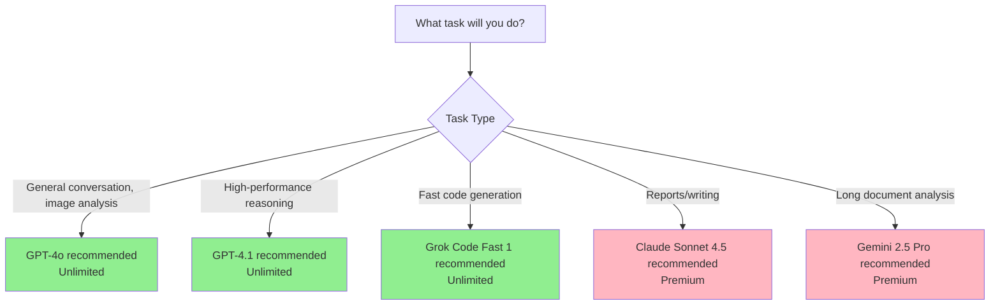
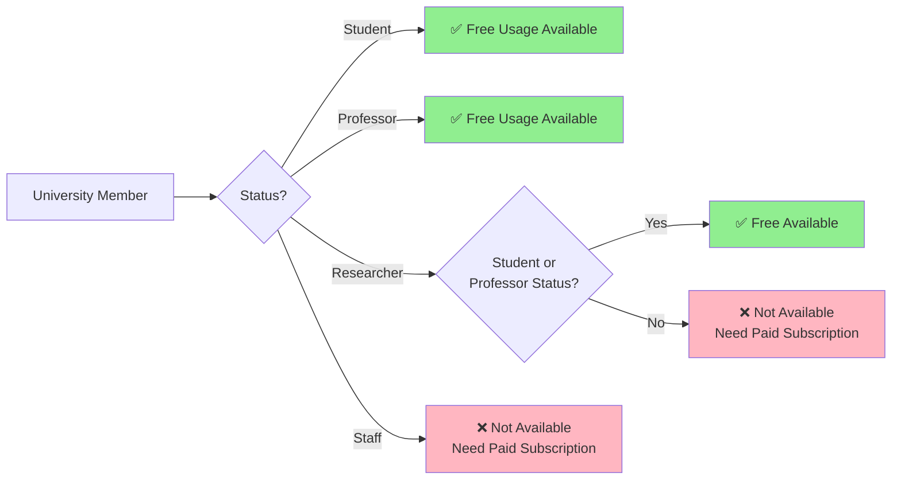

[🏠 Home](../../index.md) | [🌐 Web Guide](./copilot_web.md) | [💻 VS Code Guide](../../index.md#use-like-a-pro-with-vs-code-install-required)

# 🌐 GitHub Copilot Pro on the Web (Free)

> **💡 Who is this document for?**  
> - Professors and students new to programming
> - Those who want to use AI immediately **without installing VS Code**
> - Those who've used ChatGPT but are looking for more powerful AI tools

Many people think **GitHub Copilot** is 'only for programmers'. But that's not true at all! GitHub Copilot is a **world-class AI chat service** that you can use directly in your web browser **without installing VS Code**.

Especially for **university students and professors**, it's provided **completely free**, and you can use the latest AI models from **OpenAI, Anthropic, and Google** all in one place.

This guide, written as of **November 2025**, will show you everything about using GitHub Copilot on the web without any installation.

---

## 🚀 Get Started Immediately Without Installation

No complex installation process required. If you have a web browser (Chrome, Safari, Edge, etc.), you can use it right now.

### 📍 How to Access

1. **Open your web browser** (Chrome, Safari, Edge, etc.)
2. **Enter in the address bar:** [https://github.com/copilot](https://github.com/copilot)
3. **Log in with your GitHub account** (You can create one for free if you don't have one)
4. **Done!** You can now start chatting with AI.

> **⚠️ First Visit Notice**  
> When you first access, you'll see a simple guide screen. Click the "Start chatting" button.

This web interface is not just a simple chat window. It contains the most powerful AI features provided by **Microsoft**, and can be used for **various tasks** such as report writing, data analysis ideas, and email drafting.

---

## 🧠 Which AI Can You Use? (Choosing Models)

The biggest advantage of GitHub Copilot's web version is that **you can choose from the world's best AIs**. Click the model selection menu at the top left of the chat window, and you can switch AIs as if choosing "which expert should I get help from?"

### 🆓 Free Users (Free Plan)

Free users have a limit on total conversations **regardless of model type**.

- **Monthly usage limit:** **Total 50 requests** (chat and agent mode combined)
- **Available AIs:** GPT-4o, Claude 3.5 Sonnet, etc. (some latest models may be restricted)
- **Note:** For free users, even standard models (usually "0x") are displayed as **"1x"** and **consume 1 request from their 50-request limit**.
- **Reset:** The 1st of every month (9:00 AM KST) batch renewal
  > (Example: Even if you join on January 29, 50 requests will be recharged on February 1st! 🎉)

> **💡 Summary:** For free users, think of it as **"You can only have 50 conversations per month."** Use it sparingly!

---

### 🎓 University Members (Education / Pro Plan)

University members receive the same benefits as **GitHub Copilot Pro** for free. Here, a **'Credit'** system is applied, allowing much more freedom of use.

#### 1️⃣ Standard Models - **Completely Unlimited! (0x)**
These models consume no credits at all. **Even if you use them thousands of times a day, they're free**.

| AI Name | Cost (Deduction) | Features |
|---------|-----------------|----------|
| **GPT-4o** | **0 credits (0x)** | Smartest and most versatile model |
| **GPT-4.1** | **0 credits (0x)** | Strong in logical reasoning |
| **GPT-5 mini** | **0 credits (0x)** | Fast and lightweight latest model |
| **Grok Code Fast 1** | **0 credits (0x)** | Very fast code generation |
| **Raptor mini** | **0 credits (0x)** | Lightweight reasoning model |

#### 2️⃣ Premium Models - **300 Credits Provided Monthly**
The highest-performance models use **300 credits provided monthly**.

| AI Name | Cost (Deduction) | Features |
|---------|-----------------|----------|
| **Claude 3.5 Sonnet** | **1 credit (1x)** | Natural sentences, excellent coding ability |
| **GPT-5** | **1 credit (1x)** | OpenAI's latest flagship |
| **Gemini 2.5 Pro** | **1 credit (1x)** | Powerful for long document analysis |
| **Claude Haiku 4.5** | **0.33 credits** | Fast and efficient (use 3 times with 1 credit!) |
| **GPT-5.1-Codex-Mini** | **0.33 credits** | For lightweight coding tasks |

> **📅 Credit Reset Schedule:**
> - **300 credits are recharged on the 1st of every month (9:00 AM KST, UTC 00:00)**.
> - Remaining credits do not roll over to the next month.

---

### 🧐 What Do "0x" and "1x" Mean?

This is the most confusing part! The **displayed number and meaning** completely change depending on **"your status (free vs university)"**.

| Category | **Standard Models** (GPT-4o, etc.) | **Premium Models** (Claude 3.5, etc.) |
|----------|-------------------------------------|-------------------------------------|
| **Free Users** | **Displayed as "1x"**<br/>**1 request deducted** from limit (50) 😭 | **Displayed as "1x"**<br/>**1 request deducted** from limit (50) 😭 |
| **University Members** | **Displayed as "0x"**<br/>**No deduction (Unlimited)** 🎉 | **Displayed as "1x"**<br/>**1 credit deducted** (within 300/month) |

> **🎁 Conclusion:**
> - **Free Users:** All models are displayed as **1x** and consume requests.
> - **University Members:** **0x models are free (unlimited)**, **1x models use 300 monthly tickets**!

---

### 📊 When to Use Each AI?



**Practical Examples:**

| What You Want to Do | Recommended AI | Reason | Usage Limit |
|---------------------|----------------|--------|-------------|
| **Daily questions/tasks** | **GPT-4o** | Fast, smart, and recognizes images | **Unlimited** 🎉 |
| **Fast code writing** | **Grok Code Fast 1** | Very fast code generation | **Unlimited** 🎉 |
| **Email drafting** | **Claude Sonnet 4.5** | Most natural sentences | Premium (monthly limit) |
| **Paper/report summary** | **Gemini 2.5 Pro** | Reads long texts well | Premium (monthly limit) |
| **Complex coding** | **GPT-5-Codex** | Coding specialist model | Premium (monthly limit) |

> **💡 Tip:** Usually use **GPT-4o or Grok (unlimited)**, and only use **Claude Sonnet 4.5** or **Gemini 2.5 Pro** for really important documents or difficult questions!


## 🎓 University Members Use It For Free!

Normally, these high-performance AIs are paid services costing **$10/month**. However, if you're **affiliated with a university, you can use them completely free**!

### ✅ Who Can Use It For Free?



| Category | Free Usage Available | Conditions |
|----------|---------------------|-----------|
| 🎓 **Students** | ✅ **Available** | Enrollment verification required (student ID, enrollment certificate) |
| 👨‍🏫 **Professors/Instructors** | ✅ **Available** | Employment verification required (professor introduction page link, etc.) |
| 🔬 **Researchers** | ⚠️ **Conditional** | Must have student or professor status |
| 💼 **Administrative Staff** | ❌ **Not Available** | University must separately purchase paid license |

> **⚠️ Important:** Researchers or staff members have difficulty receiving free benefits. Only possible if you have student status (graduate student, etc.) or teach classes.

---

### 🎁 Free vs Paid, What's Different?

| Item | Free Users<br/>(GitHub sign-up only) | University Members<br/>(Education verification) |
|------|--------------------------------------|------------------------------------------------|
| **Available AIs** | GPT-4.1, GPT-4o, GPT-5 mini,<br/>Grok, Raptor (limited) | **Same models unlimited** +<br/>Claude, Gemini, GPT-5, etc. added |
| **Usage Limit** | **About 50 times/month** (limited) | **Unlimited** (basic 5 models)<br/>+ Premium models added |
| **Use in VS Code** | Limited | **Unlimited auto-completion** |
| **Data Protection** | May be used for training | **Never used for training** guaranteed |

**Simply put:**
- Free users: Can only use about 50 times per month (must save)
- University members: **Unlimited use of 5 basic models** + premium AIs additionally provided! 🎉

---

### 📝 How to Apply Right Now

> **⚠️ Before You Start!**
> 
> Preparing the following items before starting the verification process will make it much easier:
> 
> - [ ] **English Certificate of Employment** (Professor) or **English Certificate of Enrollment** (Student)
>   - Must be issued by the administration office (usually takes 1-2 days)
>   - ⚠️ Korean certificates are NOT accepted!
> - [ ] **Smartphone** (For Microsoft Authenticator app installation)
> - [ ] **School Email Address** check
>   - DEU Examples: `@deu.ac.kr`, `@g.deu.ac.kr`, `@office.deu.ac.kr` are all accepted
> - [ ] **Camera or Scanned File** (Prepare certificate as JPG file)

---

## 📋 Step-by-Step Verification Guide

The entire process takes about **15-20 minutes**, and approval takes **1-3 days**.

---

### **Step 1: GitHub Sign Up** (5 mins)

#### 1-1. Access GitHub.com

Go to [https://github.com](https://github.com) in your web browser.


Click the **"Sign up"** button at the top right of the screen.

---

#### 1-2. Enter Email Address


Enter your **school email address**.

**Dong-Eui University Examples:**
- `hong@deu.ac.kr` (Faculty/Staff)
- `hong@g.deu.ac.kr` (Student)
- `hong@office.deu.ac.kr` (Some departments)

> **💡 Tip:** Signing up with a school email makes Education verification much faster later!

Set your password and username, then proceed.

---

#### 1-3. Email Verification


A **launch code** will be sent to the email you entered. Check the "Enter code" box on the screen.


Check your email inbox for the mail from GitHub and copy the **8-digit (or 6-digit) number code**.


Enter the copied code to complete email verification.

> **⚠️ Note:** For security, a **sign-in screen** may appear again after verification. Don't panic, just log in with the ID and password you just set.

---

### **Step 2: Two-Factor Authentication (2FA)** (5-10 mins)

> **⚠️ Important:** To apply for GitHub Education, you MUST enable **Two-Factor Authentication (2FA)**.  
> Follow these steps carefully as this might be new to many users!

#### 2-1. Access Settings Menu


After logging in, click the **circular profile icon in the top right corner**. Find and select **"Settings"** at the bottom of the dropdown menu.

---

#### 2-2. Enable 2FA


Once in Settings, proceed as follows:

1. Click **"Password and authentication"** in the "Access" section of the left sidebar.
2. Click the green **"Enable two-factor authentication"** button in the "Two-factor authentication" section.
3. Select **"Set up using an app"** on the method selection screen. (This is the easiest and recommended way)

---

#### 2-3. Install Microsoft Authenticator App

You need to **install the app on your smartphone**:

**iPhone Users:**
1. Search for "Microsoft Authenticator" in App Store
2. Download and install
3. Open app, select "Add account" → "Work or school account"

**Android Users:**
1. Search for "Microsoft Authenticator" in Google Play Store
2. Download and install
3. Open app, select "Add account" → "Work or school account"

**Scan QR Code:**
- Scan the **QR code** displayed on the GitHub screen with your smartphone app
- Your GitHub account will be added to the app, and a **6-digit number** will appear
- Enter this number on the GitHub screen to complete!

> **🔒 Security Tip:** If Recovery codes appear, make sure to **save them in a safe place**!  
> This is the only way to recover your account if you lose your phone.

---

### **Step 3: Join GitHub Education** (5 mins)

#### 3-1. Access Education Page


While logged in, go to [https://github.com/education](https://github.com/education) and click the **"Join GitHub Education"** button in the center.

---

#### 3-2. Start Application


On the next screen, find and click the **"Start an application"** button to begin the process.

---

### **Step 4: Verify Status & School** (3 mins)

#### 4-1. Select Teacher or Student


1. Select your status in **"Select your academic status"**.
   - **Student**
   - **Teacher** (Professor/Instructor)
2. If you logged in with a school email, your school name will appear automatically. Click **"Select this school"** below the school name.
   - If not displayed, search for your school's English name.

---

#### 4-2. Share Location


1. Click the **"Share location"** button to verify you are near campus. Allow browser location permission if prompted.
2. Once the map appears and confirms you are near the school, the **"Continue"** button will become active. Click it to proceed.

> **🔒 Privacy:** Location data is used temporarily only to verify you are actually at the school and is not made public.

---

### **Step 5: Upload Proof** (1-2 mins)

#### 5-1. Upload Document

.png)

This is the **"Upload proof of your academic status"** screen.

**Student:**
- **English Certificate of Enrollment**
- Or **Student ID photo** (School name and your name must be clearly visible)

**Professor:**
- **English Certificate of Employment**
- Or **Link to professor introduction page on school website**

**How to Upload (Select Proof Type):**
1. **"Take a picture"**: Take a photo of the document immediately with your phone or laptop camera.
2. **"Upload a picture"**: Upload a pre-taken photo file (JPG, PNG, etc.).

> **⚠️ Important:**
> - You MUST use **English documents** (Korean ones are rejected).
> - File format: JPG, PNG, PDF allowed.
> - File size: Max 10MB.
> - All text must be **clearly legible**.

---

#### 5-2. Application Complete!

Enter all info and click **"Submit"** to finish!

**Now just wait for approval:**
- ⏱️ **Usually takes 1-3 days**
- 📧 **Result sent via email**
- ✅ Once approved, use immediately at [github.com/copilot](https://github.com/copilot)!

---

## 4. 💬 How to Actually Use It?

Here are practical scenarios that non-majors can easily utilize.

### Scenario 1: Writing Official Emails 📧

**Situation:** You need to write an email to a student about grade correction.

**Example Question:**
```
Write an email to send to a student.
Content: Informing that midterm exam grade input error has been corrected
Tone: Polite and formal
Length: About 5-7 sentences
```

**Recommended AI:** Claude Sonnet 4.5 (strong in natural and polite sentence generation)

**Tip:** If you specify tone, length, and main content all at once, you can get an email ready to use without modification!

---

### Scenario 2: Meeting Minutes Summary 📝

**Situation:** You need to extract key points from a 2-hour meeting in 3 minutes.

**Example Question:**
```
Summarize the meeting minutes below into 3 key decisions and 5 action items.

[Paste entire meeting minutes text]
```

**Recommended AI:** Gemini 2.5 Pro (optimized for long document processing)

**Tip:** Even if the minutes are very long, Gemini can process them at once. No problem with 100-page volumes!

---

### Scenario 3: Data Analysis Ideas 💡

**Situation:** You're wondering how to analyze student survey data.

**Example Question:**
```
I have student satisfaction survey results.
- 10 questions on 5-point scale
- 3 open-ended questions
- 200 respondents

What methods would be good for analysis and visualization?
Explain step by step.
```

**Recommended AI:** GPT-5 (fast and systematic suggestions)

**Tip:** Including the keyword "step by step" gets you answers in executable order!

---

### Scenario 4: Writing Simple Program Code 💻

**Situation:** You need to create a simple program to manage student grades.

**Example Question:**
```
Create a Python program that
receives student names and grades as input,
calculates the average, and outputs the grade.

Please include detailed comments for explanation.
```

**Recommended AI:** Claude Sonnet 4.5 or GPT-5-Codex (specialized in coding tasks)

**Tip:** Using Claude Sonnet 4.5 or GPT-5-Codex for coding tasks gives you cleanly written code with comments!

---

## 5. ❓ Frequently Asked Questions (FAQ)

### Q1: Do I have to ask questions only in English?

**A:** No! **It understands multiple languages including Korean**. 
- English question → English answer ✅
- Korean question → Korean answer ✅
- English question → Request Korean answer ✅

**Example:**
```
"Summarize the following English paper in Korean"
[Paste English paper]
```

---

### Q2: What happens if I use up my monthly allowance?

**A:** Don't worry!

**Free Users (50 requests used):**
- 50 requests will be recharged next month.
- Or if you verify university status, it immediately becomes unlimited!

**University Members:**
- **The 5 basic models (GPT-4o, GPT-4.1, GPT-5 mini, Grok, Raptor) are completely unlimited**, so no worries!
- Premium models (Claude, Gemini, etc.) also provide sufficient monthly amounts.

---

### Q3: What's different between models? Which should I use?

**A:** Simply summarized:

| Situation | Recommended Model | One-line Reason | Usage Limit |
|-----------|-------------------|-----------------|-------------|
| General tasks | **GPT-4o** | Most reliable and fast | **Unlimited** |
| High-performance reasoning | **GPT-4.1** | Complex logical tasks | **Unlimited** |
| Fast code writing | **Grok Code Fast 1** | Very fast code generation | **Unlimited** |
| When you want nice writing | Claude Sonnet 4.5 | Excellent writing skills | Premium |
| Analyzing long documents | Gemini 2.5 Pro | Processes large amounts at once | Premium |

**If you're a beginner:** Start with **GPT-4o**! It's unlimited and most reliable and fast.

---

### Q4: Do follow-up questions consume additional counts?

**A:** Yes, **follow-up questions also count as 1 request**.

```
First question: "Draft a report" (1 request consumed)
↓
Follow-up: "Make it shorter" (1 additional request consumed)
↓
Follow-up: "Also make an English version" (1 additional request consumed)
```
**Total 3 requests consumed!**

**💡 Saving Tip:**
```
"Draft a report, summarize it within 200 characters, 
and also create an English version"
```
**This way only 1 request consumed!**

---

### Q5: Is the web version alone sufficient without VS Code?

**A:** It depends on the purpose!

**Web version is sufficient for:**
- Email, report writing
- Document summary, translation
- Idea brainstorming
- Simple code questions

**VS Code is needed for:**
- When you need auto-completion while actually coding
- When proceeding with programming projects

**If you're a non-major:** The web version alone is sufficient! If you don't code at all, you don't need to install VS Code.

---

### Q6: Is it safe to ask questions with personal or sensitive information?

**A:** **University members are safe!**

| Category | Data Usage Policy |
|----------|-------------------|
| Free Users | ⚠️ May be used for AI training |
| University Members (Education) | ✅ **Never used for training** guaranteed |

**But be careful:**
- Never input student personal information (resident registration numbers, phone numbers, etc.)
- Generalize sensitive school internal information when asking

**Safe Question Examples:**
```
❌ "How should I handle student John Doe's (010-1234-5678) grades?"
✅ "What's the general procedure when receiving a grade correction request?"
```

---

## 🎯 Closing: Remember Just 3 Things!

### 1️⃣ **NO Installation!**
👉 Just access [github.com/copilot](https://github.com/copilot) and you're done!

### 2️⃣ **MAX Performance!**
👉 GPT-4o, GPT-4.1, Grok unlimited + Claude, Gemini also provided!

### 3️⃣ **ZERO Cost!**
👉 Completely free if you're a university student/professor!

---

**Start Right Now:**
1. Sign up at [GitHub.com](https://github.com) (school email recommended)
2. Apply for [Education Benefits](https://education.github.com/benefits)
3. Start chatting with AI at [github.com/copilot](https://github.com/copilot)!

The world's best AIs are here to help with your work. 🚀
