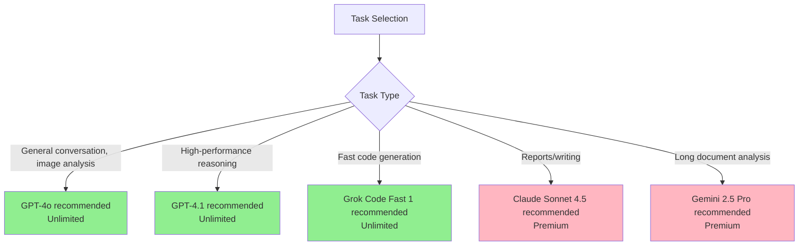
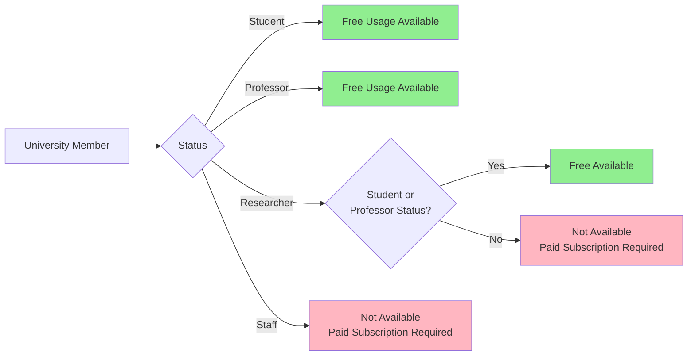
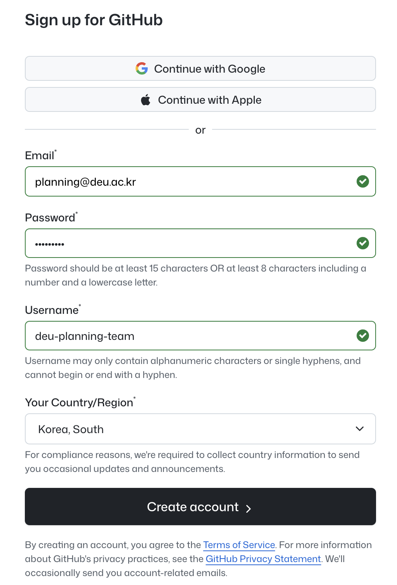
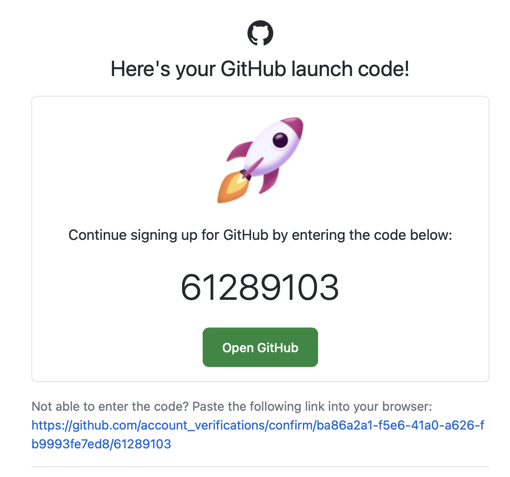
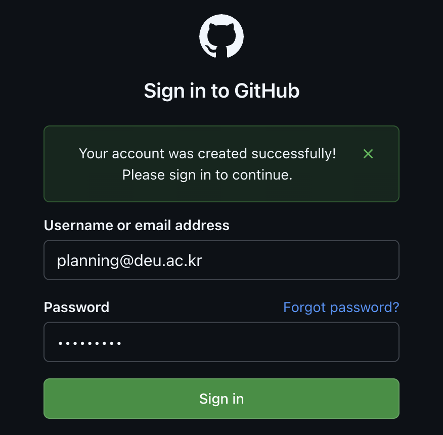
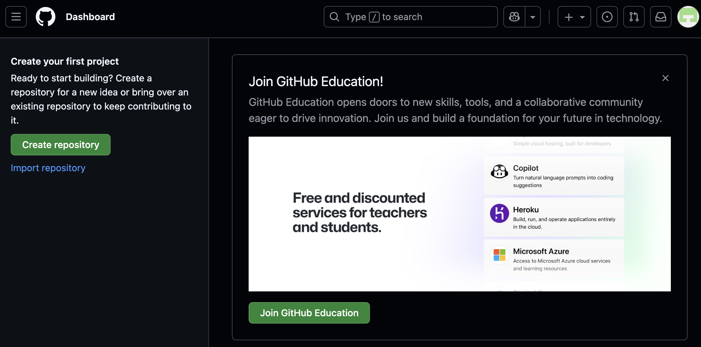
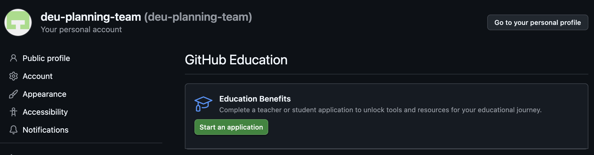

[Home](../../index.md) | [Web Guide](./copilot_web.md) | [VS Code Guide](../../index.md#use-like-a-pro-with-vs-code-install-required)

# GitHub Copilot Pro on the Web (Free)

> **Target Audience**  
> - Professors and students new to programming
> - Users who want to use AI without installing VS Code
> - Users seeking more powerful AI tools beyond ChatGPT

GitHub Copilot is a web-based AI chat service accessible directly through a browser without VS Code installation.

University students and professors can access it for free, with the ability to use the latest AI models from OpenAI, Anthropic, and Google in one place.

This guide, updated as of November 2025, covers web-based GitHub Copilot usage without installation.

---

## Get Started Without Installation

No complex installation required. Access is available through any web browser (Chrome, Safari, Edge, etc.).

### Access Method

1. Open a web browser (Chrome, Safari, Edge, etc.)
2. Navigate to: [https://github.com/copilot](https://github.com/copilot)
3. Log in with a GitHub account (free account creation available)
4. Begin using the service

> **Note**  
> First-time users will see a guide screen. Click the "Start chatting" button to proceed.

This web interface provides Microsoft's AI features for various tasks including report writing, data analysis, and email drafting.

---

## Available AI Models

GitHub Copilot's web version allows users to select from multiple AI models. The model selection menu is located at the top left of the chat window.

### Free Plan Users

Free users have a combined conversation limit regardless of model type.

- **Monthly usage limit:** 50 total requests (chat and agent mode combined)
- **Available AIs:** GPT-4o, Claude 3.5 Sonnet, etc. (some latest models may be restricted)
- **Note:** For free users, all models display as "1x" and consume 1 request from the 50-request limit.
- **Reset:** Monthly renewal on the 1st (9:00 AM KST)
  > Example: Users joining January 29 receive 50 new requests on February 1st.

> **Summary:** Free users are limited to 50 conversations per month.

---

### University Members (Education / Pro Plan)

University members receive GitHub Copilot Pro benefits at no cost. A credit system applies, allowing greater flexibility.

#### Standard Models - Unlimited (0x)
These models consume no credits. Usage is unlimited.

| AI Name | Cost (Deduction) | Features |
|---------|-----------------|----------|
| **GPT-4o** | **0 credits (0x)** | Versatile general-purpose model |
| **GPT-4.1** | **0 credits (0x)** | Strong logical reasoning |
| **GPT-5 mini** | **0 credits (0x)** | Fast, lightweight latest model |
| **Grok Code Fast 1** | **0 credits (0x)** | Rapid code generation |
| **Raptor mini** | **0 credits (0x)** | Lightweight reasoning model |

#### Premium Models - 300 Monthly Credits
High-performance models consume credits from a monthly 300-credit allocation.

| AI Name | Cost (Deduction) | Features |
|---------|-----------------|----------|
| **Claude 3.5 Sonnet** | **1 credit (1x)** | Natural language, excellent coding |
| **GPT-5** | **1 credit (1x)** | OpenAI's latest flagship |
| **Gemini 2.5 Pro** | **1 credit (1x)** | Long document analysis |
| **Claude Haiku 4.5** | **0.33 credits** | Fast and efficient |
| **GPT-5.1-Codex-Mini** | **0.33 credits** | Lightweight coding tasks |

> **Credit Reset Schedule:**
> - 300 credits recharge on the 1st of each month (9:00 AM KST, UTC 00:00)
> - Unused credits do not carry over

---

### Understanding "0x" and "1x" Notation

The displayed notation differs based on user status.

| Category | **Standard Models** (GPT-4o, etc.) | **Premium Models** (Claude 3.5, etc.) |
|----------|-------------------------------------|-------------------------------------|
| **Free Users** | Displayed as "1x" — 1 request deducted from 50 | Displayed as "1x" — 1 request deducted from 50 |
| **University Members** | Displayed as "0x" — No deduction (Unlimited) | Displayed as "1x" — 1 credit deducted from 300/month |

> **Summary:**
> - **Free Users:** All models display as 1x and consume requests.
> - **University Members:** 0x models are unlimited; 1x models use monthly credits.

---

### Model Selection Guide



**Practical Examples:**

| Task | Recommended AI | Reason | Usage Limit |
|------|----------------|--------|-------------|
| **Daily questions/tasks** | **GPT-4o** | Fast, capable, image recognition | **Unlimited** |
| **Fast code writing** | **Grok Code Fast 1** | Rapid code generation | **Unlimited** |
| **Email drafting** | **Claude Sonnet 4.5** | Natural sentence generation | Premium (monthly limit) |
| **Paper/report summary** | **Gemini 2.5 Pro** | Long text processing | Premium (monthly limit) |
| **Complex coding** | **GPT-5-Codex** | Coding specialist model | Premium (monthly limit) |

> **Recommendation:** Use GPT-4o or Grok (unlimited) for routine tasks. Reserve Claude Sonnet 4.5 or Gemini 2.5 Pro for important documents or complex questions.


## Free Access for University Members

These AI services normally cost $10/month. University-affiliated users can access them at no cost.

### Eligibility



| Category | Free Usage | Requirements |
|----------|------------|--------------|
| **Students** | Available | Enrollment verification (student ID, enrollment certificate) |
| **Professors/Instructors** | Available | Employment verification (faculty page link, etc.) |
| **Researchers** | Conditional | Must have student or professor status |
| **Administrative Staff** | Not Available | University must purchase paid license |

> **Note:** Researchers or staff without student/instructor status cannot receive free benefits.

---

### Free vs Paid Comparison

| Item | Free Users<br/>(GitHub sign-up only) | University Members<br/>(Education verification) |
|------|--------------------------------------|------------------------------------------------|
| **Available AIs** | GPT-4.1, GPT-4o, GPT-5 mini,<br/>Grok, Raptor (limited) | Same models unlimited +<br/>Claude, Gemini, GPT-5, etc. |
| **Usage Limit** | Approximately 50 times/month | Unlimited (5 basic models)<br/>+ Premium models |
| **VS Code Usage** | Limited | Unlimited auto-completion |
| **Data Protection** | May be used for training | Never used for training |

**Summary:**
- Free users: Limited to approximately 50 uses per month
- University members: Unlimited use of 5 basic models + premium AI access

---

### Application Process

> **Preparation Checklist**
> 
> Prepare the following before starting verification:
> 
> - [ ] **English Certificate of Employment** (Professor) or **English Certificate of Enrollment** (Student)
>   - Available from automated certificate machines
>   - Korean certificates are not accepted
> - [ ] **Smartphone** (Microsoft Authenticator app required)
>   - Install and log in with Microsoft account beforehand
> - [ ] **School Email Address** verification
>   - DEU Examples: `@deu.ac.kr`, `@g.deu.ac.kr`, `@office.deu.ac.kr`
> - [ ] **Certificate File** (JPG format via camera or scanner)

---

## Step-by-Step Verification Guide

Total process time: approximately 15-20 minutes. Approval takes 1-3 days.

---

### **Step 1: GitHub Sign Up** (5 mins)

#### 1-1. Access GitHub.com

Navigate to [https://github.com](https://github.com) in a web browser.


Click the **"Sign up"** button at the top right.

---

#### 1-2. Enter Email Address



Enter a school email address.

**Dong-Eui University Examples:**
- `hong@deu.ac.kr` (Faculty/Staff)
- `hong@g.deu.ac.kr` (Student)
- `hong@office.deu.ac.kr` (Some departments)

> **Note:** Using a school email accelerates Education verification.

Set password and username, then proceed.

---

#### 1-3. Email Verification


A launch code will be sent to the entered email. Check the "Enter code" box on screen.



Check the inbox for GitHub's email and copy the 8-digit (or 6-digit) code.



Enter the code to complete email verification.

> **Note:** A sign-in screen may appear after verification for security purposes. Log in with the credentials just created.

---

### **Step 2: Two-Factor Authentication (2FA)** (5-10 mins)

> **Important:** GitHub Education application requires Two-Factor Authentication (2FA).

#### 2-1. Access Settings Menu



After logging in, click the profile icon in the top right corner. Select **"Settings"** from the dropdown menu.

---

#### 2-2. Enable 2FA


In Settings:

1. Click **"Password and authentication"** in the left sidebar under "Access".
2. Click the **"Enable two-factor authentication"** button.
3. Select **"Set up using an app"** (recommended method).

---

#### 2-3. Install Microsoft Authenticator App

Install the app on a smartphone:

**iPhone Users:**
1. Search "Microsoft Authenticator" in App Store
2. Download and install
3. Open app, select "Add account" → "Work or school account"

**Android Users:**
1. Search "Microsoft Authenticator" in Google Play Store
2. Download and install
3. Open app, select "Add account" → "Work or school account"

**QR Code Scan:**
- Scan the QR code displayed on GitHub with the smartphone app
- A 6-digit number will appear in the app
- Enter this number on the GitHub screen to complete setup

> **Security Note:** Save Recovery codes in a secure location for account recovery if the phone is lost.

---

### **Step 3: Join GitHub Education** (5 mins)

#### 3-1. Access Education Page


While logged in, navigate to [https://github.com/education](https://github.com/education) and click **"Join GitHub Education"**.

---

#### 3-2. Start Application



Click **"Start an application"** to begin.

---

### **Step 4: Verify Status & School** (3 mins)

#### 4-1. Select Teacher or Student


1. Select academic status:
   - **Student**
   - **Teacher** (Professor/Instructor)
2. If logged in with a school email, the school name appears automatically. Click **"Select this school"**.
   - If not displayed, search for the school's English name.

---

#### 4-2. Share Location


1. Click **"Share location"** to verify campus proximity. Allow browser location permission if prompted.
2. Once the map confirms proximity to the school, the **"Continue"** button becomes active. Click to proceed.

> **Privacy Note:** Location data is used only for campus verification and is not made public.

---

### **Step 5: Upload Proof** (1-2 mins)

#### 5-1. Upload Document

.png)

"Upload proof of your academic status" screen:

**Student Documents:**
- English Certificate of Enrollment
- Student ID photo (school name and user name must be visible)

**Professor Documents:**
- English Certificate of Employment
- Link to faculty introduction page on school website

**Upload Options:**
1. **"Take a picture"**: Capture document with phone or laptop camera
2. **"Upload a picture"**: Upload pre-captured photo file (JPG, PNG, etc.)

> **Requirements:**
> - English documents required (Korean documents are rejected)
> - File format: JPG, PNG, PDF
> - File size: Maximum 10MB
> - All text must be clearly legible

---

#### 5-2. Application Complete

Enter all information and click **"Submit"**.

**Approval Timeline:**
- Processing time: 1-3 days
- Result notification: Via email
- Upon approval: Access available at [github.com/copilot](https://github.com/copilot)

---

## 4. Practical Usage Examples

The following scenarios demonstrate practical applications for non-technical users.

### Scenario 1: Writing Official Emails

**Situation:** Compose an email to a student regarding grade correction.

**Example Prompt:**
```
Write an email to send to a student.
Content: Informing that midterm exam grade input error has been corrected
Tone: Polite and formal
Length: About 5-7 sentences
```

**Recommended AI:** Claude Sonnet 4.5 (natural, polite sentence generation)

**Note:** Specifying tone, length, and main content produces ready-to-use emails.

---

### Scenario 2: Meeting Minutes Summary

**Situation:** Extract key points from a 2-hour meeting in 3 minutes.

**Example Prompt:**
```
Summarize the meeting minutes below into 3 key decisions and 5 action items.

[Paste entire meeting minutes text]
```

**Recommended AI:** Gemini 2.5 Pro (optimized for long document processing)

**Note:** Gemini can process extensive documents, including 100+ pages.

---

### Scenario 3: Data Analysis Ideas

**Situation:** Determine analysis methods for student survey data.

**Example Prompt:**
```
I have student satisfaction survey results.
- 10 questions on 5-point scale
- 3 open-ended questions
- 200 respondents

What methods would be good for analysis and visualization?
Explain step by step.
```

**Recommended AI:** GPT-5 (systematic, step-by-step suggestions)

**Note:** Including "step by step" produces actionable sequential answers.

---

### Scenario 4: Writing Simple Program Code

**Situation:** Create a basic student grade management program.

**Example Prompt:**
```
Create a Python program that
receives student names and grades as input,
calculates the average, and outputs the grade.

Please include detailed comments for explanation.
```

**Recommended AI:** Claude Sonnet 4.5 or GPT-5-Codex (coding specialists)

**Note:** These models produce clean, well-commented code.

---

## 5. Frequently Asked Questions (FAQ)

### Q1: Are questions required in English?

**A:** No. The system understands multiple languages including Korean.
- English question → English answer
- Korean question → Korean answer
- English question → Request Korean answer

**Example:**
```
"Summarize the following English paper in Korean"
[Paste English paper]
```

---

### Q2: What happens when monthly allowance is exhausted?

**A:** 

**Free Users (50 requests used):**
- 50 requests recharge next month
- University verification provides immediate unlimited access

**University Members:**
- 5 basic models (GPT-4o, GPT-4.1, GPT-5 mini, Grok, Raptor) are unlimited
- Premium models (Claude, Gemini, etc.) have sufficient monthly allocations

---

### Q3: How do models differ? Which should I use?

**A:** Summary:

| Situation | Recommended Model | Reason | Usage Limit |
|-----------|-------------------|--------|-------------|
| General tasks | **GPT-4o** | Reliable and fast | **Unlimited** |
| High-performance reasoning | **GPT-4.1** | Complex logical tasks | **Unlimited** |
| Fast code writing | **Grok Code Fast 1** | Rapid code generation | **Unlimited** |
| Quality writing | Claude Sonnet 4.5 | Excellent writing skills | Premium |
| Long document analysis | Gemini 2.5 Pro | Large volume processing | Premium |

**Beginners:** Start with GPT-4o. It is unlimited, reliable, and fast.

---

### Q4: Do follow-up questions consume additional counts?

**A:** Yes, follow-up questions count as separate requests.

```
First question: "Draft a report" (1 request)
↓
Follow-up: "Make it shorter" (1 additional request)
↓
Follow-up: "Also make an English version" (1 additional request)
```
**Total: 3 requests consumed**

**Efficiency Tip:**
```
"Draft a report, summarize it within 200 characters, 
and also create an English version"
```
**Result: 1 request consumed**

---

### Q5: Is the web version sufficient without VS Code?

**A:** Depends on usage:

**Web version sufficient for:**
- Email, report writing
- Document summary, translation
- Idea brainstorming
- Simple code questions

**VS Code required for:**
- Auto-completion during coding
- Programming project development

**Non-programmers:** The web version is sufficient for most needs.

---

### Q6: Is it safe to include personal or sensitive information in questions?

**A:** University members have data protection.

| Category | Data Usage Policy |
|----------|-------------------|
| Free Users | May be used for AI training |
| University Members (Education) | Never used for training |

**Precautions:**
- Never input student personal information (resident registration numbers, phone numbers, etc.)
- Generalize sensitive school internal information

**Example:**
```
Avoid: "How should I handle student John Doe's (010-1234-5678) grades?"
Use: "What's the general procedure when receiving a grade correction request?"
```

---

## Summary

### 1. No Installation Required
Access [github.com/copilot](https://github.com/copilot) directly.

### 2. High Performance
GPT-4o, GPT-4.1, Grok unlimited + Claude, Gemini available.

### 3. No Cost
Free for university students and professors.

---

**Getting Started:**
1. Sign up at [GitHub.com](https://github.com) (school email recommended)
2. Apply for [Education Benefits](https://education.github.com/benefits)
3. Access AI at [github.com/copilot](https://github.com/copilot)
