# 🌐 GitHub Copilot on the Web (Use Without VS Code)

> **💡 Who is this document for?**  
> - Professors and students new to programming
> - Those who want to use AI immediately without complex installation
> - Those who've used ChatGPT but are looking for more powerful AI tools

Many people think **GitHub Copilot** is 'only for programmers'. But that's not true at all! GitHub Copilot is a **world-class AI chat service** that you can use directly in your web browser.

Especially for **university students and professors**, it's provided **completely free**, and you can use the latest AI models from **OpenAI, Anthropic, and Google** all in one place.

This guide, written as of **November 2025**, will show you everything about using GitHub Copilot on the web without any installation.

---

## 1. 🚀 Get Started Immediately Without Installation

No complex installation process required. If you have a web browser (Chrome, Safari, Edge, etc.), you can use it right now.

### 📍 How to Access

1. **Open your web browser** (Chrome, Safari, Edge, etc.)
2. **Enter in the address bar:** [https://github.com/copilot](https://github.com/copilot)
3. **Log in with your GitHub account** (You can create one for free if you don't have one)
4. **Done!** You can now start chatting with AI.

> **⚠️ First Visit Notice**  
> When you first access, you'll see a simple guide screen. Click the "Start chatting" button.

This web interface is not just a simple chat window. It contains the most powerful AI features provided by **Microsoft**, and can be used for **various tasks** such as report writing, data analysis ideas, and email drafting.

## 2. 🧠 Which AI Can You Use? (Choosing Models)

The biggest advantage of GitHub Copilot's web version is that **you can choose from the world's best AIs**. Click the model selection menu at the top left of the chat window, and you can switch AIs as if choosing "which expert should I get help from?"

### 🆓 Free Users (Free Plan)

Free users have a limit on total conversations **regardless of model type**.

- **Monthly usage limit:** **Total 50 requests** (chat and agent mode combined)
- **Available AIs:** GPT-4o, Claude 3.5 Sonnet, etc. (some latest models may be restricted)
- **Note:** Even when using models labeled "0x", free users **consume 1 request from their 50-request limit**.
- **Reset:** The 1st of every month (9:00 AM KST) batch renewal
  > (Example: Even if you join on January 29, 50 requests will be recharged on February 1st! 🎉)

> **💡 Summary:** For free users, think of it as **"You can only have 50 conversations per month."** Use it sparingly!

---

### 🎓 University Members (Education / Pro Plan)

University members receive the same benefits as **GitHub Copilot Pro** for free. Here, a **'Credit'** system is applied, allowing much more freedom of use.

#### 1️⃣ Standard Models - **Completely Unlimited! (0x)**
These models consume no credits at all. **Even if you use them thousands of times a day, they're free**.

| AI Name | Cost (Deduction) | Features |
|---------|-----------------|----------|
| **GPT-4o** | **0 credits (0x)** | Smartest and most versatile model |
| **GPT-4.1** | **0 credits (0x)** | Strong in logical reasoning |
| **GPT-5 mini** | **0 credits (0x)** | Fast and lightweight latest model |
| **Grok Code Fast 1** | **0 credits (0x)** | Very fast code generation |
| **Raptor mini** | **0 credits (0x)** | Lightweight reasoning model |

#### 2️⃣ Premium Models - **300 Credits Provided Monthly**
The highest-performance models use **300 credits provided monthly**.

| AI Name | Cost (Deduction) | Features |
|---------|-----------------|----------|
| **Claude 3.5 Sonnet** | **1 credit (1x)** | Natural sentences, excellent coding ability |
| **GPT-5** | **1 credit (1x)** | OpenAI's latest flagship |
| **Gemini 2.5 Pro** | **1 credit (1x)** | Powerful for long document analysis |
| **Claude Haiku 4.5** | **0.33 credits** | Fast and efficient (use 3 times with 1 credit!) |
| **GPT-5.1-Codex-Mini** | **0.33 credits** | For lightweight coding tasks |

> **📅 Credit Reset Schedule:**
> - **300 credits are recharged on the 1st of every month (9:00 AM KST, UTC 00:00)**.
> - Remaining credits do not roll over to the next month.

---

### 🧐 What Do "0x" and "1x" Mean?

This is the most confusing part! The meaning **completely changes depending on "your status (free vs university)"**.

| Category | When Using **0x (Standard)** Models | When Using **1x (Premium)** Models |
|----------|-------------------------------------|-------------------------------------|
| **Free Users** | **1 request deducted** from my limit (50) 😭 | **1 request deducted** from my limit (50) 😭 |
| **University Members** | **No deduction (completely free/unlimited)** 🎉 | **1 credit deducted** (within 300/month limit) |

> **🎁 Conclusion:** If you're a university member, **"0x models are free, 1x models use 300 monthly tickets"** is the most accurate understanding!

---

### 📊 When to Use Each AI?


**Practical Examples:**

| What You Want to Do | Recommended AI | Reason | Usage Limit |
|---------------------|----------------|--------|-------------|
| **Daily questions/tasks** | **GPT-4o** | Fast, smart, and recognizes images | **Unlimited** 🎉 |
| **Fast code writing** | **Grok Code Fast 1** | Very fast code generation | **Unlimited** 🎉 |
| **Email drafting** | **Claude Sonnet 4.5** | Most natural sentences | Premium (monthly limit) |
| **Paper/report summary** | **Gemini 2.5 Pro** | Reads long texts well | Premium (monthly limit) |
| **Complex coding** | **GPT-5-Codex** | Coding specialist model | Premium (monthly limit) |

> **💡 Tip:** Usually use **GPT-4o or Grok (unlimited)**, and only use **Claude Sonnet 4.5** or **Gemini 2.5 Pro** for really important documents or difficult questions!


## 3. 🎓 University Members Use It For Free!

Normally, these high-performance AIs are paid services costing **$10/month (about ₩14,000)**. However, if you're **affiliated with a university, you can use them completely free**!

### ✅ Who Can Use It For Free?

```mermaid
graph LR
    A[University Member] --> B{Status?}
    B -->|Student| C[✅ Free Usage Available]
    B -->|Professor| D[✅ Free Usage Available]
    B -->|Researcher| E{Student or<br/>Professor Status?}
    B -->|Staff| F[❌ Not Available<br/>Need Paid Subscription]
    E -->|Yes| G[✅ Free Available]
    E -->|No| H[❌ Not Available<br/>Need Paid Subscription]
    
    style C fill:#90EE90
    style D fill:#90EE90
    style G fill:#90EE90
    style F fill:#FFB6C1
    style H fill:#FFB6C1
```



| Category | Free Usage Available | Conditions |
|----------|---------------------|-----------|
| 🎓 **Students** | ✅ **Available** | Enrollment verification required (student ID, enrollment certificate) |
| 👨‍🏫 **Professors/Instructors** | ✅ **Available** | Employment verification required (professor introduction page link, etc.) |
| 🔬 **Researchers** | ⚠️ **Conditional** | Must have student or professor status |
| 💼 **Administrative Staff** | ❌ **Not Available** | University must separately purchase paid license |

> **⚠️ Important:** Researchers or staff members have difficulty receiving free benefits. Only possible if you have student status (graduate student, etc.) or teach classes.

---

### 🎁 Free vs Paid, What's Different?

| Item | Free Users<br/>(GitHub sign-up only) | University Members<br/>(Education verification) |
|------|--------------------------------------|------------------------------------------------|
| **Available AIs** | GPT-4.1, GPT-4o, GPT-5 mini,<br/>Grok, Raptor (limited) | **Same models unlimited** +<br/>Claude, Gemini, GPT-5, etc. added |
| **Usage Limit** | **About 50 times/month** (limited) | **Unlimited** (basic 5 models)<br/>+ Premium models added |
| **Use in VS Code** | Limited | **Unlimited auto-completion** |
| **Data Protection** | May be used for training | **Never used for training** guaranteed |

**Simply put:**
- Free users: Can only use about 50 times per month (must save)
- University members: **Unlimited use of 5 basic models** + premium AIs additionally provided! 🎉

---

### 📝 How to Apply Right Now

#### Step 1: Create GitHub Account
1. Access [GitHub.com](https://github.com)
2. Click "Sign up"
3. **Recommended to sign up with school email address** (e.g., hong@snu.ac.kr)

#### Step 2: Apply for Education Benefits


**Student Application:**
1. Access [GitHub Education Benefits](https://education.github.com/benefits) page
2. Click "Get student benefits"
3. Upload school name, student ID photo, or enrollment certificate
4. Approval within 1-3 days (sometimes within hours!)

**Professor Application:**
1. Access [GitHub Education Benefits](https://education.github.com/benefits) page
2. Click "Get teacher benefits"
3. Submit link to professor introduction page on school website or employment certificate
4. Approval within 1-3 days

> **💡 Tip:** Approval is much faster if you sign up with your school email!

#### Step 3: Start Using Copilot!
Once approved, you can immediately use all AIs for free at [https://github.com/copilot](https://github.com/copilot)!

---

## 4. 💬 How to Actually Use It?

Here are practical scenarios that non-majors can easily utilize.

### Scenario 1: Writing Official Emails 📧

**Situation:** You need to write an email to a student about grade correction.

**Example Question:**
```
Write an email to send to a student.
Content: Informing that midterm exam grade input error has been corrected
Tone: Polite and formal
Length: About 5-7 sentences
```

**Recommended AI:** Claude Sonnet 4.5 (strong in natural and polite sentence generation)

**Tip:** If you specify tone, length, and main content all at once, you can get an email ready to use without modification!

---

### Scenario 2: Meeting Minutes Summary 📝

**Situation:** You need to extract key points from a 2-hour meeting in 3 minutes.

**Example Question:**
```
Summarize the meeting minutes below into 3 key decisions and 5 action items.

[Paste entire meeting minutes text]
```

**Recommended AI:** Gemini 2.5 Pro (optimized for long document processing)

**Tip:** Even if the minutes are very long, Gemini can process them at once. No problem with 100-page volumes!

---

### Scenario 3: Data Analysis Ideas 💡

**Situation:** You're wondering how to analyze student survey data.

**Example Question:**
```
I have student satisfaction survey results.
- 10 questions on 5-point scale
- 3 open-ended questions
- 200 respondents

What methods would be good for analysis and visualization?
Explain step by step.
```

**Recommended AI:** GPT-5 (fast and systematic suggestions)

**Tip:** Including the keyword "step by step" gets you answers in executable order!

---

### Scenario 4: Writing Simple Program Code 💻

**Situation:** You need to create a simple program to manage student grades.

**Example Question:**
```
Create a Python program that
receives student names and grades as input,
calculates the average, and outputs the grade.

Please include detailed comments for explanation.
```

**Recommended AI:** Claude Sonnet 4.5 or GPT-5-Codex (specialized in coding tasks)

**Tip:** Using Claude Sonnet 4.5 or GPT-5-Codex for coding tasks gives you cleanly written code with comments!

---

## 5. ❓ Frequently Asked Questions (FAQ)

### Q1: Do I have to ask questions only in English?

**A:** No! **It understands Korean questions perfectly**. 
- Korean question → Korean answer ✅
- Korean question → Request English answer ✅
- English question → Request Korean answer ✅

**Example:**
```
"Summarize the following English paper in Korean"
[Paste English paper]
```

---

### Q2: What happens if I use up my monthly allowance?

**A:** Don't worry!

**Free Users (50 requests used):**
- 50 requests will be recharged next month.
- Or if you verify university status, it immediately becomes unlimited!

**University Members:**
- **The 5 basic models (GPT-4o, GPT-4.1, GPT-5 mini, Grok, Raptor) are completely unlimited**, so no worries!
- Premium models (Claude, Gemini, etc.) also provide sufficient monthly amounts.

---

### Q3: What's different between models? Which should I use?

**A:** Simply summarized:

| Situation | Recommended Model | One-line Reason | Usage Limit |
|-----------|-------------------|-----------------|-------------|
| General tasks | **GPT-4o** | Most reliable and fast | **Unlimited** |
| High-performance reasoning | **GPT-4.1** | Complex logical tasks | **Unlimited** |
| Fast code writing | **Grok Code Fast 1** | Very fast code generation | **Unlimited** |
| When you want nice writing | Claude Sonnet 4.5 | Excellent writing skills | Premium |
| Analyzing long documents | Gemini 2.5 Pro | Processes large amounts at once | Premium |

**If you're a beginner:** Start with **GPT-4o**! It's unlimited and most reliable and fast.

---

### Q4: Do follow-up questions consume additional counts?

**A:** Yes, **follow-up questions also count as 1 request**.

```
First question: "Draft a report" (1 request consumed)
↓
Follow-up: "Make it shorter" (1 additional request consumed)
↓
Follow-up: "Also make an English version" (1 additional request consumed)
```
**Total 3 requests consumed!**

**💡 Saving Tip:**
```
"Draft a report, summarize it within 200 characters, 
and also create an English version"
```
**This way only 1 request consumed!**

---

### Q5: Is the web version alone sufficient without VS Code?

**A:** It depends on the purpose!

**Web version is sufficient for:**
- Email, report writing
- Document summary, translation
- Idea brainstorming
- Simple code questions

**VS Code is needed for:**
- When you need auto-completion while actually coding
- When proceeding with programming projects

**If you're a non-major:** The web version alone is sufficient! If you don't code at all, you don't need to install VS Code.

---

### Q6: Is it safe to ask questions with personal or sensitive information?

**A:** **University members are safe!**

| Category | Data Usage Policy |
|----------|-------------------|
| Free Users | ⚠️ May be used for AI training |
| University Members (Education) | ✅ **Never used for training** guaranteed |

**But be careful:**
- Never input student personal information (resident registration numbers, phone numbers, etc.)
- Generalize sensitive school internal information when asking

**Safe Question Examples:**
```
❌ "How should I handle student Hong Gil-dong's (010-1234-5678) grades?"
✅ "What's the general procedure when receiving a grade correction request?"
```

---

## 🎯 Closing: Remember Just 3 Things!

### 1️⃣ **NO Installation!**
👉 Just access [github.com/copilot](https://github.com/copilot) and you're done!

### 2️⃣ **MAX Performance!**
👉 GPT-4o, GPT-4.1, Grok unlimited + Claude, Gemini also provided!

### 3️⃣ **ZERO Cost!**
👉 Completely free if you're a university student/professor!

---

**Start Right Now:**
1. Sign up at [GitHub.com](https://github.com) (school email recommended)
2. Apply for [Education Benefits](https://education.github.com/benefits)
3. Start chatting with AI at [github.com/copilot](https://github.com/copilot)!

The world's best AIs are here to help with your work. 🚀


