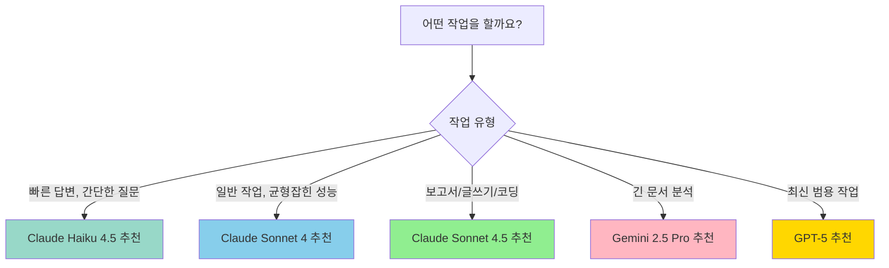
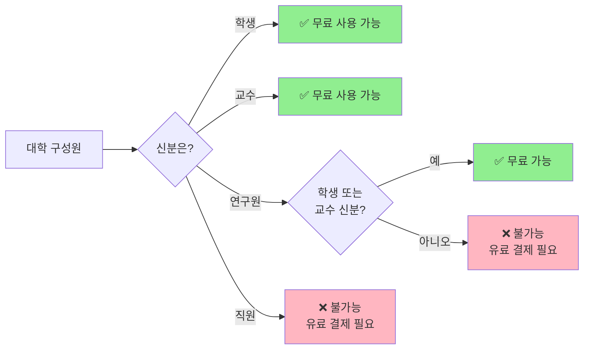
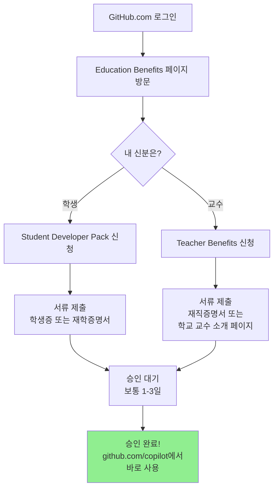

# 🌐 웹에서 만나는 GitHub Copilot (VS Code 없이 사용하기)

> **💡 이 문서는 누구를 위한 것인가요?**  
> - 프로그래밍을 처음 접하시는 교수님, 학생분들
> - 복잡한 설치 과정 없이 바로 AI를 사용하고 싶은 분들
> - ChatGPT를 써봤지만 더 강력한 AI 도구를 찾는 분들

많은 분들이 **GitHub Copilot**을 '프로그래머를 위한 도구'로만 알고 계십니다. 하지만 전혀 그렇지 않습니다! GitHub Copilot은 웹 브라우저에서 바로 사용할 수 있는 **세계 최고 수준의 AI 채팅 서비스**입니다.

특히 **대학 소속 학생과 교수님**에게는 **완전 무료**로 제공되며, **OpenAI, Anthropic, Google**의 최신 AI 모델을 한곳에서 모두 사용할 수 있습니다.

**2025년 11월 현재 기준**으로 작성된 이 가이드에서는, 설치 없이 웹에서 바로 사용하는 GitHub Copilot의 모든 것을 알려드립니다.

---

## 1. 🚀 설치 없이 바로 시작하기

복잡한 설치 과정이 전혀 없습니다. 웹 브라우저(Chrome, Safari, Edge 등)만 있으면 지금 바로 사용할 수 있습니다.

### 📍 접속 방법

1. **웹 브라우저를 여세요** (Chrome, Safari, Edge 등)
2. **주소창에 입력하세요:** [https://github.com/copilot](https://github.com/copilot)
3. **GitHub 계정으로 로그인** (없다면 무료로 만들 수 있습니다)
4. **끝!** 이제 바로 AI와 대화를 시작할 수 있습니다.

> **⚠️ 첫 방문 시 안내**  
> 처음 접속하시면 간단한 안내 화면이 나옵니다. "Start chatting" 또는 "시작하기" 버튼을 클릭하세요.

이 웹 인터페이스는 단순한 채팅창이 아닙니다. **Microsoft**가 제공하는 가장 강력한 AI 기능을 담고 있으며, 보고서 작성, 데이터 분석 아이디어, 이메일 초안 작성 등 **다양한 업무**에 활용할 수 있습니다.

## 2. � 어떤 AI를 쓸 수 있나요? (모델 선택하기)

GitHub Copilot 웹 버전의 가장 큰 장점은 **세계 최고의 AI들을 골라서 사용할 수 있다**는 점입니다. 채팅창 왼쪽 상단의 모델 선택 메뉴를 클릭하면, 마치 "어느 전문가에게 도움을 받을까?" 선택하는 것처럼 AI를 바꿀 수 있습니다.

### 🆓 무료 사용자가 쓸 수 있는 AI

무료 계정(GitHub에 가입만 한 상태)으로도 다음 AI들을 사용할 수 있습니다:

| AI 이름 | 만든 회사 | 이런 분께 추천해요 | 사용 제한 |
|---------|----------|-------------------|--------------||
| **Claude Haiku 4.5** | Anthropic | 빠른 답변, 간단한 질문 | 제한적 사용 가능 |
| **Claude Sonnet 4** | Anthropic | 균형잡힌 성능, 일반적인 작업 | 제한적 사용 가능 |
| **Claude Sonnet 4.5** | Anthropic | 긴 글 작성, 보고서 초안, 자연스러운 문장 | 제한적 사용 가능 |
| **Gemini 2.5 Pro** | Google | 방대한 정보 처리, 긴 문서 분석 | 제한적 사용 가능 |

> **💡 참고:** 무료 사용자는 위 모델들을 **제한적**으로 사용할 수 있습니다. **추가 질문도 1회로 카운트**되니, 한 번에 여러 질문을 묶어서 하는 것이 효율적입니다!

**예시:**
- ❌ 나쁜 방법: "이 보고서 요약해줘" → (답변) → "더 짧게 해줘" → (답변) → "영어로도 해줘" (**3회 소모**)
- ✅ 좋은 방법: "이 보고서를 요약하고, 200자 이내로 줄이고, 영어 버전도 함께 만들어줘" (**1회 소모**)

---

### 🎓 대학 구성원(학생/교수)이 쓸 수 있는 AI

**GitHub Education 혜택**을 받으면 훨씬 더 많은 최신 AI를 사용할 수 있습니다!

#### 📱 일반 모델 (빠르고 가벼운 작업용)

| AI 이름 | 만든 회사 | 특별한 점 | 사용 제한 |
|---------|----------|----------|--------------||
| **Claude Haiku 4.5** | Anthropic | 초고속 답변, 간단한 질문에 최적 | 무제한 |
| **Claude Sonnet 4** | Anthropic | 균형잡힌 성능, 대부분의 작업 처리 | 무제한 |
| **Claude Sonnet 4.5** | Anthropic | 코딩에 특히 강함, 자연스러운 글쓰기 | 무제한 |
| **Gemini 2.5 Pro** | Google | 방대한 정보 처리, 긴 문서 분석 | 무제한 |
| **Gemini 3 Pro (Preview)** | Google | 최신 Gemini 모델, 향상된 성능 | 무제한 |
| **GPT-5** | OpenAI | OpenAI 최신 범용 모델 | 무제한 |

#### 🚀 프리미엄 모델 (특수 작업용 - 횟수 제한)

| AI 이름 | 만든 회사 | 특별한 점 | 사용 제한 |
|---------|----------|----------|--------------||
| **GPT-4.1** | OpenAI | 고성능 추론 모델 | 사용 불가 (0x) |
| **GPT-4o** | OpenAI | 멀티모달 능력, 빠른 성능 | 사용 불가 (0x) |
| **GPT-5 mini** | OpenAI | 경량화된 GPT-5 | 사용 불가 (0x) |
| **Grok Code Fast 1** | xAI | 빠른 코드 생성 | 사용 불가 (0x) |
| **Raptor mini (Preview)** | - | 경량 추론 모델 | 사용 불가 (0x) |
| **GPT-5-Codex (Preview)** | OpenAI | 코딩 특화 모델 | 무제한 |
| **GPT-5.1 (Preview)** | OpenAI | 최신 실험 모델 | 무제한 |
| **GPT-5.1-Codex (Preview)** | OpenAI | 최신 코딩 특화 | 무제한 |
| **GPT-5.1-Codex-Mini (Preview)** | OpenAI | 경량 코딩 모델 | 제한적 (0.33x) |

> **🎁 핵심 혜택:** 대학 구성원은 **대부분의 일반 모델을 무제한**으로 사용할 수 있습니다! 특히 Claude Sonnet 4.5, Gemini 2.5 Pro, GPT-5가 무제한입니다.

---

### 📊 각 AI는 언제 사용하나요?



**실전 예시:**

| 하고 싶은 일 | 추천 AI | 이유 |
|------------|---------|------|
| 빠른 질문/답변 | Claude Haiku 4.5 | 초고속 응답 |
| 이메일 초안 작성 | Claude Sonnet 4.5 | 자연스럽고 정중한 문장 |
| 데이터 분석 아이디어 | GPT-5 | 빠르고 다양한 제안 |
| 100페이지 논문 요약 | Gemini 2.5 Pro | 긴 문서 처리에 강함 |
| 코딩 작업 | Claude Sonnet 4.5 또는 GPT-5-Codex | 코드 생성/디버깅에 특화 |

> **💡 팁:** 같은 질문을 여러 AI에게 던져보고, 가장 마음에 드는 답변을 선택하세요. 이것이 진정한 'AI 활용 고수'가 되는 길입니다!


## 3. 🎓 대학 구성원은 무료로 사용하세요!

원래 이런 고성능 AI들은 **월 10달러(약 14,000원)** 를 내고 사용하는 유료 서비스입니다. 하지만 **대학 소속이라면 완전 무료**로 사용할 수 있습니다!

### ✅ 누가 무료로 사용할 수 있나요?



| 구분 | 무료 사용 가능 여부 | 조건 |
|------|------------------|------|
| 🎓 **학생** | ✅ **가능** | 재학 증명 필요 (학생증, 재학증명서) |
| 👨‍🏫 **교수/강사** | ✅ **가능** | 재직 증명 필요 (교수 소개 페이지 링크 등) |
| 🔬 **연구원** | ⚠️ **조건부** | 학생 신분 또는 교수 신분이 있어야 함 |
| 💼 **행정직원** | ❌ **불가능** | 대학이 별도로 유료 라이선스 구매 필요 |

> **⚠️ 중요:** 연구원이나 직원분들은 무료 혜택을 받기 어렵습니다. 만약 학생 신분(대학원생 등)이거나 강의를 하시는 경우에만 가능합니다.

---

### 🎁 무료 vs 유료, 뭐가 다른가요?

| 항목 | 무료 사용자<br/>(GitHub 가입만) | 대학 구성원<br/>(Education 인증) |
|------|--------------------------|---------------------------|
| **사용 가능한 AI** | Claude Haiku 4.5, Sonnet 4/4.5,<br/>Gemini 2.5 Pro (제한적) | 위 모델들 **무제한** +<br/>GPT-5, Gemini 3 Pro,<br/>GPT-5-Codex 등 |
| **사용 제한** | 제한적 사용 | **무제한** (일반 모델)<br/>일부 프리미엄 모델만 제한 |
| **VS Code에서 사용** | 제한적 | 무제한 자동 완성 |
| **데이터 보호** | 학습에 사용될 수 있음 | **학습에 절대 사용 안 함** 보장 |

**쉽게 말하면:**
- 무료 사용자: 제한적으로 사용 가능 (정확한 횟수는 비공개)
- 대학 구성원: **대부분의 모델을 무제한**으로 사용 가능! 🎉

---

### 📝 지금 바로 신청하는 방법

#### Step 1: GitHub 계정 만들기
1. [GitHub.com](https://github.com) 접속
2. "Sign up" 클릭
3. **학교 이메일 주소**로 가입하는 것을 추천합니다 (예: hong@snu.ac.kr)

#### Step 2: Education 혜택 신청하기



**학생 신청:**
1. [GitHub Education Benefits](https://education.github.com/benefits) 페이지 접속
2. "Get student benefits" 클릭
3. 학교 이름, 학생증 사진 또는 재학증명서 업로드
4. 1-3일 내 승인 (빠르면 몇 시간!)

**교수 신청:**
1. [GitHub Education Benefits](https://education.github.com/benefits) 페이지 접속
2. "Get teacher benefits" 클릭
3. 학교 웹사이트의 교수 소개 페이지 링크 또는 재직증명서 제출
4. 1-3일 내 승인

> **💡 팁:** 학교 이메일로 가입하면 승인이 훨씬 빠릅니다!

#### Step 3: Copilot 사용 시작!
승인되면 즉시 [https://github.com/copilot](https://github.com/copilot)에서 모든 AI를 무료로 사용할 수 있습니다!

---

## 4. 💬 실제로 어떻게 사용하나요?

비전공자분들도 쉽게 활용할 수 있는 실전 시나리오를 소개합니다.

### 시나리오 1: 공식 이메일 작성 📧

**상황:** 학생에게 보낼 성적 정정 관련 이메일을 작성해야 합니다.

**질문 예시:**
```
학생에게 보낼 이메일을 작성해줘.
내용: 중간고사 성적 입력 오류가 있어서 정정했다는 내용
톤: 정중하고 공식적으로
분량: 5-7문장 정도
```

**추천 AI:** Claude Sonnet 4.5 (자연스럽고 정중한 문장 생성에 강함)

**팁:** 한 번에 톤, 분량, 주요 내용을 모두 명시하면 수정 없이 바로 사용할 수 있는 이메일을 받을 수 있습니다!

---

### 시나리오 2: 회의록 요약 📝

**상황:** 2시간짜리 회의 내용을 3분 안에 핵심만 추려야 합니다.

**질문 예시:**
```
아래 회의록을 3가지 핵심 결정사항과 5가지 액션 아이템으로 요약해줘.

[회의록 전체 텍스트를 붙여넣기]
```

**추천 AI:** Gemini 2.5 Pro (긴 문서 처리에 최적화)

**팁:** 회의록이 매우 길어도 Gemini는 한 번에 처리할 수 있습니다. 100페이지 분량도 문제없습니다!

---

### 시나리오 3: 데이터 분석 아이디어 💡

**상황:** 학생 설문조사 데이터를 어떻게 분석할지 고민 중입니다.

**질문 예시:**
```
학생 만족도 설문조사 결과가 있어.
- 5점 척도 질문 10개
- 자유 서술형 질문 3개
- 응답자 200명

어떤 방식으로 분석하고 시각화하면 좋을까?
단계별로 설명해줘.
```

**추천 AI:** GPT-5 (빠르고 체계적인 제안)

**팁:** "단계별로"라는 키워드를 넣으면 실행 가능한 순서대로 답변을 받을 수 있습니다!

---

### 시나리오 4: 간단한 프로그램 코드 작성 💻

**상황:** 학생 성적을 관리하는 간단한 프로그램을 만들어야 합니다.

**질문 예시:**
```
학생 이름과 성적을 입력받아서
평균을 계산하고 학점을 출력하는
파이썬 프로그램을 만들어줘.

주석도 자세히 달아서 설명해줘.
```

**추천 AI:** Claude Sonnet 4.5 또는 GPT-5-Codex (코딩 작업에 특화)

**팁:** 코딩 작업은 Claude Sonnet 4.5나 GPT-5-Codex를 사용하면 주석까지 깔끔하게 작성된 코드를 받을 수 있습니다!

---

## 5. ❓ 자주 묻는 질문 (FAQ)

### Q1: 영어로만 질문해야 하나요?

**A:** 아닙니다! **한국어로 질문해도 완벽하게 이해**합니다. 
- 한국어 질문 → 한국어 답변 ✅
- 한국어 질문 → 영어 답변 요청 ✅
- 영어 질문 → 한국어 답변 요청 ✅

**예시:**
```
"다음 영어 논문을 한국어로 요약해줘"
[영어 논문 붙여넣기]
```

---

### Q2: 한 달 사용량을 다 쓰면 어떻게 되나요?

**A:** 걱정하지 마세요!

**무료 사용자 (50회 소진):**
- 다음 달이 되면 다시 50회가 충전됩니다.
- 또는 대학 인증을 하면 즉시 무제한으로 바뀝니다!

**대학 구성원 (대부분 무제한):**
- Claude Sonnet 4.5, Gemini 2.5 Pro, GPT-5 등 **대부분의 모델이 무제한**이므로 걱정 없습니다.
- 일부 특수 프리미엄 모델만 제한이 있을 수 있습니다.

---

### Q3: 모델마다 뭐가 다른가요? 어떤 걸 써야 하나요?

**A:** 간단히 정리하면:

| 상황 | 추천 모델 | 한 줄 이유 |
|------|----------|----------|
| 빠른 답변이 필요할 때 | Claude Haiku 4.5 | 가장 빠른 속도 |
| 일반적인 작업 | Claude Sonnet 4 또는 GPT-5 | 균형잡힌 성능 |
| 글을 예쁘게 쓰고 싶을 때 | Claude Sonnet 4.5 | 문장력이 뛰어남 |
| 긴 문서를 분석할 때 | Gemini 2.5 Pro | 많은 양을 한 번에 처리 |
| 코딩 작업을 할 때 | Claude Sonnet 4.5 또는 GPT-5-Codex | 코드 생성/디버깅에 특화 |

**처음이라면:** Claude Sonnet 4 또는 GPT-5로 시작하세요! 가장 무난하고 빠릅니다.

---

### Q4: 후속 질문을 하면 횟수가 추가로 차감되나요?

**A:** 네, **후속 질문도 1회로 카운트**됩니다.

```
첫 질문: "보고서 초안 작성해줘" (1회 차감)
↓
후속 질문: "더 짧게 해줘" (1회 추가 차감)
↓
후속 질문: "영어로도 만들어줘" (1회 추가 차감)
```
**총 3회 소모됨!**

**💡 절약 팁:**
```
"보고서 초안을 작성하고, 200자 이내로 요약하고, 
영어 버전도 함께 만들어줘"
```
**이렇게 하면 1회만 소모!**

---

### Q5: VS Code 없이 웹에서만 써도 충분한가요?

**A:** 용도에 따라 다릅니다!

**웹만으로 충분한 경우:**
- 이메일, 보고서 작성
- 문서 요약, 번역
- 아이디어 브레인스토밍
- 간단한 코드 질문

**VS Code가 필요한 경우:**
- 실제로 코딩을 하면서 자동 완성이 필요할 때
- 프로그래밍 프로젝트를 진행할 때

**비전공자라면:** 웹 버전만으로도 충분합니다! 코딩을 전혀 하지 않는다면 VS Code를 설치할 필요가 없습니다.

---

### Q6: 개인정보나 민감한 내용을 질문해도 안전한가요?

**A:** **대학 구성원은 안전합니다!**

| 구분 | 데이터 사용 정책 |
|------|---------------|
| 무료 사용자 | ⚠️ AI 학습에 사용될 수 있음 |
| 대학 구성원 (Education) | ✅ **절대 학습에 사용하지 않음** 보장 |

**하지만 주의:**
- 학생 개인정보 (주민번호, 전화번호 등)는 절대 입력하지 마세요
- 민감한 학교 내부 정보는 가급적 일반화해서 질문하세요

**안전한 질문 예시:**
```
❌ "홍길동(010-1234-5678) 학생의 성적을 어떻게 처리할까?"
✅ "성적 정정 요청을 받았을 때 일반적인 처리 절차는?"
```

---

## 🎯 마무리: 3가지만 기억하세요!

### 1️⃣ **설치 NO!**
👉 [github.com/copilot](https://github.com/copilot) 접속만 하면 끝!

### 2️⃣ **성능 MAX!**
👉 Claude Sonnet 4.5, Gemini 2.5 Pro, GPT-5를 골라서 사용!

### 3️⃣ **비용 ZERO!**
👉 대학 학생/교수라면 완전 무료!

---

**지금 바로 시작하세요:**
1. [GitHub.com](https://github.com)에 가입 (학교 이메일 추천)
2. [Education Benefits](https://education.github.com/benefits) 신청
3. [github.com/copilot](https://github.com/copilot)에서 AI와 대화 시작!

세계 최고의 AI들이 여러분의 업무를 도와드립니다. 🚀


