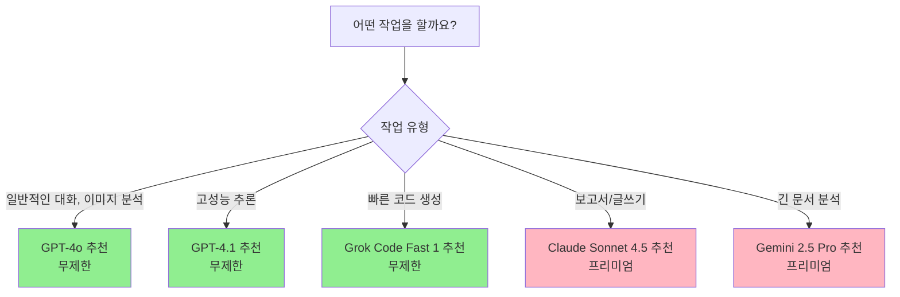
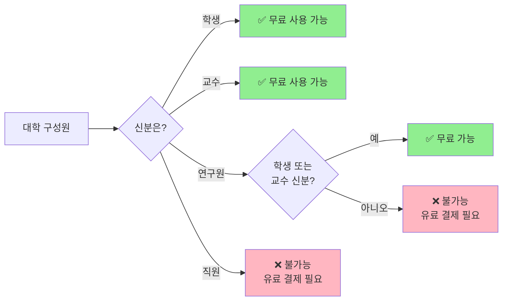

[[🏠 홈]](../../index.html) · [[🌐 웹 가이드]](./copilot_web.html) · [[💻 VS Code 가이드]](../../admin/ko/)

# 🌐 GitHub Copilot Pro를 무료로 웹에서 사용하기

> **VS Code 설치 없이, 브라우저만 있으면 됩니다.**

> **💡 이 문서는 누구를 위한 것인가요?**  
> - 프로그래밍을 처음 접하시는 교수님, 학생분들
> - **VS Code 설치 없이** 바로 AI를 사용하고 싶은 분들
> - ChatGPT를 써봤지만 더 강력한 AI 도구를 찾는 분들

많은 분들이 **GitHub Copilot**을 '프로그래머를 위한 도구'로만 알고 계십니다. 하지만 전혀 그렇지 않습니다! GitHub Copilot은 **VS Code 설치 없이** 웹 브라우저에서 바로 사용할 수 있는 **세계 최고 수준의 AI 채팅 서비스**입니다.

특히 **대학 소속 학생과 교수님**에게는 **완전 무료**로 제공되며, **OpenAI, Anthropic, Google**의 최신 AI 모델을 한곳에서 모두 사용할 수 있습니다.

**2025년 11월 현재 기준**으로 작성된 이 가이드에서는, 설치 없이 웹에서 바로 사용하는 GitHub Copilot의 모든 것을 알려드립니다.

---

## 1. 🚀 설치 없이 바로 시작하기

복잡한 설치 과정이 전혀 없습니다. 웹 브라우저(Chrome, Safari, Edge 등)만 있으면 지금 바로 사용할 수 있습니다.

### 📍 접속 방법

1. **웹 브라우저를 여세요** (Chrome, Safari, Edge 등)
2. **주소창에 입력하세요:** [https://github.com/copilot](https://github.com/copilot)
3. **GitHub 계정으로 로그인** (없다면 무료로 만들 수 있습니다)
4. **끝!** 이제 바로 AI와 대화를 시작할 수 있습니다.

> **⚠️ 첫 방문 시 안내**  
> 처음 접속하시면 간단한 안내 화면이 나옵니다. "Start chatting" 또는 "시작하기" 버튼을 클릭하세요.

이 웹 인터페이스는 단순한 채팅창이 아닙니다. **Microsoft**가 제공하는 가장 강력한 AI 기능을 담고 있으며, 보고서 작성, 데이터 분석 아이디어, 이메일 초안 작성 등 **다양한 업무**에 활용할 수 있습니다.

## 2. 🧠 어떤 AI를 쓸 수 있나요? (모델 선택하기)

GitHub Copilot 웹 버전의 가장 큰 장점은 **세계 최고의 AI들을 골라서 사용할 수 있다**는 점입니다. 채팅창 왼쪽 상단의 모델 선택 메뉴를 클릭하면, 마치 "어느 전문가에게 도움을 받을까?" 선택하는 것처럼 AI를 바꿀 수 있습니다.

### 🆓 무료 사용자 (Free Plan)

무료 사용자는 **모델 종류와 상관없이** 전체 대화 횟수에 제한이 있습니다.

- **월 사용 한도:** **총 50회** (채팅 및 에이전트 모드 통합)
- **사용 가능한 AI:** GPT-4o, Claude 3.5 Sonnet 등 (일부 최신 모델은 제한될 수 있음)
- **특이 사항:** 대학 구성원에게는 "0x"로 표시되는 기본 모델들도, 무료 사용자에게는 **"1x"로 표시**되며 **보유한 50회 한도에서 1회가 차감**됩니다.
- **리셋:** 매월 1일 (한국 시간 오전 9시) 일괄 갱신
  > (예: 1월 29일에 가입해도, 2월 1일에 50회가 다시 충전됩니다! 🎉)

> **💡 요약:** 무료 사용자는 **"한 달에 딱 50번만 대화할 수 있다"**고 생각하시면 됩니다. 아껴서 사용하세요!

---

### 🎓 대학 구성원 (Education / Pro Plan)

대학 구성원은 **GitHub Copilot Pro**와 동일한 혜택을 무료로 받습니다. 여기서는 **'크레딧(Credit)'** 시스템이 적용되어 훨씬 자유롭게 사용할 수 있습니다.

#### 1️⃣ 기본 모델 (Standard) - **완전 무제한! (0x)**
이 모델들은 크레딧을 전혀 소모하지 않습니다. **하루에 수천 번을 써도 무료**입니다.

| AI 이름 | 비용 (차감) | 특징 |
|---------|------------|------|
| **GPT-4o** | **0 크레딧 (0x)** | 가장 똑똑하고 범용적인 모델 |
| **GPT-4.1** | **0 크레딧 (0x)** | 논리적 추론에 강함 |
| **GPT-5 mini** | **0 크레딧 (0x)** | 빠르고 가벼운 최신 모델 |
| **Grok Code Fast 1** | **0 크레딧 (0x)** | 코드 생성 속도가 매우 빠름 |
| **Raptor mini** | **0 크레딧 (0x)** | 경량화된 추론 모델 |

#### 2️⃣ 프리미엄 모델 (Premium) - **월 300 크레딧 제공**
최고 성능의 모델들은 **매월 제공되는 300 크레딧**을 사용하여 이용합니다.

| AI 이름 | 비용 (차감) | 특징 |
|---------|------------|------|
| **Claude 3.5 Sonnet** | **1 크레딧 (1x)** | 자연스러운 문장, 코딩 능력 탁월 |
| **GPT-5** | **1 크레딧 (1x)** | OpenAI의 최신 플래그십 |
| **Gemini 2.5 Pro** | **1 크레딧 (1x)** | 긴 문서 분석에 강력함 |
| **Claude Haiku 4.5** | **0.33 크레딧** | 빠르고 효율적 (1크레딧으로 3번 사용!) |
| **GPT-5.1-Codex-Mini** | **0.33 크레딧** | 가벼운 코딩 작업용 |

> **📅 크레딧 리셋 기준:**
> - **매월 1일 (한국 시간 오전 9시, UTC 00:00)**에 300 크레딧이 새로 충전됩니다.
> - 남은 크레딧은 다음 달로 이월되지 않습니다.

---

### 🧐 "0x"와 "1x"가 도대체 무슨 뜻인가요?

가장 헷갈리는 부분이죠! **"내 신분(무료 vs 대학)"**에 따라 **표시되는 숫자와 의미**가 완전히 다릅니다.

| 구분 | **Standard 모델** (GPT-4o 등) | **Premium 모델** (Claude 3.5 등) |
|------|-----------------------------|-----------------------------|
| **무료 사용자** | **"1x"로 표시됨**<br/>내 한도(50회)에서 **1회 차감** 😭 | **"1x"로 표시됨**<br/>내 한도(50회)에서 **1회 차감** 😭 |
| **대학 구성원** | **"0x"로 표시됨**<br/>**차감 없음 (완전 무료/무제한)** 🎉 | **"1x"로 표시됨**<br/>**1 크레딧 차감** (월 300회 한도 내) |

> **🎁 결론:**
> - **무료 사용자:** 모든 모델이 **1x**로 표시되며, 횟수가 차감됩니다.
> - **대학 구성원:** **0x 모델은 공짜(무제한)**, **1x 모델은 월 300개 티켓**으로 사용합니다!

---

### 📊 각 AI는 언제 사용하나요?



**실전 예시:**

| 하고 싶은 일 | 추천 AI | 이유 | 사용 제한 |
|------------|---------|------|----------|
| **일상적인 질문/업무** | **GPT-4o** | 빠르고 똑똑하며 이미지도 인식 | **무제한** 🎉 |
| **빠른 코드 작성** | **Grok Code Fast 1** | 코드 생성이 매우 빠름 | **무제한** 🎉 |
| **이메일 초안 작성** | **Claude Sonnet 4.5** | 문장이 가장 자연스러움 | 프리미엄 (월 제한) |
| **논문/보고서 요약** | **Gemini 2.5 Pro** | 긴 글을 잘 읽음 | 프리미엄 (월 제한) |
| **복잡한 코딩** | **GPT-5-Codex** | 코딩 전문 모델 | 프리미엄 (월 제한) |

> **💡 팁:** 평소에는 **GPT-4o나 Grok(무제한)**을 쓰다가, 정말 중요한 문서나 어려운 질문이 있을 때만 **Claude Sonnet 4.5**나 **Gemini 2.5 Pro**를 쓰세요!


## 3. 🎓 대학 구성원은 무료로 사용하세요!

원래 이런 고성능 AI들은 **월 10달러(약 15,000원)** 를 내고 사용하는 유료 서비스입니다. 하지만 **대학 소속이라면 완전 무료**로 사용할 수 있습니다!

### ✅ 누가 무료로 사용할 수 있나요?



| 구분 | 무료 사용 가능 여부 | 조건 |
|------|------------------|------|
| 🎓 **학생** | ✅ **가능** | 재학 증명 필요 (학생증, 재학증명서) |
| 👨‍🏫 **교수/강사** | ✅ **가능** | 재직 증명 필요 (교수 소개 페이지 링크 등) |
| 🔬 **연구원** | ⚠️ **조건부** | 학생 신분 또는 교수 신분이 있어야 함 |
| 💼 **행정직원** | ❌ **불가능** | 대학이 별도로 유료 라이선스 구매 필요 |

> **⚠️ 중요:** 연구원이나 직원분들은 무료 혜택을 받기 어렵습니다. 만약 학생 신분(대학원생 등)이거나 강의를 하시는 경우에만 가능합니다.

---

### 🎁 무료 vs 유료, 뭐가 다른가요?

| 항목 | 무료 사용자<br/>(GitHub 가입만) | 대학 구성원<br/>(Education 인증) |
|------|--------------------------|---------------------------|
| **사용 가능한 AI** | GPT-4.1, GPT-4o, GPT-5 mini,<br/>Grok, Raptor (제한적) | **같은 모델들을 무제한** +<br/>Claude, Gemini, GPT-5 등 추가 |
| **사용 제한** | **월 50회 정도** (제한적) | **무제한** (기본 5개 모델)<br/>+ 프리미엄 모델 추가 |
| **VS Code에서 사용** | 제한적 | **무제한 자동 완성** |
| **데이터 보호** | 학습에 사용될 수 있음 | **학습에 절대 사용 안 함** 보장 |

**쉽게 말하면:**
- 무료 사용자: 한 달에 50번 정도만 사용 가능 (아껴 써야 함)
- 대학 구성원: **기본 모델 5개를 무제한**으로 사용 + 최고급 AI도 추가로 제공! 🎉

---

### 📝 지금 바로 신청하는 방법

> **⚠️ 시작하기 전에 꼭 준비하세요!**
> 
> 인증 과정을 시작하기 전에 다음 사항을 미리 준비하시면 훨씬 수월합니다:
> 
> - [ ] **영문 재직증명서** (교수) 또는 **영문 재학증명서** (학생)
>   - 자동발급기에서 발급받을 수 있습니다.
>   - ⚠️ 한글 증명서는 승인되지 않습니다!
> - [ ] **스마트폰** (Microsoft Authenticator 앱 설치 및 로그인 필요)
>   - 앱을 미리 설치하고 Microsoft 계정으로 로그인해두세요
> - [ ] **학교 이메일 주소** 확인
>   - 동의대 예시: `@deu.ac.kr`, `@g.deu.ac.kr`, `@office.deu.ac.kr` 모두 사용 가능
> - [ ] **카메라 또는 스캔 파일** (증명서를 JPG 파일로 준비)

---

## 📋 단계별 상세 인증 가이드

전체 과정은 약 **15-20분** 정도 소요되며, 승인까지는 **1-3일**이 걸립니다.

---

### **1단계: GitHub 회원가입** (5분)

#### 1-1. GitHub.com 접속

웹 브라우저에서 [https://github.com](https://github.com)에 접속합니다.


화면 우측 상단의 **"Sign up"** 버튼을 클릭합니다.

---

#### 1-2. 이메일 주소 입력


**학교 이메일 주소**를 입력하세요. 

**동의대학교 예시:**
- `hong@deu.ac.kr` (교직원용)
- `hong@g.deu.ac.kr` (학생용)
- `hong@office.deu.ac.kr` (일부 부서)

> **💡 팁:** 학교 이메일로 가입하면 나중에 Education 인증이 훨씬 빠릅니다!

비밀번호와 사용자 이름을 설정한 후 다음으로 진행합니다.

---

#### 1-3. 이메일 인증


입력한 이메일로 **인증 코드(Launch code)**가 전송됩니다. 화면에 보이는 "Enter code" 입력창을 확인하세요.


이메일 수신함에서 GitHub가 보낸 메일을 확인하여 **8자리(또는 6자리) 숫자 코드**를 복사합니다.


복사한 코드를 입력하면 이메일 인증이 완료됩니다.

> **⚠️ 주의:** 인증 후 보안을 위해 **다시 로그인** 화면이 나타날 수 있습니다. 당황하지 말고 방금 설정한 아이디와 비밀번호로 로그인해주세요.

---

### **2단계: 2단계 인증 설정** (5-10분)

> **⚠️ 중요:** GitHub Education을 신청하려면 반드시 **2단계 인증(2FA)** 을 설정해야 합니다.  
> 대부분의 분들이 처음 사용하시는 기능이므로 천천히 따라하세요!

#### 2-1. Settings 메뉴 접근


로그인 후 화면 **우측 상단 구석에 있는 원형 프로필 아이콘**을 클릭합니다. 나타나는 드롭다운 메뉴의 하단에서 **"Settings"** 항목을 찾아 선택합니다.

---

#### 2-2. 2단계 인증 활성화


설정 화면에 진입했다면 다음 순서대로 진행합니다:

1. 화면 왼쪽 사이드바 메뉴의 "Access" 섹션에서 **"Password and authentication"**을 클릭합니다.
2. 화면 중앙의 "Two-factor authentication" 섹션에 있는 초록색 **"Enable two-factor authentication"** 버튼을 클릭합니다.
3. 인증 방법 선택 화면에서 **"Set up using an app"**을 선택합니다. (가장 쉽고 권장되는 방법입니다)

---

#### 2-3. Microsoft Authenticator 앱 설치

**스마트폰에 앱을 설치**해야 합니다:

**iPhone 사용자:**
1. App Store에서 "Microsoft Authenticator" 검색
2. 앱 다운로드 및 설치
3. 앱 실행 후 "계정 추가" → "회사 또는 학교 계정" 선택

**Android 사용자:**
1. Google Play 스토어에서 "Microsoft Authenticator" 검색
2. 앱 다운로드 및 설치
3. 앱 실행 후 "계정 추가" → "회사 또는 학교 계정" 선택

**QR 코드 스캔:**
- GitHub 화면에 표시되는 **QR 코드**를 스마트폰 앱으로 스캔합니다
- 앱에 GitHub 계정이 추가되고, **6자리 숫자**가 표시됩니다
- 이 숫자를 GitHub 화면에 입력하면 완료!

> **🔒 보안 팁:** 복구 코드(Recovery codes)가 표시되면 반드시 **안전한 곳에 저장**하세요!  
> 스마트폰을 분실했을 때 계정을 복구할 수 있는 유일한 방법입니다.

---

### **3단계: GitHub Education 신청** (5분)

#### 3-1. GitHub Education 페이지 접속


로그인 상태에서 [https://github.com/education](https://github.com/education) 접속 후 화면 중앙의 **"Join GitHub Education"** 버튼을 클릭합니다.

---

#### 3-2. 신청 시작


다음 화면에서 **"Start an application"** 버튼을 찾아 클릭하여 신청 절차를 시작합니다.

---

### **4단계: 신분 선택 및 학교 확인** (3분)

#### 4-1. Teacher 또는 Student 선택


1. **"Select your academic status"** 항목에서 본인의 신분을 선택합니다.
   - **Student**: 학생
   - **Teacher**: 교수 또는 강사
2. 학교 이메일로 로그인했다면 학교 이름이 자동으로 표시됩니다. 학교 이름 아래의 **"Select this school"**을 클릭하여 선택합니다.
   - 만약 학교가 표시되지 않는다면 검색창에 학교 영문명을 입력하여 찾으세요.

---

#### 4-2. 위치 공유


1. 학교 위치 확인을 위해 **"Share location"** 버튼을 클릭합니다. 브라우저의 위치 정보 권한 요청이 뜨면 '허용'을 눌러주세요.
2. 지도가 표시되고 학교 근처임이 확인되면 하단의 **"Continue"** 버튼이 활성화됩니다. 클릭하여 다음 단계로 이동합니다.

> **🔒 개인정보 보호:** 위치 정보는 학교에 실제로 있는지 확인하는 용도로만 일시적으로 사용되며, 공개되지 않습니다.

---

### **5단계: 증명서류 제출** (1-2분)

#### 5-1. 증명서 업로드


**"Upload proof of your academic status"** 화면입니다.

**학생:**
- **영문 재학증명서** (English Certificate of Enrollment)
- 또는 **학생증 사진** (학교 이름과 이름이 명확히 보여야 함)

**교수:**
- **영문 재직증명서** (English Certificate of Employment)
- 또는 **학교 웹사이트의 교수 소개 페이지 링크**

**업로드 방법 (Proof Type 선택):**
1. **"Take a picture"**: 스마트폰이나 노트북 카메라로 증명서를 즉시 촬영합니다.
2. **"Upload a picture"**: 미리 찍어둔 증명서 사진 파일(JPG, PNG 등)을 업로드합니다.

> **⚠️ 중요:**
> - 반드시 **영문 증명서**를 사용하세요 (한글은 거부됨)
> - 파일 형식: JPG, PNG, PDF 가능
> - 파일 크기: 최대 10MB
> - 모든 글자가 **선명하게 읽혀야** 합니다

---

#### 5-2. 신청 완료!

모든 정보를 입력하고 **"Submit"** 버튼을 클릭하면 신청이 완료됩니다!

**이제 승인을 기다리면 됩니다:**
- ⏱️ **일반적으로 1-3일** 소요
- 📧 **이메일로 승인 결과** 통보
- ✅ 승인되면 즉시 [github.com/copilot](https://github.com/copilot)에서 사용 가능!


---

### ❓ 인증 관련 자주 묻는 질문

#### Q1: Microsoft Authenticator가 없으면 안 되나요?

**A:** 2단계 인증에는 여러 방법이 있습니다:
- ✅ **Microsoft Authenticator** (가장 추천)
- ✅ **Google Authenticator** (대체 가능)
- ✅ **SMS 인증** (전화번호로 코드 수신)
- ⚠️ 하지만 앱 사용이 가장 안전하고 편리합니다!

---

#### Q2: 한글 재학증명서는 정말 안 되나요?

**A:** 네, **반드시 영문 증명서**를 사용해야 합니다.
- GitHub Education은 전 세계 학생을 대상으로 하므로 영문 서류만 처리됩니다
- 행정실에서 "영문 재학증명서" 또는 "영문 재직증명서"를 요청하세요
- 보통 1-2일 내에 발급받을 수 있습니다

---

#### Q3: 어떤 이메일 주소를 사용해야 하나요?

**A:** **학교 공식 이메일**을 사용하세요:

**동의대학교 예시:**
- ✅ `@deu.ac.kr` (교직원)
- ✅ `@g.deu.ac.kr` (학생)
- ✅ `@office.deu.ac.kr` (일부 부서)
- ❌ Gmail, Naver 등 개인 이메일은 승인이 느리거나 거부될 수 있습니다

**다른 대학:**
- 학교 이메일 도메인 확인 (예: @snu.ac.kr, @yonsei.ac.kr 등)

---

#### Q4: 승인이 거부되면 어떻게 하나요?

**A:** 다음 사항을 확인하고 **재신청**하세요:
1. 증명서가 **영문**인가요?
2. 증명서의 **모든 글자가 선명**한가요?
3. **학교 이메일**로 가입했나요?
4. 증명서에 **학교 이름과 이름**이 명확히 나와 있나요?

재신청은 **24시간 후** 가능합니다.

---

#### Q5: 교직원이나 행정직원도 무료로 사용할 수 있나요?

**A:** **아쉽게도 불가능**합니다.
- ✅ **학생** (재학 중)
- ✅ **교수/강사** (강의 담당)
- ❌ **행정직원** (무료 혜택 없음)
- ⚠️ **연구원**: 학생 신분을 함께 가지고 있거나 강의를 하는 경우에만 가능

행정직원분들은 대학이 별도로 Organization 라이선스를 구매해야 합니다.

---

#### Q6: 승인 후 얼마나 사용할 수 있나요?

**A:** 신분이 유지되는 동안 **계속 무료**입니다!
- **학생:** 졸업할 때까지 (보통 매년 재인증 필요)
- **교수:** 재직하는 동안

매년 또는 2년마다 **재인증**을 요청받을 수 있으니, 그때 다시 증명서를 제출하면 됩니다.

---

## 4. 💬 실제로 어떻게 사용하나요?

비전공자분들도 쉽게 활용할 수 있는 실전 시나리오를 소개합니다.

### 시나리오 1: 공식 이메일 작성 📧

**상황:** 학생에게 보낼 성적 정정 관련 이메일을 작성해야 합니다.

**질문 예시:**
```
학생에게 보낼 이메일을 작성해줘.
내용: 중간고사 성적 입력 오류가 있어서 정정했다는 내용
톤: 정중하고 공식적으로
분량: 5-7문장 정도
```

**추천 AI:** Claude Sonnet 4.5 (자연스럽고 정중한 문장 생성에 강함)

**팁:** 한 번에 톤, 분량, 주요 내용을 모두 명시하면 수정 없이 바로 사용할 수 있는 이메일을 받을 수 있습니다!

---

### 시나리오 2: 회의록 요약 📝

**상황:** 2시간짜리 회의 내용을 3분 안에 핵심만 추려야 합니다.

**질문 예시:**
```
아래 회의록을 3가지 핵심 결정사항과 5가지 액션 아이템으로 요약해줘.

[회의록 전체 텍스트를 붙여넣기]
```

**추천 AI:** Gemini 2.5 Pro (긴 문서 처리에 최적화)

**팁:** 회의록이 매우 길어도 Gemini는 한 번에 처리할 수 있습니다. 100페이지 분량도 문제없습니다!

---

### 시나리오 3: 데이터 분석 아이디어 💡

**상황:** 학생 설문조사 데이터를 어떻게 분석할지 고민 중입니다.

**질문 예시:**
```
학생 만족도 설문조사 결과가 있어.
- 5점 척도 질문 10개
- 자유 서술형 질문 3개
- 응답자 200명

어떤 방식으로 분석하고 시각화하면 좋을까?
단계별로 설명해줘.
```

**추천 AI:** GPT-5 (빠르고 체계적인 제안)

**팁:** "단계별로"라는 키워드를 넣으면 실행 가능한 순서대로 답변을 받을 수 있습니다!

---

### 시나리오 4: 간단한 프로그램 코드 작성 💻

**상황:** 학생 성적을 관리하는 간단한 프로그램을 만들어야 합니다.

**질문 예시:**
```
학생 이름과 성적을 입력받아서
평균을 계산하고 학점을 출력하는
파이썬 프로그램을 만들어줘.

주석도 자세히 달아서 설명해줘.
```

**추천 AI:** Claude Sonnet 4.5 또는 GPT-5-Codex (코딩 작업에 특화)

**팁:** 코딩 작업은 Claude Sonnet 4.5나 GPT-5-Codex를 사용하면 주석까지 깔끔하게 작성된 코드를 받을 수 있습니다!

---

## 5. ❓ 자주 묻는 질문 (FAQ)

### Q1: 영어로만 질문해야 하나요?

**A:** 아닙니다! **한국어로 질문해도 완벽하게 이해**합니다. 
- 한국어 질문 → 한국어 답변 ✅
- 한국어 질문 → 영어 답변 요청 ✅
- 영어 질문 → 한국어 답변 요청 ✅

**예시:**
```
"다음 영어 논문을 한국어로 요약해줘"
[영어 논문 붙여넣기]
```

---

### Q2: 한 달 사용량을 다 쓰면 어떻게 되나요?

**A:** 걱정하지 마세요!

**무료 사용자 (50회 소진):**
- 다음 달이 되면 다시 50회가 충전됩니다.
- 또는 대학 인증을 하면 즉시 무제한으로 바뀝니다!

**대학 구성원:**
- **기본 모델 5개(GPT-4o, GPT-4.1, GPT-5 mini, Grok, Raptor)는 완전 무제한**이므로 걱정 없습니다!
- 프리미엄 모델(Claude, Gemini 등)도 매달 충분한 양을 제공받습니다.

---

### Q3: 모델마다 뭐가 다른가요? 어떤 걸 써야 하나요?

**A:** 간단히 정리하면:

| 상황 | 추천 모델 | 한 줄 이유 | 사용 제한 |
|------|----------|----------|----------|
| 일반적인 작업 | **GPT-4o** | 가장 무난하고 빠름 | **무제한** |
| 고성능 추론 | **GPT-4.1** | 복잡한 논리적 작업 | **무제한** |
| 빠른 코드 작성 | **Grok Code Fast 1** | 코드 생성이 매우 빠름 | **무제한** |
| 글을 예쁘게 쓰고 싶을 때 | Claude Sonnet 4.5 | 문장력이 뛰어남 | 프리미엄 |
| 긴 문서를 분석할 때 | Gemini 2.5 Pro | 많은 양을 한 번에 처리 | 프리미엄 |

**처음이라면:** **GPT-4o**로 시작하세요! 무제한이면서 가장 무난하고 빠릅니다.

---

### Q4: 후속 질문을 하면 횟수가 추가로 차감되나요?

**A:** 네, **후속 질문도 1회로 카운트**됩니다.

```
첫 질문: "보고서 초안 작성해줘" (1회 차감)
↓
후속 질문: "더 짧게 해줘" (1회 추가 차감)
↓
후속 질문: "영어로도 만들어줘" (1회 추가 차감)
```
**총 3회 소모됨!**

**💡 절약 팁:**
```
"보고서 초안을 작성하고, 200자 이내로 요약하고, 
영어 버전도 함께 만들어줘"
```
**이렇게 하면 1회만 소모!**

---

### Q5: VS Code 없이 웹에서만 써도 충분한가요?

**A:** 용도에 따라 다릅니다!

**웹만으로 충분한 경우:**
- 이메일, 보고서 작성
- 문서 요약, 번역
- 아이디어 브레인스토밍
- 간단한 코드 질문

**VS Code가 필요한 경우:**
- 실제로 코딩을 하면서 자동 완성이 필요할 때
- 프로그래밍 프로젝트를 진행할 때

**비전공자라면:** 웹 버전만으로도 충분합니다! 코딩을 전혀 하지 않는다면 VS Code를 설치할 필요가 없습니다.

---

### Q6: 개인정보나 민감한 내용을 질문해도 안전한가요?

**A:** **대학 구성원은 안전합니다!**

| 구분 | 데이터 사용 정책 |
|------|---------------|
| 무료 사용자 | ⚠️ AI 학습에 사용될 수 있음 |
| 대학 구성원 (Education) | ✅ **절대 학습에 사용하지 않음** 보장 |

**하지만 주의:**
- 학생 개인정보 (주민번호, 전화번호 등)는 절대 입력하지 마세요
- 민감한 학교 내부 정보는 가급적 일반화해서 질문하세요

**안전한 질문 예시:**
```
❌ "홍길동(010-1234-5678) 학생의 성적을 어떻게 처리할까?"
✅ "성적 정정 요청을 받았을 때 일반적인 처리 절차는?"
```

---

## 🎯 마무리: 3가지만 기억하세요!

### 1️⃣ **설치 NO!**
👉 [github.com/copilot](https://github.com/copilot) 접속만 하면 끝!

### 2️⃣ **성능 MAX!**
👉 GPT-4o, GPT-4.1, Grok를 무제한으로 + Claude, Gemini도 추가 제공!

### 3️⃣ **비용 ZERO!**
👉 대학 학생/교수라면 완전 무료!

---

**지금 바로 시작하세요:**
1. [GitHub.com](https://github.com)에 가입 (학교 이메일 추천)
2. [Education Benefits](https://education.github.com/benefits) 신청
3. [github.com/copilot](https://github.com/copilot)에서 AI와 대화 시작!

세계 최고의 AI들이 여러분의 업무를 도와드립니다. 🚀


