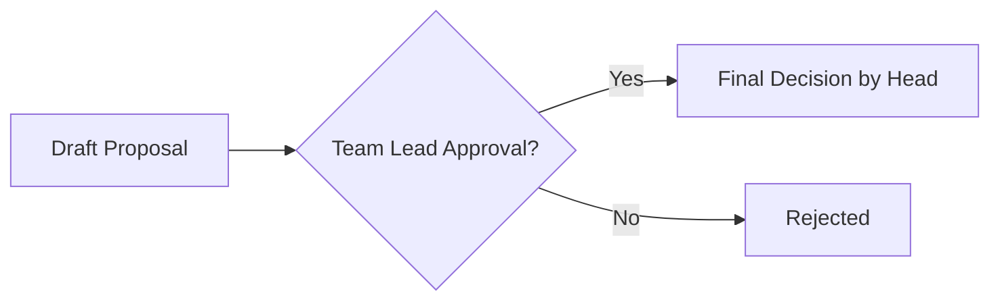

## 8. Data & Visualization: Analyzing and Drawing Without Excel

### 8.1 Drawing Charts with Text (Mermaid)
Don't waste time drawing shapes in PowerPoint. Just write text, and it becomes a picture.

**[Practice] Drawing a Workflow Diagram**
Copy and paste the code below.

### 8.2 Data Analysis
Open an Excel file and ask in the chat window, and it will analyze it for you.
> "From this Excel file (`survey.xlsx`), pick the top 3 items with the lowest satisfaction and summarize the reasons why."
