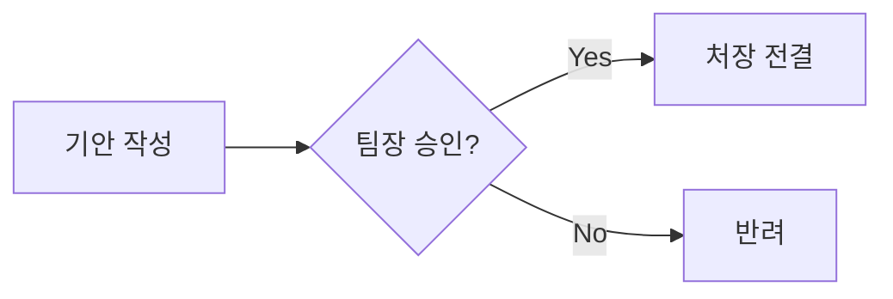

[🏠 목차로 돌아가기](../../README.md) | [🇺🇸 English Version](../../../docs/en/level-3-expert/08-data-visualization.md)

---
title: "Data & Visualization: 엑셀 없이 분석하고 그림 그리기"
level: 3
order: 8
---

## 8. Data & Visualization: 엑셀 없이 분석하고 그림 그리기
- [ ] 학습 완료

### 8.1 텍스트로 차트 그리기 (Mermaid)
파워포인트에서 도형 그리느라 시간 낭비하지 마세요. 글자만 쓰면 그림이 됩니다.

**[실습] 업무 흐름도 그리기**
아래 코드를 복사해서 붙여넣어 보세요.

### 8.2 데이터 분석 (Data Analysis)
엑셀 파일을 열고 채팅창에 물어보면 분석해줍니다.
> "이 엑셀 파일(`survey.xlsx`)에서 만족도가 가장 낮은 항목 3개를 뽑고, 그 이유를 요약해줘."

---
## ✅ Key Takeaways
- Mermaid 문법을 사용하면 텍스트만으로 순서도, 간트 차트 등 다양한 다이어그램을 그릴 수 있다.
- Copilot Chat에 데이터 파일(예: .xlsx, .csv)을 참조시키고 자연어로 질문하여 데이터 분석 및 요약을 수행할 수 있다.
---
### ✍️ 자가 진단 퀴즈

Q1. 파워포인트 없이 마크다운 문서 내에서 직접 워크플로우 다이어그램을 그리려면 어떤 문법을 사용할 수 있나요?

**A1.** Mermaid 문법입니다.

---
[< 이전 글](./07-agents-instructions.md) | [다음 글 >](./09-workbook-3.md) |
