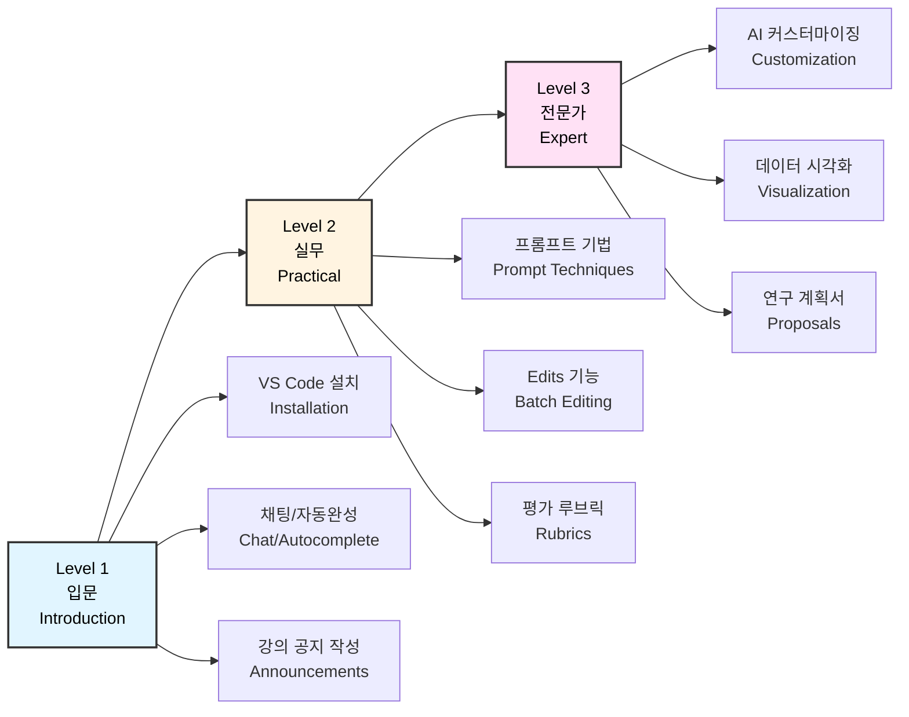
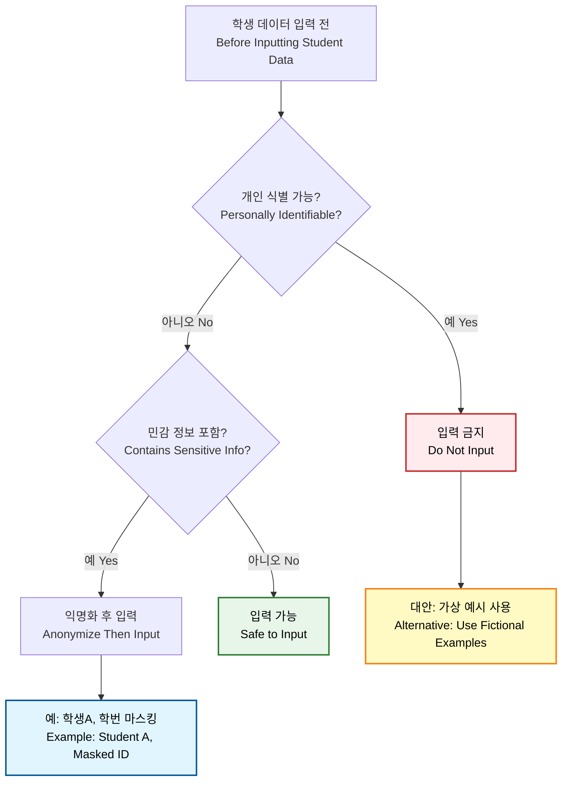
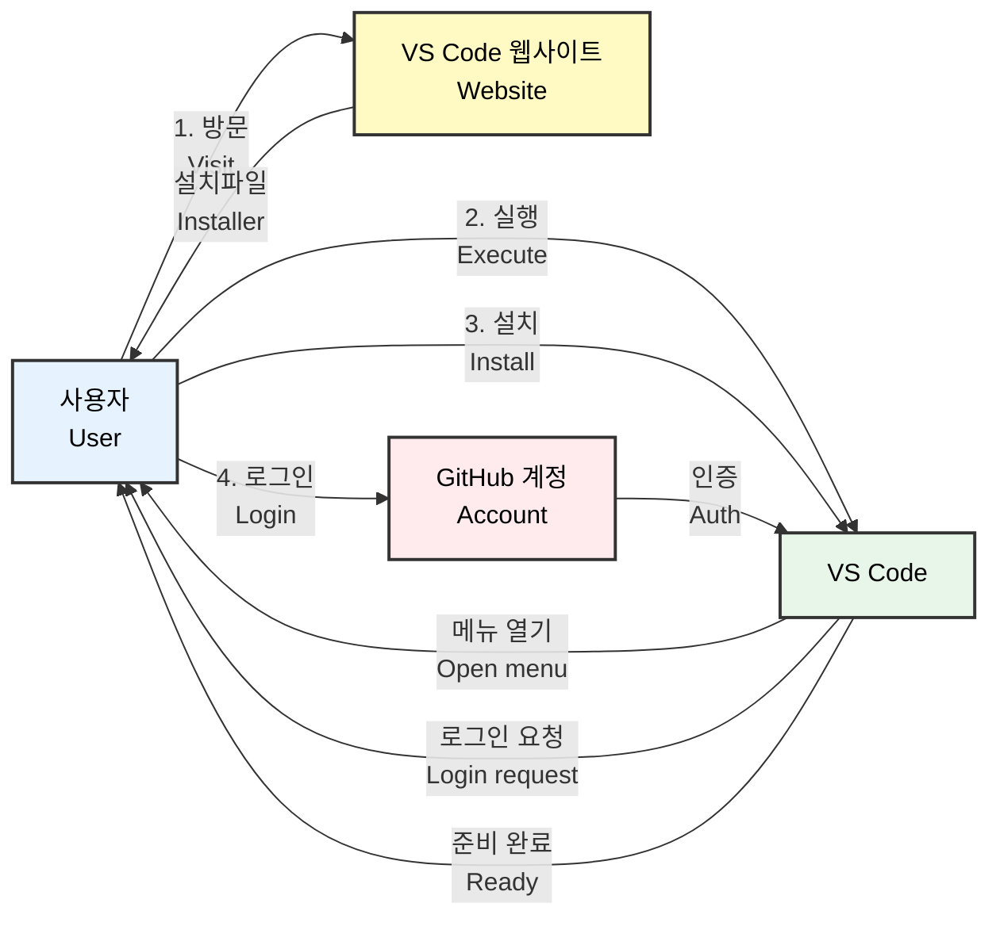
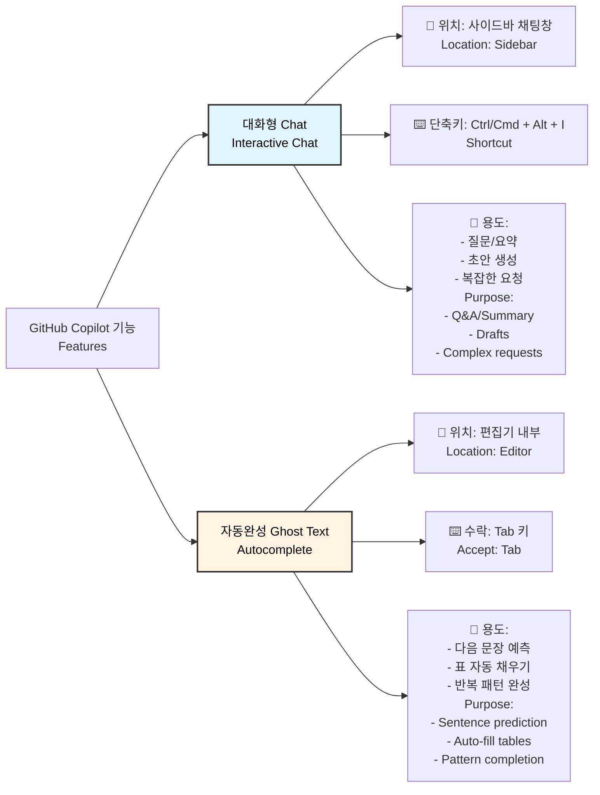
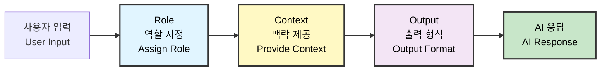
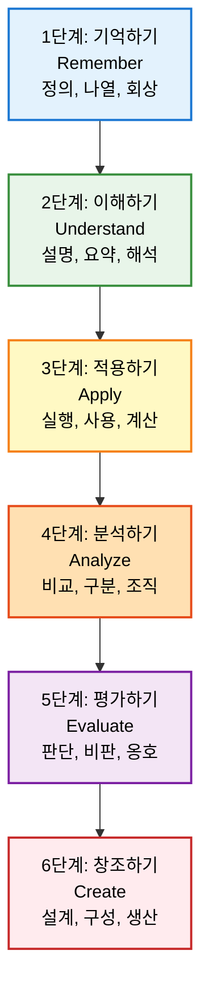
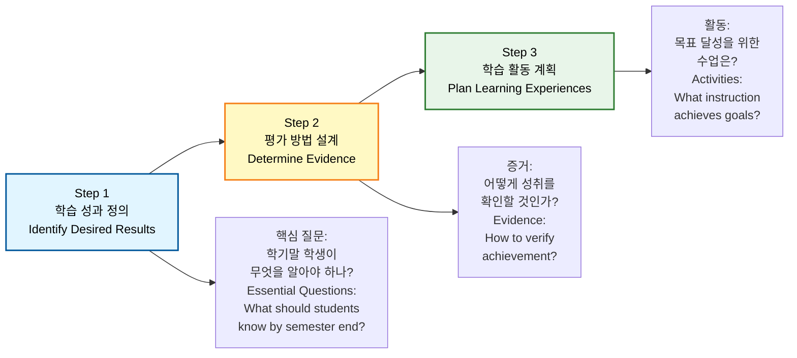
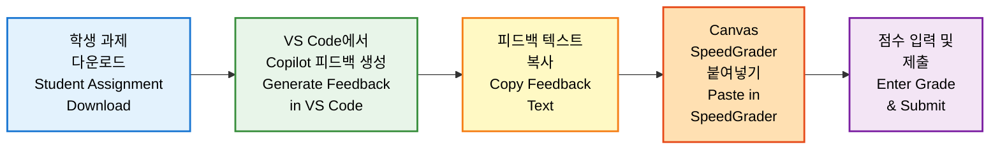
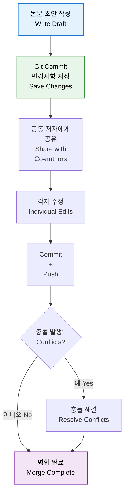
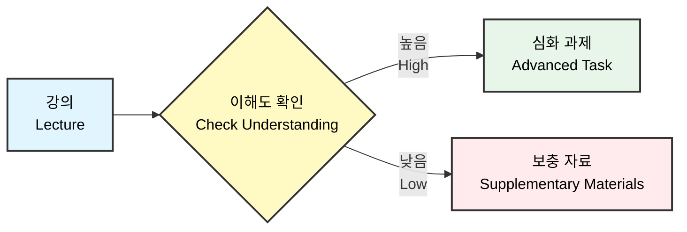

[[홈]](../../../index.md) · [[웹 가이드]](../../common/ko/copilot_web.md) · [[VS Code 가이드]](../../admin/ko/)

# 교수자를 위한 GitHub Copilot 완전 정복 (All-in-One 가이드)
# (Professor's Guide to GitHub Copilot Mastery - All-in-One)

**환영합니다!** 이 문서는 AI 도구를 처음 접하시는 교수님들을 위한 종합 가이드입니다. 여러 개의 파일로 된 복잡한 구조 대신, 이 하나의 문서만 위에서부터 아래로 읽고 따라 하시면 Copilot의 기초부터 전문가 수준의 활용법까지 모두 익히실 수 있습니다.

**Welcome!** This comprehensive guide is designed for professors new to AI tools. Rather than navigating through multiple complex files, simply read and follow this single document from top to bottom to master GitHub Copilot from basics to expert level.

---

## 목차 (Table of Contents)
## (Table of Contents)

- [학습 경로 안내](#학습-경로-안내)
- [(Learning Path Guide)](#학습-경로-안내)

### **[Level 0: 준비] AI 불안 해소**
### **[(Level 0: Preparation) AI Anxiety Relief]**

  - [1. 보안 (Security)](#1--내-연구-자료가-유출되나요-보안)
  - [2. 연구윤리 (Research Ethics)](#2--ai-생성-콘텐츠와-연구윤리-학술적-정직성)
  - [3. 프라이버시 (Privacy)](#3--학생-데이터-프라이버시-개인정보-보호)

### **[Level 1: 입문] AI 교육자의 첫걸음**
### **[(Level 1: Introduction) First Steps as an AI Educator]**

  - [1. 준비하기: 디지털 연구실 만들기](#1-준비하기-나만의-디지털-연구실-만들기)
  - [(1. Getting Started: Creating Your Digital Research Lab)](#1-준비하기-나만의-디지털-연구실-만들기)
    - [1.1 설치 및 세팅](#11-설치-및-세팅)
    - [(1.1 Installation and Setup)](#11-설치-및-세팅)
  - [2. 기초: 채팅과 자동완성 구분하기](#2-기초-채팅과-자동완성-구분하기)
  - [(2. Fundamentals: Distinguishing Between Chat and Autocomplete)](#2-기초-채팅과-자동완성-구분하기)
  - [3. Workbook 1: 학문 분야별 실전 예시](#3-workbook-1-학문-분야별-실전-예시)
  - [(3. Workbook 1: Discipline-Specific Practical Examples)](#3-workbook-1-학문-분야별-실전-예시)
    - [3.1 인문학](#31-인문학-문학-작품-분석-루브릭-생성)
    - [3.2 사회과학](#32-사회과학-질적-연구-데이터-코딩)
    - [3.3 자연과학](#33-자연과학-실험-보고서-구조화)
    - [3.4 공학](#34-공학-설계-문서-검토)
    - [3.5 예술](#35-예술-작품-평가-기준-작성)

### **[Level 2: 실무] 교육 효율성 극대화**
### **[(Level 2: Practical) Maximizing Teaching Efficiency]**

  - [4. 명령어 작성법 (Prompt Engineering)](#4-명령어-작성법-명확한-지시로-정확한-결과-얻기)
  - [(4. Prompt Engineering: Getting Accurate Results)](#4-명령어-작성법-명확한-지시로-정확한-결과-얻기)
  - [5. Copilot Edits: 여러 강의 자료 일괄 수정](#5-copilot-edits-여러-강의-자료를-한-번에-수정하기)
  - [(5. Copilot Edits: Batch-Editing Multiple Course Materials)](#5-copilot-edits-여러-강의-자료를-한-번에-수정하기)
  - [6. Workbook 2: 교육학 프레임워크 기반 강의 설계](#6-workbook-2-교육학-프레임워크-기반-강의-설계)
  - [(6. Workbook 2: Course Design Based on Educational Frameworks)](#6-workbook-2-교육학-프레임워크-기반-강의-설계)
    - [6.1 Bloom's Taxonomy](#61-blooms-taxonomy-기반-학습-목표-작성)
    - [6.2 Backward Design](#62-backward-design-강의-계획-워크북)
    - [6.3 Constructive Alignment](#63-constructive-alignment-정렬-체크리스트)
    - [6.4 학술 인용 (APA/MLA)](#64-학술-인용-자동화-apamla)

### **[Level 3: 전문가] 맞춤형 AI 교육 비서 운영**
### **[(Level 3: Expert) Operating Your Customized AI Teaching Assistant]**

  - [7. Agents & Instructions: 강의 맞춤형 AI 만들기](#7-agents--instructions-강의-맞춤형-ai-만들기)
  - [(7. Agents & Instructions: Creating Course-Specific AI)](#7-agents--instructions-강의-맞춤형-ai-만들기)
    - [7.1 맞춤형 지침](#71-맞춤형-지침-githubcopilot-instructionsmd)
    - [7.2 학문 분야별 AI Instructions 템플릿](#72-학문-분야별-ai-instructions-템플릿)
  - [8. LMS 통합 및 협업 워크플로우](#8-lms-통합-및-협업-워크플로우)
  - [(8. LMS Integration and Collaboration Workflow)](#8-lms-통합-및-협업-워크플로우)
    - [8.1 Canvas LMS](#81-canvas-lms-연계)
    - [8.2 Blackboard](#82-blackboard-연계)
    - [8.3 Moodle](#83-moodle-연계)
    - [8.4 LMS 공통 활용 팁](#84-lms-공통-활용-팁)
    - [8.5 Git 기반 공동 연구 워크플로우](#85-git-기반-공동-연구-워크플로우-선택-학습)
  - [9. Data & Visualization: 학생 성적 분석](#9-data--visualization-학생-성적-분석과-시각화)
  - [(9. Data & Visualization: Student Performance Analysis)](#9-data--visualization-학생-성적-분석과-시각화)
  - [10. Workbook 3: 연구 계획서 자동 구조화](#10-workbook-3-연구-계획서-자동-구조화)
  - [(10. Workbook 3: Auto-structuring Research Proposals)](#10-workbook-3-연구-계획서-자동-구조화)

### **[부록 (Appendices)]**

### **[(Appendices)]**

  - [A. 교수자를 위한 실전 시나리오](#a-교수자를-위한-실전-시나리오)
  - [(A. Real-world Scenarios for Professors)](#a-교수자를-위한-실전-시나리오)
    - [A.1 인문학](#a1-인문학-시나리오)
    - [A.2 사회과학](#a2-사회과학-시나리오)
    - [A.3 자연과학](#a3-자연과학-시나리오)
    - [A.4 공학](#a4-공학-시나리오)
    - [A.5 예술](#a5-예술-시나리오)
    - [A.6 통합 시나리오 (전 학문 분야)](#a6-통합-시나리오-전-학문-분야-공통)
  - [B. 교육용 프롬프트 사전](#b-교육용-프롬프트-사전)
  - [(B. Educational Prompt Dictionary)](#b-교육용-프롬프트-사전)
  - [C. 좋은 프롬프트 vs 나쁜 프롬프트 예시](#c-좋은-프롬프트-vs-나쁜-프롬프트-예시)
  - [(C. Good vs Bad Prompt Examples)](#c-좋은-프롬프트-vs-나쁜-프롬프트-예시)

---

## 학습 경로 안내
## (Learning Path Guide)

이 가이드는 3단계 학습 경로로 구성되어 있습니다:

(This guide consists of a three-stage learning path:)



**예상 학습 시간 (Expected Learning Time)**:
- Level 1 (입문/Introduction): 30분 (30 minutes)
- Level 2 (실무/Practical): 1시간 (1 hour)
- Level 3 (전문가/Expert): 1시간 30분 (1.5 hours)
- **총 소요 시간 (Total Time)**: 약 3시간 (approximately 3 hours)

---

## 왜 ChatGPT가 아닌 VS Code + Copilot인가?
## (Why VS Code + Copilot Instead of ChatGPT?)

### 이미 ChatGPT를 사용 중인데, 왜 배워야 하나요?
### (Already Using ChatGPT - Why Learn This?)

"저는 이미 ChatGPT로 강의 자료를 만들고 있어요. 충분히 편리한데, 왜 또 다른 도구를 배워야 하나요?"

("I'm already creating course materials with ChatGPT. It's convenient enough - why learn another tool?")

ChatGPT, Claude, Gemini는 훌륭한 도구입니다. 하지만 **여러 강의 자료를 동시에 관리하는 교육 업무**에서는 VS Code + Copilot이 훨씬 효율적입니다.

(ChatGPT, Claude, and Gemini are excellent tools. However, for **educational work managing multiple course materials simultaneously**, VS Code + Copilot is far more efficient.)

### 실제 교육 시나리오로 비교해봅시다
### (Let's Compare with Real Teaching Scenarios)

#### 시나리오: 5개 강의의 주차별 학습 목표 작성
#### (Scenario: Writing Weekly Learning Objectives for 5 Courses)

각 강의마다 비슷하지만 조금씩 다른 주차별 학습 목표를 작성해야 하는 상황입니다.

(You need to write similar but slightly different weekly learning objectives for each course.)

| 단계<br/>(Step) | 웹 기반 AI (ChatGPT/Claude)<br/>(Web-based AI) | VS Code + Copilot |
|------|--------------------------|------------------|
| **1. 준비<br/>(Preparation)** | • 브라우저 새 탭 열기<br/>(Open browser tab)<br/>• ChatGPT 접속<br/>(Access ChatGPT)<br/>• 프롬프트 입력<br/>(Enter prompt) | • VS Code에서 폴더 열기<br/>(Open folder in VS Code)<br/>• 5개 파일 미리보기로 확인<br/>(Preview 5 files) |
| **2. 작업<br/>(Work)** | • 첫 번째 강의 목표 생성<br/>(Generate first course objectives)<br/>• 전체 텍스트 복사<br/>(Copy all text)<br/>• Word/한글 붙여넣기<br/>(Paste in Word)<br/>• 파일 저장<br/>(Save file)<br/>• **반복 5번<br/>(Repeat 5 times)** | • 첫 번째 파일에서 Copilot 호출<br/>(Call Copilot in first file)<br/>• 나머지 4개 파일에 자동 적용<br/>(Auto-apply to 4 other files)<br/>• 실시간 미리보기 확인<br/>(Real-time preview) |
| **⏱️ 소요 시간<br/>(Time)** | **약 25분<br/>(About 25 minutes)** | **약 10분 (60% 절약)<br/>(About 10 min - 60% saved)** |

---

## [Level 0: 준비] AI 불안 해소 - 시작하기 전 오해 풀기
## ([Level 0: Preparation] AI Anxiety Relief - Clearing Misconceptions)

### 1. "내 연구 자료가 유출되나요?" (보안)
### (1. "Will My Research Data Be Leaked?" - Security)

많은 교수님들이 연구 데이터의 보안을 걱정하십니다. 하지만 **기업용(Enterprise) 버전**은 다릅니다.

(Many professors worry about research data security. However, the **Enterprise version** is different.)

- **무료 버전(일반용):** 사용자의 데이터를 학습에 사용 (입력 금지)
- (Free version: Uses user data for training - Do not input)
- **기업용 버전(Copilot):** 사용자의 데이터를 절대 학습하지 않습니다. 암호화 처리 후 즉시 폐기 (입력 가능)
- (Enterprise version: Never trains on user data. Encrypted and immediately discarded - Safe to input)

### 2. "AI 생성 콘텐츠와 연구윤리" (학술적 정직성)

### (2. "AI-Generated Content and Research Ethics" - Academic Integrity)

AI 도구 사용 시 반드시 지켜야 할 연구윤리 원칙이 있습니다.

(There are essential research ethics principles to follow when using AI tools.)

#### 절대 금지 사항

#### (Strictly Prohibited)

- **AI 생성 콘텐츠를 그대로 제출하지 마세요**: AI가 생성한 논문, 보고서, 연구 계획서를 본인 저작물로 제출하는 것은 표절입니다.
- (Never submit AI-generated content as-is: Submitting AI-generated papers, reports, or proposals as your own work is plagiarism)
- **학생 과제 평가 시 주의**: AI로 작성 가능한 과제는 학생도 AI를 사용할 수 있습니다. 평가 방식을 재고하세요.
- (Caution in student assessment: If an assignment can be AI-generated, students can also use AI. Reconsider your evaluation method)

#### 권장 사용 방법

#### (Recommended Usage)

- **초안 작성 도우미**: AI로 아이디어를 브레인스토밍하고, 본인이 직접 검토·수정·보완
- (Drafting assistant: Brainstorm ideas with AI, then personally review, revise, and supplement)
- **문법 및 표현 개선**: 본인이 작성한 텍스트의 문법 오류나 표현을 다듬는 용도로 활용
- (Grammar and expression improvement: Use to refine grammar and expressions in your own text)
- **명시적 인용**: AI 도구를 사용했다면 각주나 방법론에 명시 (예: "본 문서는 GitHub Copilot을 보조 도구로 활용하여 작성되었습니다.")
- (Explicit citation: If AI tools were used, indicate in footnotes or methodology - e.g., "This document was prepared with GitHub Copilot as an auxiliary tool")

#### 학생의 AI 사용 감지 FAQ

#### (FAQ: Detecting Student AI Usage)

**Q: "학생이 AI를 사용했는지 어떻게 알 수 있나요?"**

**Q: "How can I tell if a student used AI?"**

- **AI 탐지 도구는 불완전합니다**: GPTZero, Turnitin 등의 탐지 도구는 오탐(false positive)률이 높습니다.
- (AI detection tools are imperfect: Tools like GPTZero and Turnitin have high false positive rates)
- **대안: 과정 중심 평가**: 최종 결과물만이 아닌, 작성 과정(초안→수정본)을 함께 제출받으세요.
- (Alternative: Process-based assessment: Request submission of the writing process - draft→revision, not just final product)
- **구두 발표 추가**: 과제 내용에 대한 즉석 질문이나 발표를 통해 이해도를 확인하세요.
- (Add oral presentations: Verify understanding through impromptu questions or presentations on assignment content)

### 3. "학생 데이터 프라이버시" (개인정보 보호)

### (3. "Student Data Privacy" - Personal Information Protection)

학생 정보를 AI 도구에 입력할 때는 법적 의무를 준수해야 합니다.

(When inputting student information into AI tools, you must comply with legal obligations.)

#### 준수해야 할 법률

#### (Laws to Comply With)

- **미국 FERPA**: 학생 교육 기록의 프라이버시 보호 (Family Educational Rights and Privacy Act)
- (US FERPA: Protects privacy of student education records)
- **한국 개인정보보호법**: 학생의 성명, 학번, 성적 등은 민감 정보로 분류
- (Korean Personal Information Protection Act: Student names, IDs, grades are classified as sensitive information)

#### 안전한 사용법

#### (Safe Usage Guidelines)

- **익명화 필수**: 학생 이름 대신 "학생A", "학생B" 또는 "학번 마스킹(202X****)" 사용
- (Anonymization required: Use "Student A", "Student B" or masked IDs "202X****" instead of names)
- **성적 데이터 금지**: 개별 학생의 점수, 평가 내역은 AI에 입력하지 마세요
- (Grade data prohibited: Do not input individual student scores or evaluation details into AI)
- **대안: 집합 데이터**: "30명 학생 중 15명이 80점 이상"과 같은 통계적 요약만 사용
- (Alternative: Aggregate data: Use only statistical summaries like "15 out of 30 students scored above 80")



---

## [Level 1: 입문] AI 교육자의 첫걸음
## ([Level 1: Introduction] First Steps as an AI Educator)

### 1. 준비하기: 나만의 디지털 연구실 만들기
### (1. Getting Started: Creating Your Digital Research Lab)
- [ ] 학습 완료 (Learning completed)

#### 1.1 설치 및 세팅
#### (1.1 Installation and Setup)



**단계별 설명 (Step-by-step Instructions)**:
1.  **Visual Studio Code 설치:** [code.visualstudio.com](https://code.visualstudio.com)에서 다운로드 및 설치
    (Install Visual Studio Code: Download from [code.visualstudio.com](https://code.visualstudio.com))
2.  **GitHub Copilot 확장 프로그램:** VS Code 왼쪽 '블록 아이콘(Extensions)' 클릭 → `GitHub Copilot` 검색 및 설치
    (GitHub Copilot Extension: Click 'Extensions' icon on left → Search and install `GitHub Copilot`)

---

### 2. 기초: 채팅과 자동완성 구분하기
### (2. Fundamentals: Distinguishing Between Chat and Autocomplete)
- [ ] 학습 완료 (Learning completed)



---

### 3. Workbook 1: 학문 분야별 실전 예시
### (3. Workbook 1: Discipline-Specific Practical Examples)

- [ ] 학습 완료 (Learning completed)

각 전공 분야에 맞는 구체적인 활용 사례를 소개합니다.

(Introducing specific use cases tailored to each academic field.)

#### 3.1 인문학: 문학 작품 분석 루브릭 생성
#### (3.1 Humanities: Creating Literary Analysis Rubric)

**시나리오**: 세익스피어 희곡 분석 과제의 평가 기준표를 작성해야 합니다.

(**Scenario**: Need to create grading criteria for Shakespeare play analysis assignment.)

**프롬프트 예시 (Prompt Example)**:

```markdown
저는 영문학과 교수입니다. 학부생 대상 "햄릿" 분석 과제에 대한 평가 루브릭을 작성해주세요.

평가 항목:
1. 주제 분석 (30점) - 복수, 광기, 도덕적 딜레마
2. 인물 분석 (25점) - 햄릿의 심리 변화
3. 문학적 기법 (25점) - 독백, 상징, 비극적 결함
4. 학술적 논증 (20점) - 논리성, 근거 제시

각 항목별로 우수/보통/미흡 기준을 구체적으로 작성해주세요.
```

```markdown
I am an English literature professor. Please create a grading rubric for an undergraduate "Hamlet" analysis assignment.

Evaluation criteria:
1. Theme Analysis (30 points) - revenge, madness, moral dilemma
2. Character Analysis (25 points) - Hamlet's psychological transformation
3. Literary Techniques (25 points) - soliloquy, symbolism, tragic flaw
4. Academic Argumentation (20 points) - logic, evidence

Provide specific standards for Excellent/Average/Poor for each criterion.
```

#### 3.2 사회과학: 질적 연구 데이터 코딩
#### (3.2 Social Sciences: Qualitative Research Data Coding)

**시나리오**: 인터뷰 녹취록에서 반복되는 주제를 추출해야 합니다.

(**Scenario**: Need to extract recurring themes from interview transcripts.)

**프롬프트 예시 (Prompt Example)**:

```markdown
저는 사회학과 교수로 노인 고독에 관한 질적 연구를 진행 중입니다.
아래 3명의 인터뷰 녹취록에서 공통 주제(themes)를 추출하고,
각 주제별 대표 인용구(quotes)를 정리해주세요.

[인터뷰 내용 붙여넣기]

산출물 형식:
- 주제 1: [제목]
  - 설명: [2문장]
  - 대표 인용: "..." (참가자 A)
```

```markdown
I am a sociology professor conducting qualitative research on elderly loneliness.
Please extract common themes from the interview transcripts of 3 participants below,
and organize representative quotes for each theme.

[Paste interview content]

Output format:
- Theme 1: [Title]
  - Description: [2 sentences]
  - Representative Quote: "..." (Participant A)
```

#### 3.3 자연과학: 실험 보고서 구조화
#### (3.3 Natural Sciences: Structuring Lab Reports)

**시나리오**: 학생 제출 실험 보고서의 구조적 문제를 진단하고 개선안을 제시합니다.

(**Scenario**: Diagnose structural issues in student lab reports and suggest improvements.)

**프롬프트 예시 (Prompt Example)**:

```markdown
저는 화학과 교수입니다. 학생이 제출한 적정 실험 보고서를 검토해주세요.

다음 관점에서 분석:
1. IMRaD 구조 준수 여부 (Introduction-Methods-Results-Discussion)
2. 실험 방법의 재현 가능성
3. 데이터 표와 그래프의 적절성
4. 오차 분석 및 한계점 언급

각 항목에 대해 '잘함' / '개선 필요'로 평가하고, 
개선이 필요한 부분은 구체적인 수정 제안을 해주세요.

[학생 보고서 내용 붙여넣기]
```

```markdown
I am a chemistry professor. Please review a student's titration lab report.

Analyze from these perspectives:
1. Compliance with IMRaD structure (Introduction-Methods-Results-Discussion)
2. Reproducibility of experimental methods
3. Appropriateness of data tables and graphs
4. Error analysis and limitation discussion

Evaluate each item as 'Good' / 'Needs Improvement',
and provide specific revision suggestions for areas needing improvement.

[Paste student report content]
```

#### 3.4 공학: 설계 문서 검토
#### (3.4 Engineering: Design Document Review)

**시나리오**: 캡스톤 프로젝트 설계 문서의 기술적 타당성을 평가합니다.

(**Scenario**: Evaluate technical feasibility of capstone project design documents.)

**프롬프트 예시 (Prompt Example)**:

```markdown
저는 전기공학과 교수입니다. 학생팀의 "스마트 에너지 관리 시스템" 설계서를 검토해주세요.

검토 항목:
1. 시스템 아키텍처 (센서-마이크로컨트롤러-서버 연결)
2. 전력 소모 계산의 정확성
3. 보안 프로토콜 (데이터 암호화)
4. 비용 대비 효과
5. 제작 가능성 (부품 조달, 일정)

각 항목별 점수(1-5점)와 개선 제안을 표 형식으로 정리해주세요.

[설계 문서 내용 붙여넣기]
```

```markdown
I am an electrical engineering professor. Please review a student team's "Smart Energy Management System" design document.

Review items:
1. System Architecture (sensor-microcontroller-server connection)
2. Accuracy of power consumption calculations
3. Security protocols (data encryption)
4. Cost-benefit effectiveness
5. Feasibility (component procurement, timeline)

Organize scores (1-5) and improvement suggestions for each item in table format.

[Paste design document content]
```

#### 3.5 예술: 작품 평가 기준 작성
#### (3.5 Arts: Creating Artwork Evaluation Criteria)

**시나리오**: 시각예술 전공 학생의 포트폴리오 평가 기준을 마련합니다.

(**Scenario**: Establish evaluation criteria for visual arts student portfolios.)

**프롬프트 예시 (Prompt Example)**:

```markdown
저는 조형예술과 교수입니다. 졸업 작품 전시회를 위한 포트폴리오 평가 기준을 작성해주세요.

평가 영역:
1. 독창성 (Originality) - 30%
   - 주제의 신선함, 표현 방식의 참신함
2. 기술적 완성도 (Technical Proficiency) - 25%
   - 재료 활용, 표현 기법 숙련도
3. 개념적 깊이 (Conceptual Depth) - 25%
   - 작가 노트와 작품의 연계성
4. 전시 구성 (Exhibition Composition) - 20%
   - 작품 간 조화, 공간 활용

각 영역별로 4단계 평가 기준(탁월/우수/보통/미흡)을 작성하되,
예술 작품의 주관성을 고려한 균형 잡힌 표현을 사용해주세요.
```

```markdown
I am a fine arts professor. Please create portfolio evaluation criteria for the graduation exhibition.

Evaluation areas:
1. Originality - 30%
   - Freshness of theme, novelty of expression
2. Technical Proficiency - 25%
   - Material utilization, technique mastery
3. Conceptual Depth - 25%
   - Connection between artist statement and work
4. Exhibition Composition - 20%
   - Harmony among works, space utilization

Create 4-level evaluation standards (Excellent/Good/Average/Poor) for each area,
using balanced language that considers the subjectivity of artwork.
```

---

## [Level 2: 실무] 교육 효율성 극대화
## ([Level 2: Practical] Maximizing Teaching Efficiency)

### 4. 명령어 작성법: 명확한 지시로 정확한 결과 얻기
### (4. Prompt Engineering: Getting Accurate Results with Clear Instructions)
- [ ] 학습 완료 (Learning completed)

#### 4.1 R.C.O 공식
#### (4.1 R.C.O. Formula)

*   **Role (역할):** "당신은 10년 경력의 교육학 교수입니다."
*   (Role: "You are an education professor with 10 years of experience.")
*   **Context (맥락):** "학부생 대상 교육심리학 강의를 준비하고 있습니다."
*   (Context: "Preparing an educational psychology course for undergraduates.")
*   **Output (출력):** "첫 주차 강의 계획서를 표 형식으로 작성해주세요."
*   (Output: "Create a first-week syllabus in table format.")



---

### 5. Copilot Edits: 여러 강의 자료를 한 번에 수정하기
### (5. Copilot Edits: Batch-Editing Multiple Course Materials)
- [ ] 학습 완료 (Learning completed)

**[2025 New Feature]**

#### 5.1 사용법
#### (5.1 How to Use)

1.  채팅창 하단 모드를 **'Edits'**로 변경
    (Change chat mode to **'Edits'**)
2.  수정할 강의 자료 파일들을 선택 (`#` 키 사용)
    (Select course material files using `#` key)
3.  명령 입력:
    (Enter command:)

> "여기 있는 5개 강의계획서의 학기를 모두 2024년에서 2025년으로 변경하고, 평가 비율을 중간고사 30%, 기말고사 40%, 과제 30%로 통일해주세요."

> "Change the semester from 2024 to 2025 in all 5 syllabi, and standardize the grading to: Midterm 30%, Final 40%, Assignments 30%."

---

### 6. Workbook 2: 교육학 프레임워크 기반 강의 설계
### (6. Workbook 2: Course Design Based on Educational Frameworks)

- [ ] 학습 완료 (Learning completed)

교육학적 원리를 활용하여 효과적인 강의를 설계해봅시다.

(Let's design effective courses using educational principles.)

#### 6.1 Bloom's Taxonomy 기반 학습 목표 작성
#### (6.1 Writing Learning Objectives Based on Bloom's Taxonomy)

**배경 지식 (Background)**:

Bloom의 교육목표 분류법은 학습 목표를 6단계 인지적 영역으로 구분합니다:

(Bloom's Taxonomy categorizes learning objectives into 6 cognitive levels:)



**각 단계별 동사 예시 (Action Verbs by Level)**:

| 단계<br/>Level | 동사 예시 (Korean)<br/>Korean Verbs | 동사 예시 (English)<br/>English Verbs |
|:---:|:---|:---|
| **1. 기억<br/>Remember** | 정의하다, 나열하다, 식별하다, 암기하다 | Define, List, Identify, Recall |
| **2. 이해<br/>Understand** | 설명하다, 요약하다, 분류하다, 비유하다 | Explain, Summarize, Classify, Interpret |
| **3. 적용<br/>Apply** | 적용하다, 실행하다, 해결하다, 시연하다 | Apply, Execute, Solve, Demonstrate |
| **4. 분석<br/>Analyze** | 분석하다, 비교하다, 대조하다, 구분하다 | Analyze, Compare, Contrast, Differentiate |
| **5. 평가<br/>Evaluate** | 평가하다, 비판하다, 판단하다, 정당화하다 | Evaluate, Critique, Judge, Justify |
| **6. 창조<br/>Create** | 설계하다, 구성하다, 개발하다, 창조하다 | Design, Construct, Develop, Create |

**Copilot 활용 프롬프트 (Copilot Prompt)**:

```markdown
저는 교육심리학과 교수입니다. "학습 동기 이론" 3주차 강의의 학습 목표를 
Bloom의 교육목표 분류법 기반으로 작성해주세요.

요구사항:
- 기억 수준 1개
- 이해 수준 2개
- 적용 수준 1개
- 분석 수준 2개

각 목표는 "학생은 ~할 수 있다" 형식으로 시작하고,
측정 가능한(measurable) 동사를 사용해주세요.
```

```markdown
I am an educational psychology professor. Please write learning objectives for 
Week 3 lecture on "Motivation Theory" based on Bloom's Taxonomy.

Requirements:
- 1 Remember level
- 2 Understand levels
- 1 Apply level
- 2 Analyze levels

Start each objective with "Students will be able to..." 
and use measurable verbs.
```

#### 6.2 Backward Design 강의 계획 워크북
#### (6.2 Backward Design Course Planning Workbook)

**원리 (Principle)**:

Backward Design은 최종 학습 성과에서 역으로 설계하는 3단계 접근법입니다.

(Backward Design is a 3-step approach that starts from the desired learning outcomes.)



**Copilot 활용 프롬프트 (Copilot Prompt)**:

```markdown
Backward Design 방법론을 사용하여 "통계학 입문" 강의를 설계해주세요.

Step 1 - 학습 성과 정의:
학기말까지 학생들이 반드시 알아야 할 핵심 개념 5개를 나열하고,
각 개념에 대한 "이해의 증거"를 제시해주세요.

Step 2 - 평가 방법:
각 학습 성과를 평가할 수 있는 평가 도구를 설계해주세요.
(예: 중간고사, 프로젝트, 퀴즈, 발표)

Step 3 - 학습 활동:
Step 1의 성과 달성과 Step 2의 평가 준비를 위한 
주차별 학습 활동을 16주 강의계획표로 작성해주세요.
```

```markdown
Design an "Introduction to Statistics" course using the Backward Design methodology.

Step 1 - Identify Desired Results:
List 5 core concepts students must know by semester end,
and provide "evidence of understanding" for each concept.

Step 2 - Assessment Methods:
Design assessment tools to evaluate each learning outcome
(e.g., midterm, project, quiz, presentation).

Step 3 - Learning Activities:
Create a 16-week course schedule with weekly learning activities
to achieve Step 1 outcomes and prepare for Step 2 assessments.
```

#### 6.3 Constructive Alignment 정렬 체크리스트
#### (6.3 Constructive Alignment Checklist)

**개념 (Concept)**:

Constructive Alignment는 학습 목표-교수 활동-평가 방법의 일치를 확인하는 원리입니다.

(Constructive Alignment ensures consistency between learning objectives, teaching activities, and assessment methods.)

```mermaid
graph TD
    A[학습 목표<br/>Learning Objectives<br/>"학생은 ~할 수 있다"] --> B[교수 활동<br/>Teaching Activities<br/>"어떻게 가르칠까?"]
    B --> C[평가 방법<br/>Assessment Methods<br/>"어떻게 측정할까?"]
    C --> D{정렬 확인<br/>Alignment Check}
    
    D -->|정렬됨<br/>Aligned| E[✅ 효과적 강의<br/>Effective Course]
    D -->|불일치<br/>Misaligned| F[⚠️ 재설계 필요<br/>Redesign Needed]
    
    F --> A
    
    style A fill:#e1f5ff,stroke:#01579b,stroke-width:2px,color:#000
    style B fill:#fff9c4,stroke:#f57f17,stroke-width:2px,color:#000
    style C fill:#f3e5f5,stroke:#7b1fa2,stroke-width:2px,color:#000
    style E fill:#e8f5e9,stroke:#2e7d32,stroke-width:2px,color:#000
    style F fill:#ffebee,stroke:#c62828,stroke-width:2px,color:#000
```

**Copilot 활용 프롬프트 (Copilot Prompt)**:

```markdown
저는 경영학과 교수입니다. 다음 강의 요소가 Constructive Alignment 원리에 맞게
정렬되었는지 검토하고, 개선점을 제안해주세요.

학습 목표: "학생은 SWOT 분석을 실제 기업에 적용할 수 있다."

교수 활동: "SWOT 분석의 정의와 이론을 강의식으로 설명한다."

평가 방법: "4지선다형 객관식 시험으로 SWOT의 정의를 묻는다."

분석 결과를 다음 형식으로 작성:
1. 정렬 상태: [✅ 정렬됨 / ⚠️ 부분 정렬 / ❌ 불일치]
2. 문제점: [구체적 지적]
3. 개선안: [단계별 제안]
```

```markdown
I am a business administration professor. Please review whether the following course elements
are aligned according to Constructive Alignment principles and suggest improvements.

Learning Objective: "Students will be able to apply SWOT analysis to real companies."

Teaching Activity: "Explain SWOT analysis definition and theory through lecture."

Assessment Method: "Multiple-choice exam asking for SWOT definition."

Present analysis in this format:
1. Alignment Status: [✅ Aligned / ⚠️ Partially Aligned / ❌ Misaligned]
2. Issues: [Specific problems]
3. Improvements: [Step-by-step suggestions]
```

#### 6.4 학술 인용 자동화 (APA/MLA)
#### (6.4 Academic Citation Automation - APA/MLA)

**시나리오**: 참고문헌 목록을 올바른 형식으로 변환합니다.

(**Scenario**: Convert reference lists to correct citation formats.)

**APA 7판 프롬프트 (APA 7th Edition Prompt)**:

```markdown
아래 참고문헌을 APA 7판 형식으로 변환해주세요:

1. 저자: Smith, J. / 출판년도: 2023 / 제목: The future of AI / 출판사: MIT Press
2. 저자: Lee, K. & Park, M. / 출판년도: 2022 / 논문 제목: Machine learning applications / 
   학술지: Journal of Education / 권: 45 / 호: 3 / 페이지: 120-135
3. 웹사이트: OpenAI / 날짜: 2024. 01. 15. / 제목: ChatGPT documentation / 
   URL: https://openai.com/chatgpt

출력 형식:
References

[APA 형식 목록]
```

```markdown
Convert the following references to APA 7th edition format:

1. Author: Smith, J. / Year: 2023 / Title: The future of AI / Publisher: MIT Press
2. Authors: Lee, K. & Park, M. / Year: 2022 / Article: Machine learning applications / 
   Journal: Journal of Education / Vol: 45 / Issue: 3 / Pages: 120-135
3. Website: OpenAI / Date: 2024-01-15 / Title: ChatGPT documentation / 
   URL: https://openai.com/chatgpt

Output format:
References

[APA format list]
```

**MLA 9판 프롬프트 (MLA 9th Edition Prompt)**:

```markdown
동일한 참고문헌을 MLA 9판 형식으로도 작성해주세요.

출력 형식:
Works Cited

[MLA 형식 목록]
```

```markdown
Also convert the same references to MLA 9th edition format.

Output format:
Works Cited

[MLA format list]
```

**💡 팁 (Tip)**: DOI가 있는 학술 논문은 반드시 포함하도록 프롬프트에 명시하세요.

(**💡 Tip**: Specify in your prompt to always include DOIs for academic papers when available.)

---

## [Level 3: 전문가] 맞춤형 AI 교육 비서 운영
## ([Level 3: Expert] Operating Your Customized AI Teaching Assistant)

### 7. Agents & Instructions: 강의 맞춤형 AI 만들기
### (7. Agents & Instructions: Creating Course-Specific AI)

- [ ] 학습 완료 (Learning completed)

#### 7.1 맞춤형 지침 (.github/copilot-instructions.md)
#### (7.1 Custom Instructions)

프로젝트 폴더에 `.github/copilot-instructions.md` 파일을 만들고 강의 규칙을 적어두세요:

(Create `.github/copilot-instructions.md` in your project folder and write course rules:)

> **예시 (Example):**
> 1. 모든 강의 자료는 APA 7판 인용 스타일을 따를 것
>    (All course materials follow APA 7th edition citation style)
> 2. 학생 대상 문서는 경어체("~합니다")로 작성
>    (Student-facing documents use formal tone)
> 3. 학습 목표는 Bloom의 교육목표 분류법을 기준으로 작성
>    (Learning objectives based on Bloom's Taxonomy)

#### 7.2 학문 분야별 AI Instructions 템플릿
#### (7.2 Discipline-Specific AI Instructions Templates)

각 전공에 맞는 `.github/copilot-instructions.md` 예시를 제공합니다.

(Providing `.github/copilot-instructions.md` examples for each discipline.)

**인문학 템플릿 (Humanities Template)**:

```markdown
# 영문학과 강의 AI 지침
# English Literature AI Instructions

## 1. 글쓰기 스타일 (Writing Style)
- 학술적 어조 유지 (Maintain academic tone)
- MLA 9판 인용 형식 사용 (Use MLA 9th edition)
- 비평 용어 정확히 사용 (Use critical terminology accurately)

## 2. 분석 방법 (Analysis Methods)
- 텍스트 근거 기반 논증 (Text-based argumentation)
- 역사적/문화적 맥락 고려 (Consider historical/cultural context)
- 다양한 비평 관점 제시 (Present multiple critical perspectives)

## 3. 금지 사항 (Prohibitions)
- AI 생성 해석을 절대 진리로 제시하지 말 것 (Never present AI interpretations as absolute truth)
- 학생의 독자적 해석을 존중 (Respect students' independent interpretations)
```

**사회과학 템플릿 (Social Sciences Template)**:

```markdown
# 사회학과 강의 AI 지침
# Sociology AI Instructions

## 1. 연구 방법론 (Research Methodology)
- 질적/양적 연구 구분 명확히 (Clearly distinguish qualitative/quantitative research)
- APA 7판 인용 형식 준수 (Follow APA 7th edition)
- 윤리적 고려사항 강조 (Emphasize ethical considerations)

## 2. 데이터 처리 (Data Handling)
- 개인정보는 반드시 익명화 (Always anonymize personal information)
- 통계적 유의성 명시 (Specify statistical significance)
- 한계점 솔직히 기술 (Honestly describe limitations)

## 3. 이론 적용 (Theory Application)
- 고전 이론가 인용 시 원전 확인 (Verify original sources for classical theorists)
- 현대 사회 현상과 연결 (Connect to contemporary social phenomena)
```

**자연과학 템플릿 (Natural Sciences Template)**:

```markdown
# 화학과 강의 AI 지침
# Chemistry AI Instructions

## 1. 실험 보고서 (Lab Reports)
- IMRaD 구조 엄격히 준수 (Strictly follow IMRaD structure)
- SI 단위 사용 (Use SI units)
- 유효숫자 규칙 적용 (Apply significant figures rules)

## 2. 화학식 표기 (Chemical Notation)
- IUPAC 명명법 사용 (Use IUPAC nomenclature)
- 반응식 균형 맞춤 (Balance chemical equations)
- 구조식은 ChemDraw 스타일 (Use ChemDraw style for structures)

## 3. 안전 지침 (Safety Guidelines)
- 모든 실험에 안전 주의사항 포함 (Include safety precautions for all experiments)
- MSDS 참조 권장 (Recommend MSDS references)
```

**공학 템플릿 (Engineering Template)**:

```markdown
# 전기공학과 강의 AI 지침
# Electrical Engineering AI Instructions

## 1. 설계 문서 (Design Documents)
- IEEE 표준 형식 사용 (Use IEEE standard format)
- 회로도는 표준 기호 사용 (Use standard symbols for circuit diagrams)
- 설계 근거 명확히 기술 (Clearly describe design rationale)

## 2. 계산 및 시뮬레이션 (Calculations & Simulations)
- 단위 변환 정확히 (Accurate unit conversions)
- 오차 범위 명시 (Specify error margins)
- MATLAB/Python 코드 주석 필수 (Comments required for code)

## 3. 프로젝트 관리 (Project Management)
- 일정 관리 (Gantt chart) (Schedule management with Gantt charts)
- 비용 분석 포함 (Include cost analysis)
- 위험 관리 계획 (Risk management plan)
```

**예술 템플릿 (Arts Template)**:

```markdown
# 조형예술과 강의 AI 지침
# Fine Arts AI Instructions

## 1. 작품 평가 (Artwork Evaluation)
- 절대적 기준 회피, 다원적 관점 제시 (Avoid absolute standards, present pluralistic perspectives)
- 형식적/개념적 요소 균형 (Balance formal/conceptual elements)
- 역사적 맥락 연결 (Connect to historical context)

## 2. 크리틱 언어 (Critique Language)
- 건설적이고 존중하는 어조 (Constructive and respectful tone)
- 구체적 관찰 근거 (Specific observational evidence)
- "좋다/나쁘다" 대신 "효과적/비효과적" 사용 (Use "effective/ineffective" instead of "good/bad")

## 3. 기술적 지도 (Technical Guidance)
- 재료 특성 설명 (Describe material properties)
- 안전 절차 강조 (Emphasize safety procedures)
- 다양한 기법 소개 (Introduce various techniques)
```

### 8. LMS 통합 및 협업 워크플로우
### (8. LMS Integration and Collaboration Workflows)

- [ ] 학습 완료 (Learning completed)

#### 8.1 Canvas LMS 연계
#### (8.1 Canvas LMS Integration)

**시나리오**: Copilot으로 작성한 피드백을 Canvas SpeedGrader에 효율적으로 입력합니다.

(**Scenario**: Efficiently input Copilot-generated feedback into Canvas SpeedGrader.)

**워크플로우 (Workflow)**:



**단계별 가이드 (Step-by-Step Guide)**:

1. **Canvas에서 과제 다운로드 (Download from Canvas)**:
   - SpeedGrader → "Download All Submissions"
   - ZIP 파일 압축 해제 (Extract ZIP file)

2. **VS Code에서 Copilot 호출 (Call Copilot in VS Code)**:
   ```
   이 학생 보고서에 대해 다음 형식으로 피드백을 작성해주세요:
   
   1. 잘한 점 (2-3문장)
   2. 개선이 필요한 점 (구체적 예시 포함)
   3. 다음 과제를 위한 조언
   4. 격려 메시지
   
   어조: 친근하지만 전문적
   ```

3. **Canvas에 붙여넣기 (Paste to Canvas)**:
   - 생성된 피드백 전체 복사 (Ctrl/Cmd + C)
   - SpeedGrader "Comment" 필드에 붙여넣기
   - 점수 입력 후 "Submit" 클릭

**팁 (Tips)**:
- Canvas의 "Rubric" 기능과 병행 사용하세요 (Use alongside Canvas "Rubric" feature)
- 30명 이상 학생의 경우 Copilot Edits로 일괄 생성 후 개별 조정 (For 30+ students, batch generate with Copilot Edits then adjust individually)

#### 8.2 Blackboard 연계
#### (8.2 Blackboard Integration)

**시나리오**: 루브릭을 Blackboard 형식에 맞게 변환합니다.

(**Scenario**: Convert rubrics to Blackboard-compatible format.)

**프롬프트 예시 (Prompt Example)**:

```markdown
아래 평가 루브릭을 Blackboard의 "Rubric Builder" 형식에 맞게 변환해주세요.

원본 루브릭:
[기존 루브릭 내용 붙여넣기]

출력 형식:
- Criterion 1: [제목]
  - Level 4 (Excellent): [설명] - [점수]
  - Level 3 (Good): [설명] - [점수]
  - Level 2 (Fair): [설명] - [점수]
  - Level 1 (Poor): [설명] - [점수]
```

```markdown
Convert the rubric below to Blackboard "Rubric Builder" format.

Original Rubric:
[Paste existing rubric content]

Output format:
- Criterion 1: [Title]
  - Level 4 (Excellent): [Description] - [Points]
  - Level 3 (Good): [Description] - [Points]
  - Level 2 (Fair): [Description] - [Points]
  - Level 1 (Poor): [Description] - [Points]
```

#### 8.3 Moodle 연계
#### (8.3 Moodle Integration)

**시나리오**: 퀴즈 문제를 Moodle XML 형식으로 변환합니다.

(**Scenario**: Convert quiz questions to Moodle XML format.)

**프롬프트 예시 (Prompt Example)**:

```markdown
다음 객관식 문제 10개를 Moodle XML 형식으로 변환해주세요.

문제 예시:
Q1. Photosynthesis occurs in which cell organelle?
A) Mitochondria
B) Chloroplast (정답)
C) Nucleus
D) Ribosome

[나머지 9개 문제]

출력은 Moodle에 직접 import 가능한 XML 코드로 작성해주세요.
```

```markdown
Convert the following 10 multiple-choice questions to Moodle XML format.

Question example:
Q1. Photosynthesis occurs in which cell organelle?
A) Mitochondria
B) Chloroplast (Correct)
C) Nucleus
D) Ribosome

[Remaining 9 questions]

Output should be XML code directly importable to Moodle.
```

#### 8.4 Git 기반 논문 공동 집필 (선택 - 고급)
#### (8.4 Git-based Collaborative Paper Writing - Optional Advanced)

**배경**: 공동 연구자와 논문을 협업할 때 Word의 "변경 내용 추적"보다 Git이 효율적일 수 있습니다.

(**Background**: Git can be more efficient than Word's "Track Changes" when collaborating on papers with co-authors.)

**기초 워크플로우 (Basic Workflow)**:



**필수 명령어 (Essential Commands)**:

```bash
# 1. 논문 프로젝트 시작 (Start paper project)
git init
git add manuscript.md
git commit -m "Initial draft"

# 2. 변경사항 저장 (Save changes)
git add manuscript.md
git commit -m "Revised introduction section"

# 3. 공동 저자의 변경사항 받기 (Get co-author's changes)
git pull origin main

# 4. 내 변경사항 공유 (Share my changes)
git push origin main
```

**Copilot으로 커밋 메시지 자동 생성 (Auto-generate Commit Messages)**:

```markdown
아래 논문의 변경 내역을 보고 Git commit 메시지를 작성해주세요.

변경 내역:
- Introduction에 최근 연구 3편 추가
- Methods 섹션의 샘플 크기 120→150으로 수정
- Figure 2 캡션 보완

형식: 50자 이내 요약 + 세부 설명 (Conventional Commits 스타일)
```

```markdown
Write a Git commit message based on the following paper changes.

Changes:
- Added 3 recent studies to Introduction
- Corrected sample size from 120 to 150 in Methods
- Enhanced Figure 2 caption

Format: Summary within 50 characters + details (Conventional Commits style)
```

**주의사항 (Cautions)**:
- Git은 학습 곡선이 있습니다. 공동 저자 모두가 동의한 경우에만 사용하세요.
- (Git has a learning curve. Use only when all co-authors agree)
- 간단한 수정은 여전히 Word가 편리합니다.
- (Word is still more convenient for simple edits)

### 9. Data & Visualization: 학생 성적 분석과 시각화
### (9. Data & Visualization: Student Performance Analysis and Visualization)

- [ ] 학습 완료 (Learning completed)

#### 9.1 텍스트로 차트 그리기 (Mermaid)
#### (9.1 Creating Charts with Text - Mermaid)

학생 학습 과정을 다이어그램으로 표현:

(Visualize student learning process in diagram:)



---

### 10. Workbook 3: 연구 계획서 자동 구조화
### (10. Workbook 3: Auto-structuring Research Proposals)

- [ ] 학습 완료 (Learning completed)

연구 아이디어 메모를 체계적인 연구 계획서로 변환해봅시다.

(Let's transform research idea notes into a structured proposal.)

#### [Step 1] 연구 메모 준비
#### (Prepare Research Notes)

`research_notes.txt` 파일 생성:

(Create `research_notes.txt`:)

```text
# 연구 아이디어 메모
# (Research Idea Notes)

- 주제: AI 기반 개인화 학습의 효과성
- (Topic: Effectiveness of AI-based personalized learning)
- 대상: 대학 신입생 100명
- (Subjects: 100 university freshmen)
- 기간: 한 학기
- (Duration: One semester)
- 가설: AI 피드백이 전통적 방식보다 학습 성취도를 높일 것
- (Hypothesis: AI feedback will improve learning outcomes vs traditional methods)
```

#### [Step 2] Copilot에 구조화 요청
#### (Request Structuring from Copilot)

```
"@workspace `research_notes.txt`를 바탕으로 학술 연구 계획서를 다음 구조로 작성해주세요:
1. 연구 배경 및 필요성
2. 연구 목적 및 연구 문제
3. 이론적 배경
4. 연구 방법 (대상, 도구, 절차)
5. 기대 효과
각 섹션은 학술적 어조로 작성하고, 참고문헌 양식도 포함해주세요."

"Based on `research_notes.txt`, write an academic research proposal with this structure:
1. Background and Rationale
2. Research Purpose and Questions
3. Theoretical Framework
4. Methodology (Subjects, Tools, Procedures)
5. Expected Outcomes
Write each section in academic tone and include reference format."
```

---

## 부록
## (Appendices)

### A. 교수자를 위한 실전 시나리오
### (A. Real-world Scenarios for Professors)

#### A.1 인문학 시나리오
#### (A.1 Humanities Scenarios)

| 상황<br/>(Scenario) | AI 활용 방법<br/>(AI Usage) |
| :--- | :--- |
| **강의계획서 작성<br/>(Syllabus Creation)** | "16주차 강의계획서를 주차별 학습목표와 평가방법을 포함하여 표로 작성<br/>(Create 16-week syllabus with learning objectives and assessment per week in table format)" |
| **문학 작품 토론 질문 생성<br/>(Literature Discussion Questions)** | "카프카의 '변신'에 대한 토론 질문 10개를 작성해주세요. 난이도: 학부 3학년 수준, 초점: 실존주의 주제<br/>(Create 10 discussion questions for Kafka's 'Metamorphosis'. Level: Junior undergraduate, Focus: Existentialist themes)" |
| **논문 피드백<br/>(Paper Feedback)** | "이 학생 논문의 논리적 구조를 분석하고 개선점 3가지 제시<br/>(Analyze logical structure of this student paper and suggest 3 improvements)" |
| **1차 사료 분석 가이드<br/>(Primary Source Analysis Guide)** | "18세기 편지 사료를 분석하는 방법을 학생들에게 가르치기 위한 단계별 가이드 작성<br/>(Create step-by-step guide to teach students how to analyze 18th-century letter sources)" |
| **비평 에세이 루브릭<br/>(Critical Essay Rubric)** | "비평적 사고, 논증, 증거 사용, 글쓰기 스타일 기준으로 5단계 평가 루브릭 작성<br/>(Create 5-level rubric based on critical thinking, argumentation, evidence use, writing style)" |

#### A.2 사회과학 시나리오
#### (A.2 Social Sciences Scenarios)

| 상황<br/>(Scenario) | AI 활용 방법<br/>(AI Usage) |
| :--- | :--- |
| **질적 데이터 코딩<br/>(Qualitative Data Coding)** | "20개 인터뷰 녹취록에서 반복되는 주제 추출 및 주제별 빈도 계산<br/>(Extract recurring themes from 20 interview transcripts and calculate frequency by theme)" |
| **설문 문항 검토<br/>(Survey Item Review)** | "이 5점 척도 설문 문항이 응답 편향(response bias)을 유발하는지 분석하고 개선안 제시<br/>(Analyze if this 5-point scale survey item causes response bias and suggest improvements)" |
| **사례 연구 구조화<br/>(Case Study Structuring)** | "기업 파산 사례를 경영학 수업용 case study로 변환. 포함 요소: 배경, 의사결정 딜레마, 토론 질문<br/>(Convert corporate bankruptcy case to business case study. Include: Background, decision dilemma, discussion questions)" |
| **문헌 검토 요약<br/>(Literature Review Summary)** | "최근 10년간 '사회적 자본' 주제 연구 50편을 이론적 접근법별로 분류하고 표로 정리<br/>(Categorize 50 studies on 'social capital' from past 10 years by theoretical approach and organize in table)" |
| **연구 제안서 검토<br/>(Research Proposal Review)** | "학부생 연구 제안서의 방법론 섹션을 검토하고 실현 가능성 평가<br/>(Review methodology section of undergraduate research proposal and assess feasibility)" |

#### A.3 자연과학 시나리오
#### (A.3 Natural Sciences Scenarios)

| 상황<br/>(Scenario) | AI 활용 방법<br/>(AI Usage) |
| :--- | :--- |
| **실험 프로토콜 작성<br/>(Lab Protocol Writing)** | "DNA 추출 실험의 단계별 프로토콜을 안전 주의사항, 소요 시간, 예상 결과 포함하여 작성<br/>(Write step-by-step DNA extraction protocol including safety precautions, time required, expected results)" |
| **시험 문제 출제<br/>(Exam Questions)** | "일반생물학 중간고사 객관식 20문항 출제, 난이도 중상, 주제: 세포 호흡, 광합성<br/>(Create 20 multiple-choice questions for general biology midterm, medium-high difficulty, topics: cellular respiration, photosynthesis)" |
| **데이터 해석 피드백<br/>(Data Interpretation Feedback)** | "학생이 제출한 그래프의 축 레이블, 단위, 범례가 과학적 표준에 맞는지 검토<br/>(Review if axis labels, units, and legend in student-submitted graph meet scientific standards)" |
| **오차 분석 가이드<br/>(Error Analysis Guide)** | "물리 실험 보고서에서 계통 오차와 우연 오차를 구분하는 방법 설명<br/>(Explain how to distinguish systematic vs. random errors in physics lab reports)" |
| **개념 비교표 생성<br/>(Concept Comparison Table)** | "유사분열과 감수분열의 차이점을 단계별로 비교한 표 작성<br/>(Create table comparing mitosis and meiosis step-by-step)" |

#### A.4 공학 시나리오
#### (A.4 Engineering Scenarios)

| 상황<br/>(Scenario) | AI 활용 방법<br/>(AI Usage) |
| :--- | :--- |
| **캡스톤 프로젝트 평가<br/>(Capstone Project Evaluation)** | "학생팀의 IoT 프로젝트를 기술적 타당성, 혁신성, 실용성, 팀워크 기준으로 평가<br/>(Evaluate student team's IoT project based on technical feasibility, innovation, practicality, teamwork)" |
| **설계 문서 템플릿<br/>(Design Document Template)** | "전기회로 설계 문서 템플릿 생성: 요구사항, 회로도, 부품 목록, 시뮬레이션 결과 섹션 포함<br/>(Create circuit design document template including: requirements, schematic, BOM, simulation results sections)" |
| **코드 리뷰 체크리스트<br/>(Code Review Checklist)** | "학생 제출 C++ 코드를 리뷰하기 위한 체크리스트 작성: 가독성, 효율성, 주석, 오류 처리<br/>(Create checklist to review student C++ code: readability, efficiency, comments, error handling)" |
| **프로젝트 일정 계획<br/>(Project Schedule Planning)** | "16주 학기 동안 완료할 로봇 프로젝트의 Gantt chart 작성<br/>(Create Gantt chart for robot project to be completed during 16-week semester)" |
| **기술 보고서 피드백<br/>(Technical Report Feedback)** | "학생의 유한요소 해석 보고서가 ASME 형식 가이드를 따르는지 확인<br/>(Verify if student's finite element analysis report follows ASME format guide)" |

#### A.5 예술 시나리오
#### (A.5 Arts Scenarios)

| 상황<br/>(Scenario) | AI 활용 방법<br/>(AI Usage) |
| :--- | :--- |
| **작품 크리틱 구조화<br/>(Artwork Critique Structuring)** | "학생 작품에 대한 건설적 피드백을 Feldman 비평 모델(기술-분석-해석-판단)에 따라 작성<br/>(Write constructive feedback on student artwork following Feldman's criticism model: description-analysis-interpretation-judgment)" |
| **전시 기획서 검토<br/>(Exhibition Proposal Review)** | "졸업 전시 기획서의 주제 통일성, 공간 활용, 예산 타당성 평가<br/>(Evaluate thematic coherence, space utilization, budget feasibility in graduation exhibition proposal)" |
| **작가 노트 가이드<br/>(Artist Statement Guide)** | "효과적인 작가 노트 작성법을 단계별로 설명하는 워크숍 자료 제작<br/>(Create workshop materials explaining step-by-step how to write effective artist statements)" |
| **포트폴리오 구성 조언<br/>(Portfolio Composition Advice)** | "시각디자인 전공 학생의 온라인 포트폴리오에 포함할 작품 선정 기준 제시<br/>(Provide criteria for selecting works to include in visual design student's online portfolio)" |
| **미술사 연결<br/>(Art History Connection)** | "학생 작품과 유사한 역사적 작품 3개를 찾아 비교 분석<br/>(Find 3 historical artworks similar to student work and provide comparative analysis)" |

#### A.6 통합 시나리오 (전 학문 분야 공통)
#### (A.6 Cross-Disciplinary Scenarios - All Fields)

| 상황<br/>(Scenario) | AI 활용 방법<br/>(AI Usage) |
| :--- | :--- |
| **접근성 개선<br/>(Accessibility Improvement)** | "이 강의 슬라이드를 시각 장애 학생을 위해 스크린 리더 친화적으로 수정<br/>(Modify this lecture slide to be screen reader-friendly for visually impaired students)" |
| **다언어 지원<br/>(Multilingual Support)** | "유학생을 위해 핵심 용어 5개를 한국어-영어-중국어로 정리한 용어집 작성<br/>(Create glossary of 5 key terms in Korean-English-Chinese for international students)" |
| **학습 부진 학생 지원<br/>(Supporting Struggling Students)** | "중간고사 낙제 학생에게 보낼 격려 이메일과 보충 학습 계획 작성<br/>(Write encouragement email and supplementary study plan for student who failed midterm)" |
| **학부모 소통<br/>(Parent Communication)** | "학생의 학업 진전 상황을 학부모에게 알리는 공식 서한 작성<br/>(Write formal letter to parents informing student's academic progress)" |
| **추천서 작성<br/>(Letter of Recommendation)** | "대학원 진학 희망 학생을 위한 추천서 초안. 강점: 연구 열정, 분석력<br/>(Draft recommendation letter for student applying to graduate school. Strengths: research passion, analytical skills)" |
| **강의 평가 응답<br/>(Course Evaluation Response)** | "학생 강의 평가 중 '진도가 너무 빠름' 피드백에 대한 개선 계획 작성<br/>(Write improvement plan in response to 'pace too fast' feedback in course evaluation)" |

---

### B. 교육용 프롬프트 사전
### (B. Educational Prompt Dictionary)

*   **강의 자료 요약<br/>(Lecture Summary):** "이 50페이지 교재를 학생들이 이해하기 쉽게 10분 분량 강의 노트로 요약<br/>(Summarize this 50-page textbook into 10-minute lecture notes easy for students)"
*   **과제 피드백 생성<br/>(Assignment Feedback):** "이 학생 보고서에 건설적 피드백 3가지와 격려 메시지 작성<br/>(Write 3 constructive feedback points and encouragement for this student report)"
*   **학습 자료 번역<br/>(Learning Material Translation):** "이 영문 논문 초록을 학부생이 이해할 수 있는 한국어로 번역<br/>(Translate this English abstract to Korean understandable by undergraduates)"

---

### C. 좋은 프롬프트 vs 나쁜 프롬프트 예시
### (C. Good vs Bad Prompt Examples)

#### 예시 1: 강의 피드백 이메일
#### (Example 1: Course Feedback Email)

**❌ 나쁜 프롬프트 (Bad Prompt):**
```
학생에게 피드백 이메일 써줘
(Write feedback email to student)
```

**✅ 좋은 프롬프트 (Good Prompt):**
```
저는 교육학과 교수입니다. 한 학생이 제출한 중간 보고서가 우수했지만, 참고문헌 형식이 잘못되었습니다. 
다음을 포함한 격려와 교정 피드백 이메일을 작성해주세요:
- 잘한 점 2가지 구체적으로 언급
- APA 형식 오류 부드럽게 지적
- 개선 방법 안내
- 다음 과제에 대한 격려
어조는 친근하면서도 전문적으로

(I am an education professor. A student's midterm report was excellent, but reference formatting was incorrect.
Write an encouraging and corrective feedback email including:
- 2 specific positive points
- Gentle indication of APA format errors
- Guidance for improvement
- Encouragement for next assignment
Tone should be friendly yet professional)
```

---

**"교육의 미래는 AI와 함께합니다. 지금 바로 시작하세요!"**
**("The future of education is with AI. Start now!")**

---

## 버전 이력 (Version History)
## (Version History)

### Version 1.0.0 - 초기 릴리스 (Initial Release) (2025. 11. 23.)

**교수자 특화 콘텐츠 (Professor-Specific Content)**

- 강의 자료 준비 및 관리 (Course material preparation and management)
- 학생 평가 및 피드백 (Student assessment and feedback)
- 연구 계획서 작성 (Research proposal writing)
- 논문 지도 지원 (Thesis supervision support)

**대상 청중 (Target Audience):** 다양한 전공의 대학 교수, IT 비전문가 (University professors from various fields, non-IT specialists)  
**예상 학습 시간 (Expected Learning Time):** 총 3시간 (실습 포함) (Total 3 hours including exercises)

---

**질문 또는 피드백 (Questions or Feedback):**  
다음 링크에서 문제를 보고하세요 (Report issues at): https://github.com/sst/opencode

---
