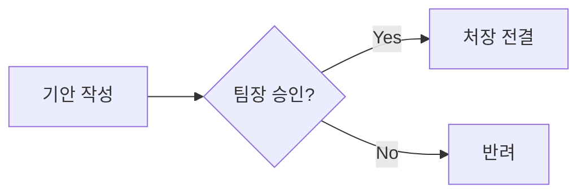

# 대학 행정직원을 위한 GitHub Copilot 완전 정복 (v3.0)
**: From Novice to Specialist**

**문서 버전:** v3.0 (2025 Edition)
**최종 수정일:** 2025년 11월 21일
**대상:** 대학성과관리팀, 기획팀, 대학혁신지원사업단 및 모든 행정 전문가

---

## 📖 이 가이드의 활용법 (User Guide)

이 문서는 단순한 '읽을거리'가 아닙니다. 여러분이 직접 따라 하며 익히는 **'실습형 자습서(Workbook)'**입니다.

*   **단계별 학습:** [Level 1: 입문]부터 [Level 3: 전문가]까지 순서대로 정복하세요.
*   **워크북(Workbook):** 각 챕터 끝에 있는 '실습 과제'를 반드시 수행해보세요. 눈으로 보는 것과 직접 해보는 것은 천지차이입니다.
*   **2025년 최신 기능:** Copilot Edits, Agents 등 2025년 11월 현재 가장 강력한 기능들을 행정 업무에 맞게 재해석했습니다.

---

## 목차 (Table of Contents)

**[Level 1: 입문] AI 행정가의 첫걸음**
1.  [준비하기: 나만의 디지털 집무실 만들기](#1-준비하기-나만의-디지털-집무실-만들기)
2.  [기초: 채팅과 자동완성 구분하기](#2-기초-채팅과-자동완성-구분하기)
3.  [Workbook 1: 3분 만에 끝내는 영문 이메일](#workbook-1-3분-만에-끝내는-영문-이메일)

**[Level 2: 실무] 업무 속도 10배 올리기**
4.  [프롬프트 엔지니어링: 개떡같이 말해도 찰떡같이 알아듣게 시키기](#4-프롬프트-엔지니어링-개떡같이-말해도-찰떡같이-알아듣게-시키기)
5.  [Copilot Edits: 여러 파일을 한 번에 수정하기](#5-copilot-edits-여러-파일을-한-번에-수정하기)
6.  [Workbook 2: 작년 보고서를 올해 버전으로 리모델링하기](#workbook-2-작년-보고서를-올해-버전으로-리모델링하기)

**[Level 3: 전문가] 나만의 AI 비서단 운영**
7.  [Agents & Instructions: 부서 맞춤형 AI 만들기](#7-agents--instructions-부서-맞춤형-ai-만들기)
8.  [Data & Visualization: 엑셀 없이 분석하고 그림 그리기](#8-data--visualization-엑셀-없이-분석하고-그림-그리기)
9.  [Workbook 3: 회의록 자동화와 시각화 보고서](#workbook-3-회의록-자동화와-시각화-보고서)

---

# [Level 1: 입문] AI 행정가의 첫걸음

## 1. 준비하기: 나만의 디지털 집무실 만들기

AI와 함께 일하려면 그들이 살 수 있는 집을 지어줘야 합니다. 우리는 **VS Code**라는 집을 짓고, **GitHub Copilot**이라는 집사를 고용할 것입니다.

### 1.1 설치 및 세팅 (2025년 최신)
1.  **Visual Studio Code 설치:** [code.visualstudio.com](https://code.visualstudio.com)에서 다운로드 및 설치.
2.  **GitHub Copilot 확장 프로그램:**
    *   VS Code 왼쪽 '블록 아이콘(Extensions)' 클릭 → `GitHub Copilot` 검색 및 설치.
    *   **중요:** 2025년 버전부터는 `Copilot Chat`이 통합되어 별도 설치가 필요 없습니다.
3.  **로그인:** 우측 하단 알림창 또는 왼쪽 프로필 아이콘을 눌러 GitHub 계정으로 로그인합니다.

### 1.2 화면 구성 이해하기
*   **편집기(Editor):** 글을 쓰는 메인 화면 (한글/워드와 같은 곳)
*   **사이드바(Sidebar):** 파일 목록이 보이는 왼쪽 영역
*   **보조 사이드바(Secondary Sidebar):** Copilot 채팅창이 열리는 오른쪽 영역 (`Ctrl/Cmd + Alt + I`로 열고 닫음)

---

## 2. 기초: 채팅과 자동완성 구분하기

Copilot을 쓰는 방법은 크게 두 가지입니다. 이 두 가지만 구분해도 상위 10%입니다.

### 2.1 대화형 (Chat): "이거 해줘"
오른쪽 채팅창에서 비서에게 말을 걸듯이 시키는 것입니다.
*   **언제 쓰나요?** 모르는 걸 물어볼 때, 긴 글을 요약할 때, 처음부터 뭔가를 만들어달라고 할 때.
*   **단축키:** `Ctrl/Cmd + Alt + I` (사이드바 채팅)

### 2.2 자동완성 (Ghost Text): "내 마음을 읽어줘"
편집기에서 글을 쓰고 있으면, 회색 글씨로 다음 내용을 미리 보여줍니다.
*   **언제 쓰나요?** 문서를 작성하는 도중, 다음 문장이 뻔할 때, 표를 채워 넣을 때.
*   **사용법:** 회색 글씨가 마음에 들면 `Tab` 키를 눌러 수락합니다.

> [!TIP]
> **행정가의 팁:** 보고서 목차를 짤 때는 **자동완성**이 편하고, 보고서 내용을 채울 때는 **채팅**이 편합니다.

---

## 3. Workbook 1: 3분 만에 끝내는 영문 이메일

자, 이제 눈으로만 보지 말고 직접 해봅시다. 해외 대학에 협정 갱신을 요청하는 이메일을 써보겠습니다.

### [Step 1] 파일 만들기
1.  VS Code에서 `File > New File`을 누릅니다.
2.  `email_draft.md`라고 저장합니다. (확장자 `.md`가 중요합니다!)

### [Step 2] 상황 설명하기 (채팅)
오른쪽 채팅창(`Ctrl/Cmd + Alt + I`)에 다음과 같이 입력하세요.

> **입력(Input):**
> "나는 OO대학교 국제교류팀 직원이야. 미국 자매대학인 ABC University에 교환학생 협정 갱신을 요청하는 이메일을 보내야 해. 정중하고 격식 있는 비즈니스 영어로 초안을 작성해줘."

### [Step 3] 결과 확인 및 수정
Copilot이 써준 영어를 복사해서 편집기에 붙여넣으세요. 그리고 내용을 조금 수정해봅니다.

### [Step 4] 자동완성 체험하기
이메일 마지막에 `Sincerely,` 라고 쓰고 엔터를 쳐보세요.
Copilot이 여러분의 이름이나 직함을 회색 글씨로 제안할 것입니다. `Tab`을 눌러 완성하세요.

> [!NOTE]
> **성공 확인:** 이메일 초안이 3분 안에 완성되었나요? 그렇다면 Level 1 통과입니다!

---

# [Level 2: 실무] 업무 속도 10배 올리기

## 4. 프롬프트 엔지니어링: 개떡같이 말해도 찰떡같이 알아듣게 시키기

AI에게 일을 잘 시키는 것도 능력입니다. 이를 '프롬프트 엔지니어링'이라고 합니다. 어렵지 않습니다. 딱 3가지만 기억하세요: **역할(Role), 맥락(Context), 출력(Output)**.

### 4.1 R.C.O 공식
*   **Role (역할):** "너는 10년 차 베테랑 행정가야."
*   **Context (맥락):** "이번에 교육부 감사 대비 자료를 만들고 있어."
*   **Output (출력):** "감사 지적 사항 예상 리스트를 표로 정리해줘."

### 4.2 톤앤매너 조절하기
AI의 말투를 조절할 수 있습니다.
*   "건조하고 객관적인 어조로 써줘." (보고서용)
*   "친절하고 부드러운 어조로 써줘." (안내문용)
*   "핵심만 요약해서 개조식으로 써줘." (임원 보고용)

---

## 5. Copilot Edits: 여러 파일을 한 번에 수정하기

**[2025 New Feature]**
지금까지는 채팅창에서 복사해서 붙여넣었죠? 이제는 Copilot이 직접 파일을 수정하게 시킬 수 있습니다. 이것이 바로 **Copilot Edits**입니다.

### 5.1 사용법
1.  채팅창(`Ctrl/Cmd + Alt + I`) 하단의 모드를 **'Edits'**로 변경합니다.
2.  수정하고 싶은 파일들을 채팅창으로 드래그하거나, `#` 키를 눌러 선택합니다.
3.  명령을 내립니다.
    > "여기 있는 5개 파일의 연도를 모두 2024년에서 2025년으로 바꿔줘. 그리고 문서 상단에 '대외비' 표시를 추가해줘."
4.  Copilot이 수정 계획을 보여줍니다. **'확인(Accept)'**을 누르면 파일이 실제로 수정됩니다.

### 5.2 언제 쓰나요?
*   여러 파일의 양식을 통일할 때
*   규정이 바뀌어서 모든 문서의 특정 문구를 수정해야 할 때
*   단순 반복 작업을 한 방에 끝내고 싶을 때

---

## 6. Workbook 2: 작년 보고서를 올해 버전으로 리모델링하기

작년에 선배가 쓴 훌륭한 사업계획서가 있습니다. 이걸 바탕으로 올해 버전을 만들어봅시다.

### [Step 1] 준비물 챙기기
1.  작년 사업계획서 파일(`plan_2024.md`)을 엽니다. (없으면 아무 내용이나 채워서 만드세요.)
2.  올해의 중점 추진 과제가 담긴 메모(`memo_2025.txt`)를 만듭니다.

### [Step 2] Copilot Edits 소환
1.  채팅창을 **Edits 모드**로 바꿉니다.
2.  두 파일을 모두 참조(`@`)시킵니다.

### [Step 3] 명령 내리기
> **입력(Input):**
> "작년 계획서(`plan_2024.md`)를 바탕으로 `plan_2025.md`를 새로 만들어줘.
> 단, `memo_2025.txt`에 있는 올해 중점 과제를 반영해서 '추진 전략' 부분을 수정해야 해.
> 날짜는 모두 2025년으로 업데이트하고, 예산은 작년 대비 5% 증액해서 계산해줘."

### [Step 4] 검토 및 승인
Copilot이 수정한 내용을 보여줄 겁니다.
*   빨간색: 삭제된 내용
*   초록색: 추가된 내용
내용이 맞다면 **'Accept'**를 눌러 저장하세요.

> [!TIP]
> **성공 확인:** 1시간 걸릴 '복붙'과 '수정' 작업이 5분 만에 끝났나요? 축하합니다. 여러분은 이제 '실무 레벨'을 마스터했습니다.

---

# [Level 3: 전문가] 나만의 AI 비서단 운영

## 7. Agents & Instructions: 부서 맞춤형 AI 만들기

이제 Copilot을 우리 부서 전용 직원으로 교육시킬 차례입니다.

### 7.1 맞춤형 지침 (.github/copilot-instructions.md)
매번 "공손하게 말해", "날짜는 YYYY.MM.DD로 해"라고 잔소리하기 지치셨나요?
프로젝트 폴더에 `.github/copilot-instructions.md` 파일을 만들고 규칙을 적어두면, Copilot이 이 규칙을 항상 따릅니다.

> **예시:**
> 1. 모든 문서는 '대학혁신지원사업 관리 지침'을 준수할 것.
> 2. 금액은 천 원 단위로 절사할 것.
> 3. 학생 개인정보는 마스킹(***) 처리할 것.

### 7.2 AI 페르소나 (Agents)
**[2025 New Feature]**
채팅창에서 `@`를 누르면 다양한 전문가를 호출할 수 있습니다.
*   `@workspace`: 내 컴퓨터에 있는 모든 문서를 다 아는 비서
*   `@terminal`: 복잡한 명령어를 대신 쳐주는 비서
*   `@vscode`: VS Code 사용법을 알려주는 비서

---

## 8. Data & Visualization: 엑셀 없이 분석하고 그림 그리기

### 8.1 텍스트로 차트 그리기 (Mermaid)
파워포인트에서 도형 그리느라 시간 낭비하지 마세요. 글자만 쓰면 그림이 됩니다.

**[실습] 업무 흐름도 그리기**
아래 코드를 복사해서 붙여넣어 보세요.

### 8.2 데이터 분석 (Data Analysis)
엑셀 파일을 열고 채팅창에 물어보면 분석해줍니다.
> "이 엑셀 파일(`survey.xlsx`)에서 만족도가 가장 낮은 항목 3개를 뽑고, 그 이유를 요약해줘."

---

## 9. Workbook 3: 회의록 자동화와 시각화 보고서

마지막 관문입니다. 회의 메모를 근사한 보고서로 바꿔봅시다.

### [Step 1] 회의 메모 준비
대충 적은 회의 메모(`meeting_note.txt`)를 준비합니다.

### [Step 2] 보고서 작성 요청
> **입력(Input):**
> "@workspace `meeting_note.txt`를 바탕으로 '주간 업무 보고서'를 작성해줘.
> 1. 주요 안건은 표로 정리해줘.
> 2. 향후 일정은 Mermaid 간트 차트로 그려줘.
> 3. 전체적인 톤은 '보고용'으로 건조하게 해줘."

### [Step 3] 결과 확인
표와 차트가 포함된 완벽한 보고서가 나왔나요?
이제 여러분은 **'AI 행정 마스터'**입니다.

---

# 부록

## A. 실전 시나리오 라이브러리 (Before & After)

| 상황 | Before (기존) | After (AI 활용) |
| :--- | :--- | :--- |
| **규정 검색** | 규정집 PDF 5개를 열고 'Ctrl+F'로 검색 | "@workspace '학칙'에서 휴학 신청 기간과 절차만 요약해줘." |
| **공문 작성** | 작년 공문 찾아서 날짜/수신처 수정 (오타 위험) | "작년 공문(`@doc`) 참고해서 수신처만 '교육부'로 바꿔서 새로 써줘." |
| **행사 기획** | 식순, 준비물 리스트 엑셀에 수기 작성 | "신입생 오리엔테이션 식순과 체크리스트를 표로 만들어줘." |

## B. 행정직원을 위한 프롬프트 사전

*   **요약:** "이 문서를 A4 1장 분량으로 요약하고, 핵심 키워드 3개를 뽑아줘."
*   **번역:** "이 이메일을 정중한 비즈니스 영어로 번역해줘."
*   **교정:** "이 보고서에서 오탈자와 비문을 찾아서 고쳐줘."
*   **아이디어:** "우리 대학 홍보 슬로건 10개만 제안해줘. (키워드: 혁신, 미래, 글로벌)"

---
**"시작이 반입니다. 지금 바로 `Ctrl + Alt + I`를 눌러보세요!"**
